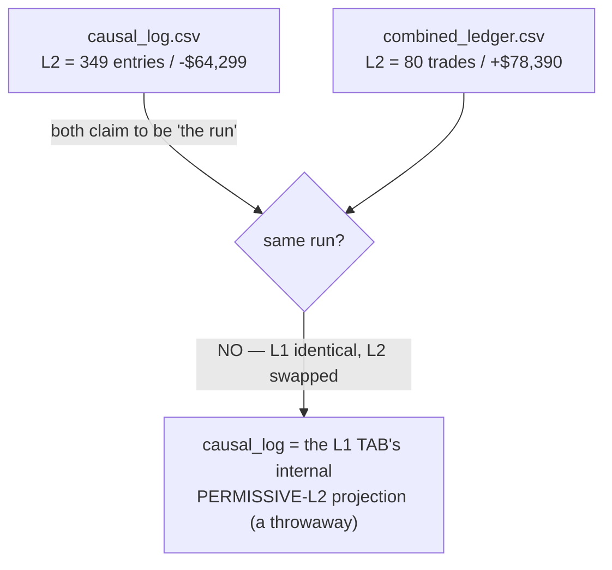

# Log Audit — `combined_ledger` vs `causal_log` (council verdict + fix)

**Question:** "do you notice anything odd?" in two exported logs — `combined_ledger(1).csv` (335 trades)
and `causal_log.csv` (2119 candles). **Verdict (controller + a 4-lens council of experts, all agreeing,
code verified): the ENGINE is sound; the oddity is an export-provenance defect, now fixed.**

> 🍼 The trading math is correct. The problem was that one of the two files was secretly from a
> *different run*, with nothing in the file saying so — so the two looked like they disagreed.

---

## 1. What looked odd

The same "L2" appeared to **lose $64,299 in one file and make $78,390 in the other**, and the log's
`equity` column seemed to crash to −$64k and end at 0.



---

## 2. Verdict: engine sound (verified)

| Check | Result |
|---|---|
| `pnl == (exit−entry)·dir·$20` | ✅ all **335** trades, 0 violations |
| Ledger reconciles to ground truth | ✅ L1 $149,989 + L2 $78,390.44 = **$228,379.44** ≈ $228,380 |
| Hard stops fill **at** the cap | ✅ L1 167.1 pt → −$3,342 · L2 271.46 pt → −$5,429 (no breach) |
| L1/L2 single-account (no overlap) | ✅ 0 interior time overlaps; 12 force-closes each align to a real L1 entry |
| Data grid | ✅ 85 gaps all legit session boundaries; no dupes; perfect index; **no look-ahead** |

The −$5,429 "worst loss" is simply the **L2 champion's 271.46-pt hard stop** (×$20). Not a leak.

## 3. The two real (export-side) oddities

- **🔴 Provenance defect (the headline).** `causal_log.csv` was the **L1 tab's internal projection**,
  which hardcodes a **PERMISSIVE no-gate L2** (`payload.py` view='l1' → `run_causal(l1p, PERMISSIVE)`).
  `GET /api/causal_log.csv` served `_LAST_CAUSAL` **with no view/params stamp**, and both the L1 route and
  the combined route overwrote that same slot (last-write-wins). **L1 was byte-identical across both
  files** (255 / $149,989), isolating the divergence to the silently-swapped L2. A downstream join on
  `(layer,entry,direction)` would mismatch every L2 row with no error raised.
- **🟡 Equity/dd display trap.** Those columns are booked **per-layer, on entry rows only** (0 on
  non-entry), computed in **exit-time order** but shown in **entry-time order** → ~82 apparent
  inversions; the column interleaves L1's +$154k curve with PERMISSIVE-L2's losing curve and the
  trailing non-entry row reads 0. It is **not** one portfolio curve and was never meant to be read as one.

*(Cosmetic only: the L2 hard stop fills at 271.460761 vs nominal 271.46 — a +$0.02 intrabar gap-fill, at
the cap, not a breach.)*

## 4. Fix shipped (`server.py`, no engine change)

The export is now **self-describing** — `GET /api/causal_log.csv` prepends `#`-comment provenance rows
(skippable by `pandas.read_csv(comment='#')`):
```
# causal_log export · view=combined · tf=4h · generated=2026-06-21 …
# l1_params={…}
# l2_source={…the real L2 params…}        # or: PERMISSIVE-internal (L1-view projection …) for the L1 tab
# NOTE: equity/dd are booked PER-LAYER on entry rows only … NOT a single combined portfolio curve.
```
`_stamp_causal(log, view, l1, l2_source, tf)` records the provenance whenever a run is cached; the **L1
route explicitly flags its `l2_source` as `PERMISSIVE-internal`**. So the two files can **never** be
silently reconciled again — the header tells you exactly which run and which L2 you're holding, and the
equity/dd caveat is stated in-file.

**Trust the `combined_ledger` (extend champion) as the source of truth.** The provenance stamp + the
equity caveat close the two export-side issues; the engine needed no change.

## 5. Optional follow-on (not done)
Rename the log's `equity`/`dd` to per-layer columns (`equity_L1`/`equity_L2`) or forward-fill non-entry
rows, so the time series is directly plottable. Low priority — the in-file NOTE already prevents misreads.
