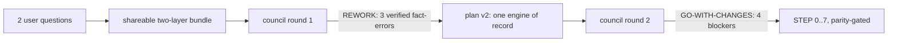
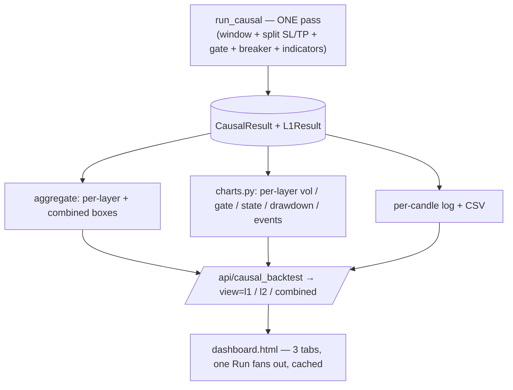

# Unified Dashboard Rebuild — Progress Report

**Scope:** consolidate the three standalone dashboards (L1 `index.html`, L2 `l2.html`, Combined
`combined.html`) into ONE central page with three tabs, driven by a single causal pass, with the full
engine option set on every tab — without ever changing the headline numbers.

**Outcome:** shipped. Served at `http://localhost:8200/` (`frontend/dashboard.html`). Commits
`865bf45 → 38e0ec0` on `dev`. The three old pages are retired; every box they showed is preserved in
the unified tabs (L1 **18** / L2 **20** / Combined **17**, browser-verified).

**Invariant held throughout:** L1 **$149,989** / 255 · L2 **$78,391** / 80 · Combined **$228,380**
stayed byte-identical at every gate.

---

## 1. Where it started

Two user questions about the existing three pages:
1. *Why doesn't one Run fill all three tabs?* → because they were three separate documents, each with
   its own Run and its own (sometimes different) L1 baseline.
2. *Why do some boxes go blank after a Run?* → only the L1 tab's warmup / indicator-requirement cards,
   which `render()` reset to `—` every Run and never repopulated.

The ask grew into: **one page · three tabs · one Run fans out · full options on all tabs · never drop a
box.**

---

## 2. How it was de-risked before any code

**Council round 1 (verdict: REWORK)** caught three load-bearing plan claims that were FALSE against the
code — verified, not opinion:
- **Window has no loader arg.** `data.load_inputs(tf)` takes no `window`; all window logic (bundle-swap
  + slice + gate-seed) lived only in `strategy.build_payload`. → window is a real backend feature.
- **`dd_cap` is display-only** — changes zero trades. → dropped from scope.
- **Engine charts exist only for L1** (via `build_payload`); `run_causal` emits none for L2/Combined,
  and the cited endpoint was wrong. → needed a new producer.

**Council round 2 (verdict: GO-WITH-CHANGES)** confirmed the rewritten plan and surfaced four blockers
(charts signature, the window *slice-not-mask* mechanism, the L2 gate-seed trap, step ordering), all of
which were folded in before coding.

---

## 3. The architecture decision — ONE engine of record

The old L1 view ran **two engines** (`strategy.build_payload` for charts + `run_causal` for the log)
that agreed only at the frozen default. Every new lever would break that coincidence and risk the
anchor. v2 makes **`CausalResult` the single engine of record**: boxes, charts, log and trades for all
three layers derive from ONE windowed causal pass, so they cannot disagree.

---

## 4. The steps (each committed + parity-gated green)

| Step | Commit | What | Gate |
|---|---|---|---|
| 0 | `a8835fe` | Pin parity gold ($149,989/$78,391/$228,380) + `use_frozen` guard | anchor 4/4 |
| 1 | `39945ea` | **Blank-box fix** — repopulate warmup cards after Run; measured 0 → "0 candles" (kept distinct, kept the `/api/warmup` driver label) | browser-verified |
| 2 | `c66e4f0` | Centralize the vol-gate percentile seed → `volatility.gate_threshold` (guards window) | golden 6/6 |
| 3a | `e08745c` | Extract `strategy.window_slice()` (bundle-swap + slice + pre-window gate seed) | golden 6/6 + 6-window smoke |
| 3b | `51baa77` | **Window through the causal engine.** `run_l1` slices the data; L2 inherits the window. THE TRAP: `run_l2` reseeds its gate on `l1.vf[:n_split]` — a windowed `vf` has no 2025 prefix for a 2026 window → would reseed on OOS data. FIX: `L1Result.vf_seed` carries the in-sample prefix; both layers seed on it. | `run_l1(w) == build_payload(w)` for all 6 windows + golden 6/6 + 45 L2 tests |
| 4 | `b8ad301` | **Per-layer engine charts** (`charts.py`) for L2/Combined — vol/gate/state/drawdown/events from the causal run (never existed before) | equity ≡ P/L, 4/4 |
| 5 | `e8bb22d` | **Split long/short SL/TP** through L1+L2 (`fast_backtest` already supported it; None ⇒ shared ⇒ byte-identical) | split-off byte-identical, 4/4 |
| 6a | `3b12eba` | `build_view_payload` carries the per-layer `engine` block (fan-out backend) | 14/14 |
| 6b | `2a0eb80` | **The unified 3-tab page** — one Run fires l1/l2/combined, caches each, renders active tab | DOM golden 18/20/17, browser-verified |
| 7 | `38e0ec0` | Serve at `/`; retire `index.html` + `l2.html` (+ `combined.html`) | routing verified |

---

## 5. The shareable backtester (parallel deliverable)

`shareable/two_layer_causal_backtester.zip` (`865bf45`) — a self-contained Python package bundling the
exact causal stack. **Acceptance gate passes from a clean `/tmp` unzip:** L1 $149,989/255 · L2
$78,391/80 · Combined $228,380. Ships `README.md` + `PLAYBOOK.md` (Mermaid diagrams + the per-box
combine rules) + `requirements.txt`; data is user-provided via `WSH_DATA_BASE`.

---

## 6. What "never drop a box" meant in practice

The three tabs are **asymmetric** (18 / 20 / 17 — not a superset relationship): Combined has no totals
group; L2 has no box-silence. The per-tab DOM golden (count `.card` + the headline P/L) confirmed each
tab renders its exact historical set. See **`FOLLOWUPS_unified_dashboard.md`** for the one honest gap:
two L1-only *non-card panels* (the SMC structure report + the rich would-be-P/L event log) are not yet
carried into the unified L1 tab — the L1 tab currently uses the leaner causal event log.

---

## 7. Verification summary

- **Backend parity:** `optimize/l2/test_parity_anchor.py` (anchor + 6-window), `test_charts.py`,
  `test_split_sltp.py`, the full 45-test L2 suite, and `perf/check_golden.py` 6/6 — all green.
- **Frontend:** Playwright + system Chrome against the live server — one Run → "all three tabs filled";
  per-tab cards 18/20/17; P/L $149,989/$78,391/$228,380; event logs 255/80/335; no blank cards; only the
  harmless favicon 404. Screenshots captured.
- **Routing:** `/` → unified (200); `/index.html`, `/l2.html`, `/combined.html` → 404; APIs intact.
