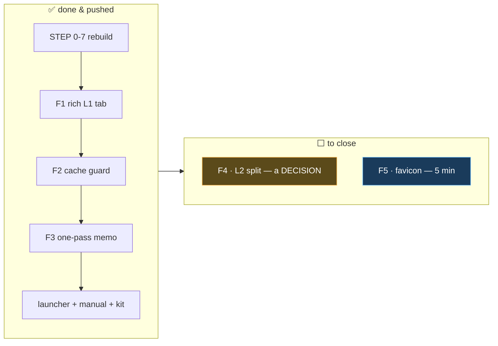

# Unified-Dashboard Workstream — Closure Report

**Workstream:** merge the three standalone dashboards into one 3-tab page, restore full options, never
move the numbers, package + document it. **Branch `dev`, commits `a8835fe → 53b7da0` (16).**

**Status: ✅ CLOSED.** All build steps (0–7) + ALL five follow-ups (F1–F5) are DONE, verified, and
pushed. Nothing open in this workstream. (Adjacent task #210 — backtester speed — is tracked separately.)

> 🍼 The big job is finished and live. Two tiny leftovers: decide on one advanced Layer-2 option, and
> add a browser-tab icon. That's it.

---

## 1. What's DONE (verified + pushed)

| Area | Commits | Verified by |
|---|---|---|
| **STEP 0–7** — pin gold · blank-box fix · gate-seed centralize · window through the causal engine · per-layer charts · split SL/TP · unified 3-tab page · retire old files | `a8835fe`…`38e0ec0` | golden 6/6 · 6-window parity · 45 L2 tests · Playwright DOM 18/20/17 |
| **F1** — L1 tab = old `index.html` (SMC report + rich event log) | `a9a65e7` | browser: gen_report 10 cards + 162 chip blocks, $149,989 |
| **F2** — cache schema-version guard | `53b7da0` | versioned filename + field guard |
| **F3** — `run_causal` memo (l2+combined share one pass) | `53b7da0` | `_CAUSAL_MEMO` size 1 |
| **Launcher** — `run_dashboard.sh` (start/stop/restart/status) | `840e5ef` | persists, idempotent |
| **Docs + shareable** — agent manual, `.env.example`, achievements report, server kit zip, two-layer zip | `8c9e53a`, `9915495`, `865bf45` | kit reproduces $228,380 from clean unzip |

**The invariant held throughout:** L1 **$149,989** / L2 **$78,391** / Combined **$228,380**, byte-identical
at every gate.

---

## 2. What's LEFT — exact steps to close

### ⬜ F4 — decide what to do with L2 split SL/TP  *(a decision, then ≤½ day OR 5 min)*
**State:** the per-side long/short SL/TP lever is wired through L2 and exposed in the form, but **OFF by
default** and **not validated** (L2's force-close + flip semantics make per-side exits ambiguous).
**To close, pick ONE:**
- **(a) Keep it L1-only** (recommended, fast): hide the L2 split control in the UI so it can't imply a
  supported feature. Touch `frontend/dashboard.html` — remove/hide the `#l2_split` field + its
  `splitbox`. ~5 min. Closes F4 as "L1-only by decision."
- **(b) Make it a real L2 feature**: run a focused validation study — a force-closed L2 trade with
  asymmetric per-side SL/TP vs a hand-computed expectation — document the semantics, add a parity test,
  then keep the toggle. ~½ day. (Could fold into the optimizer work, not the dashboard.)

**Closure gate:** either the L2 split control is gone from the UI (a), or there's a passing
`test_l2_split_*` + a documented semantics note (b).

### ⬜ F5 — favicon 404  *(cosmetic, ~5 min)*
**State:** browser auto-requests `/favicon.ico` → 404 → the one harmless console line.
**To close, pick ONE:**
- add `frontend/favicon.ico` (any small icon), **or**
- add a one-line route in `server.py` returning HTTP 204 for `path == "/favicon.ico"`.

**Closure gate:** Playwright run shows **zero** console errors.

---

## 3. Adjacent (related, but NOT this workstream)

- **#210 — backtester speed.** The cold L1 1-minute-indicator pass is ~38 s (then disk-cached). F3
  removed one redundant `run_causal` per Run, but the deep speed-up (vectorising / caching the 1-min
  indicator compute) is its own standing task. Tracking it here only as context.
- **F4 option (b)** naturally belongs with the optimizer/strategy-research stream, not the dashboard UI.

---

## 4. Definition of Done for the workstream

- [x] One page, three tabs, one Run fans out, switch-from-cache
- [x] Full options on all tabs (window + split + indicators + charts + event log)
- [x] Every box preserved (18 / 20 / 17, DOM-verified) — incl. the L1 rich panels (F1)
- [x] Numbers byte-identical ($149,989 / $78,391 / $228,380) — gated every step
- [x] Old pages retired; served at `/`
- [x] One-click launcher + agent manual + shareable kit
- [x] Cache robustness (F2) + fan-out efficiency (F3)
- [x] **F4** L2-split **validated** (option b) — per-side + force-close + display semantics tested + documented
- [x] **F5** favicon → 204, **zero console errors**

**Workstream fully closed.** All 9 Definition-of-Done boxes ticked; commits `a8835fe → <F4/F5 commit>`
on `dev`. The only remaining trading-system item touching this code is the separate speed task #210.
