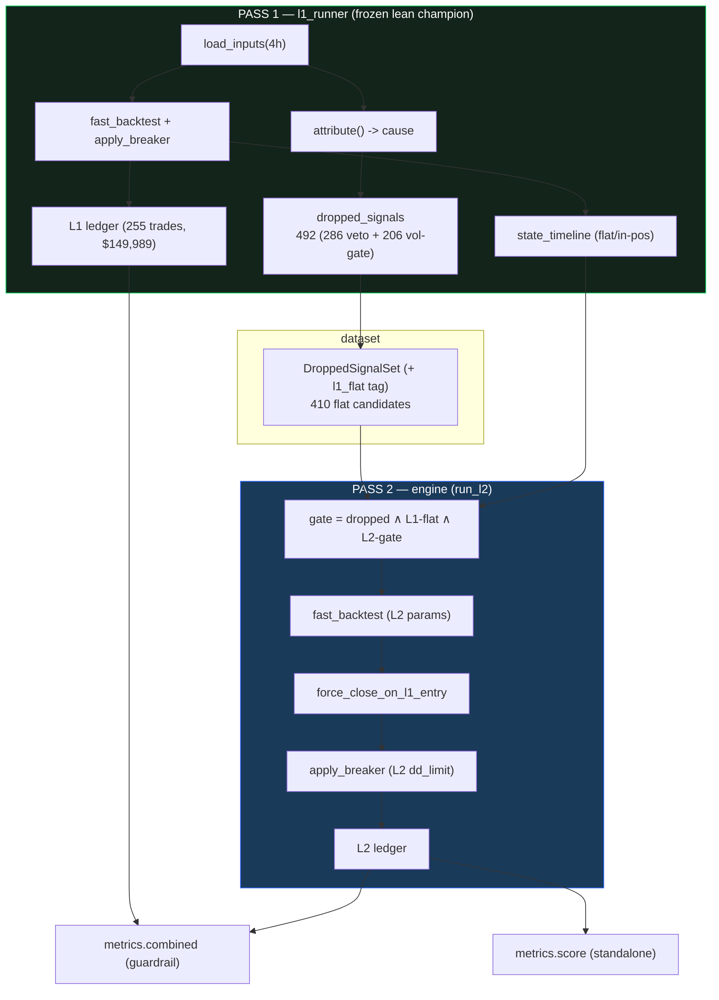

# L2 round-1 backtester — build report

> Spec: `docs/superpowers/specs/2026-06-17-second-layer-nonentry-design.md` ·
> Plan: `docs/superpowers/plans/2026-06-18-l2-backtester-round1.md`.

## Modules (all under `optimize/l2/`)
| File | Purpose | Tests |
|---|---|---|
| `l1_runner.py` | Pass 1: frozen lean champion -> ledger + dropped log + state timeline; `apply_breaker`, `build_state_timeline` | `test_l1_runner.py` (3) |
| `dataset.py` | isolated veto+vol-gate set with L1-flat tagging | `test_dataset.py` (1) |
| `engine.py` | Pass 2: masked run + L1-entry force-close + agree/oppose labelling | `test_engine.py` (3) |
| `metrics.py` | standalone score + combined-book DD guardrail | `test_metrics.py` (4) |
| `run_smoke.py` | end-to-end runnable check | — |

**10 L2 tests green; golden 6/6 unchanged** (L1 path untouched — `optimize/l2/` is isolated and nothing
in the golden path imports it).

## Lean-L1 dropped-signal counts (recorded, not asserted)
| reason | lean (3-ind) L1 | spec figure (wsh4 8-ind) |
|---|--:|--:|
| veto | **286** | 359 |
| vol-gate | **206** | 206 |
| total | **492** | 565 |

The vol-gate count is identical (indicator-independent); the veto count is lower under the 3-indicator
champion. Tests assert internal consistency and record these, rather than the old 359/565 numbers.

## End-to-end smoke (PERMISSIVE stand-in L2 profile)
`run_smoke.py` runs L2 with **no indicators / no vol gate** ⇒ it takes every flat dropped signal in the
box direction. This is a deliberate worst case to exercise the full pipeline (not a candidate profile):

- L1: **255 trades, $149,989** (exact champion match).
- Dropped: **492** (286 veto + 206 vol-gate); **410 flat candidates**.
- L2 (permissive): **n=349, P/L −$64,299, maxDD $108,453, win 54.4%, L1-entry force-closes = 52**.
- Combined: P/L $85,690, maxDD $50,574 (L1-only DD $15,491) ⇒ **dd_not_worse = False**.

**Reading:** blindly taking *every* dropped signal loses money and blows out drawdown — exactly the
counterfactual "accept the pause" result. The pipeline is correct (349 trades generated, 52 truncated
on L1 entry); the *selective, profitable* L2 profile is what the optimizer phase (prefix `l2v1`) will
search for. Note: **lean-params-as-L2 yields 0 trades** (L2 with L1's own gate rejects exactly the bars
L1 dropped) — which is why the smoke uses a permissive profile, not the lean params.

## Invariants verified
- L1 ledger P/L byte-matches `core.backtest_metrics` on the lean params (255 trades, $149,989).
- L2 never opens while L1 in-position; `L1-entry` exits map to real L1 entry bars.
- Golden **6/6** unchanged.

## Known round-1 simplification
Force-close precedes the breaker (consistent), but a truncated L2 trade can miss an L2 re-entry
between its truncated and natural exit — **conservative** (under-counts), never a single-position
violation. Round 2 may revisit (A/B "keep L2 open, discard L1").

## Next (out of this plan)
Dashboard-inside-dashboard (#236) ✅ BUILT (`UPDATE_l2_dashboard.md`) -> optimizer with prefix `l2v1` (#237) -> speed.
