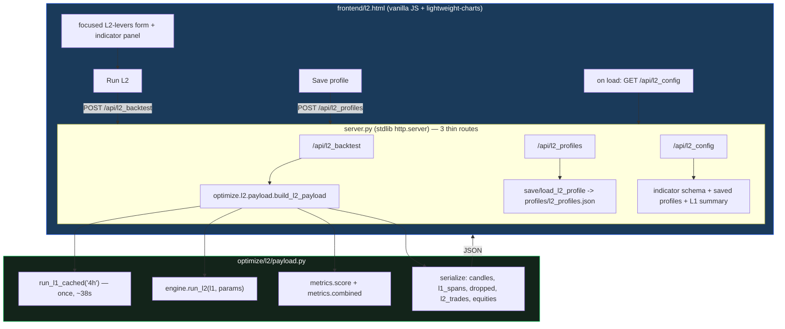

# L2 dashboard-inside-dashboard — build report

> Spec: `docs/superpowers/specs/2026-06-18-l2-dashboard-inside-dashboard-design.md` ·
> Plan: `docs/superpowers/plans/2026-06-18-l2-dashboard-inside-dashboard.md` ·
> Backtester: [[update_l2_backtester]].

## What was built
| File | Purpose | Tests |
|---|---|---|
| `optimize/l2/payload.py` | L1 cache + `validate_l2_params` + `build_l2_payload` (serialization) + profile store | `test_payload.py` (7) |
| `server.py` (3 routes) | `/api/l2_config`, `/api/l2_backtest`, `/api/l2_profiles` — thin wrappers; `L2ParamError`->400 | `test_l2_server.py` (1, live HTTP) |
| `frontend/l2.html` | focused L2-levers form + indicator panel; full-context price chart; combined-vs-L1 equity; L2 ledger + dropped table; save profile | manual + HTTP smoke |
| `frontend/index.html` | one "→ L2 layer" link | — |

**18 L2 tests green** (l1_runner 3 · dataset 1 · engine 3 · metrics 4 · payload 7) **+ live HTTP smoke**;
**golden 6/6** (L1 path untouched; `/api/backtest` and the engine are not modified).

## Decisions realized (spec §2)
- **Separate `l2.html` + routes** (no bloat to the 637-line index.html; normal backtest stays fast).
- **Fixed lean-4h L1**, cached once per process (`run_l1_cached`).
- **Focused L2-levers form** only (indicators+K, gate_pct, SL/TP, dd_limit, cooldown, flip, ind_1min) — no dead controls.
- **Full-context charts**: L1 in-position shading, dropped markers by reason (veto=orange / vol-gate=blue), L2 trades agree(solid)/oppose(hollow), `L1-entry` force-close flag, combined-vs-L1-only equity.
- **Save L2 profiles** to `profiles/l2_profiles.json`. **No optimizer launch** (that is #237).

## Live HTTP smoke (permissive stand-in profile)
- `GET /l2.html` -> 200 (12,672 bytes).
- `GET /api/l2_config` -> L1 {n_trades 255, pnl $149,989}, 7-indicator schema, 0 saved profiles.
- `POST /api/l2_backtest` -> L2 {n 349, P/L -$64,299, maxDD $108,453, win 54.4%, L1-entry exits 52};
  combined {P/L $85,690, maxDD $50,574, L1-only DD $15,491, dd_not_worse **False**}; 2119 candles,
  492 dropped, 349 L2 trades; **run_ms 189** (after the one-time ~38s L1 cache).

Reading is the same as the backtester: the permissive profile (take every flat dropped signal)
loses money and breaches the DD guardrail — the page makes that *visible* and is the manual tool to
hunt a selective profile before the optimizer (#237) searches systematically.

## Test-runner note (server offload investigation)
The AMD server (32 cores) was evaluated for offloading golden/tests: parity is **safe** — with
`WSG_DATA_ROOT=/home/dev/Mulham/wsg-i/data` (repoints `RAW` to the server's identical data, no code
change) the server reproduces golden **6/6 byte-exact**. BUT golden/L2 tests are single-threaded, so
the server is **slower** per cold run (~74s vs ~40s local; network + cold data load outweigh core
count). Decision: **keep these serial runs local**; reserve the server for parallel work (the #237
optimizer already runs there). The `WSG_DATA_ROOT` override is documented for future offload if ever
needed (e.g. to spare the laptop).

## Next (out of this plan)
Optimizer with prefix `l2v1` (#237) -> speed.
