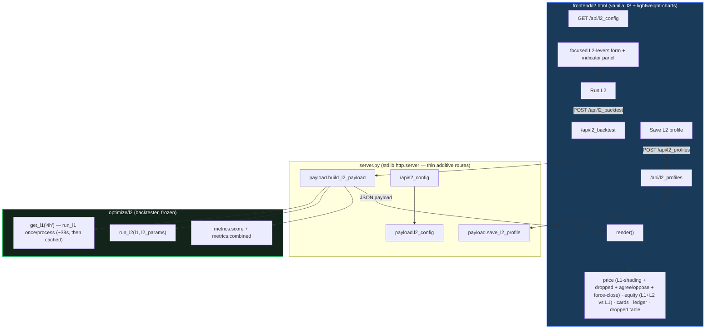

# L2 dashboard-inside-dashboard — build report

> Spec: `docs/superpowers/specs/2026-06-18-l2-dashboard-design.md` ·
> Plan: `docs/superpowers/plans/2026-06-18-l2-dashboard.md`.



## Modules / routes
| File | Purpose | Tests |
|---|---|---|
| `optimize/l2/payload.py` | `get_l1` cache + `build_l2_payload` (chart serialization) + `load/save_l2_profile` + `l2_config` | `test_payload.py` (3) + `test_payload_profiles.py` (3) |
| `server.py` (+routes) | `GET /api/l2_config`, `POST /api/l2_backtest`, `POST /api/l2_profiles` (thin; call payload) | `test_server_routes.py` (2) |
| `frontend/l2.html` | the page: focused L2 form, full-context charts, cards, L2 ledger, dropped table, save | manual smoke |

**8 L2-dashboard tests green; golden 6/6 unchanged** (all-new modules; `/api/backtest` + `index.html`
untouched). Note: `l2.html` is force-added — the repo-root `.gitignore` has a broad `*.html` rule with
per-file `index.html` exceptions; tracking `l2.html` directly avoids touching the already-modified `.gitignore`.

## End-to-end smoke (server on :8211, permissive stand-in L2 profile)
- `GET /l2.html` → HTTP 200 (14.7 KB).
- `GET /api/l2_config` → L1 = lean 4h champion: **255 trades, 492 dropped (286 veto + 206 vol-gate), 410 flat
  candidates**; 18 indicators in the schema.
- `POST /api/l2_backtest` (empty indicators, no gate) → all 8 payload keys present;
  **L2 n=349, P/L −$64,299, maxDD $108,453, win 54.4%, pf 0.87, L1-entry force-closes = 52**;
  **combined P/L $85,690, maxDD $50,574 (L1-only $15,491) → dd_not_worse = False**;
  2119 candles, 199 L1 in-position spans, 349 L2 trades. The L1 cache was warm from the config call ⇒ the
  backtest returned in **979 ms** (proving the run-once cache).

These match the backtester smoke exactly (n=349, −$64,299, 52 force-closes, combined maxDD $50,574).

## Reading
The permissive profile (take every flat dropped signal) loses money and worsens combined drawdown — the
expected counterfactual. The page makes the concurrency model visible (L1-flat shading, agree/oppose L2
arrows, purple `L1-entry` force-close marks) and the guardrail explicit (combined-vs-L1 equity + the
green/red `dd_not_worse` card). The *selective, profitable* L2 profile is the optimizer's job (#237).

## How to launch
```bash
python3 server.py --port 8200      # then open http://localhost:8200/l2.html
```

## Next (out of this plan)
Optimizer (#237): NSGA-III over the L2 levers, new prefix `l2v1`, min_trades=5, 4h; warm-start from
hand-found saved L2 profiles. Then speed (#210).
