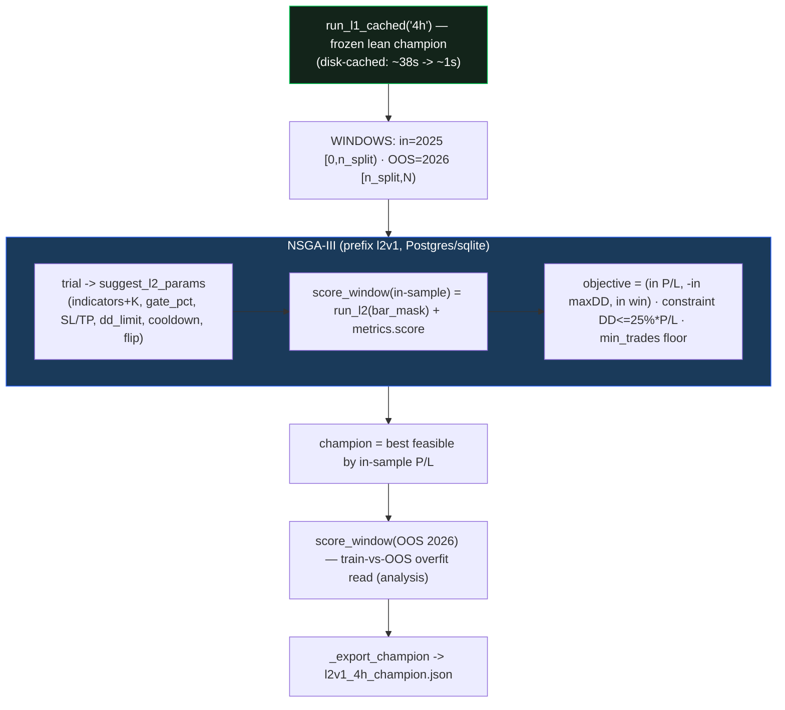

# L2 optimizer (round 1) — build report

> Spec: `docs/superpowers/specs/2026-06-17-second-layer-nonentry-design.md` (§7) ·
> Plan: `docs/superpowers/plans/2026-06-19-l2-optimizer.md` ·
> Validation choice: `docs/L2_VALIDATION_kfold_vs_holdout.md` (option 3) ·
> Backtester/dashboard: [[update_l2_backtester]] · [[update_l2_dashboard]].



## What was built (`optimize/l2/`)
| File | Purpose | Tests |
|---|---|---|
| `engine.py` (+`bar_mask`) | window L2 entries to a bar range (in-sample/OOS); additive, default None unchanged | `test_engine.py` (4) |
| `payload.py` (disk cache) | `run_l1_cached` persists the frozen L1 to a temp pickle (keyed by tf+param hash) → ~1s reloads | `test_payload.py` (8) |
| `optimize.py` | `WINDOWS`, `score_window`, `suggest_l2_params`, NSGA-III `run()`, `_export_champion`, CLI `main()` | `test_optimize.py` (4) |

**Validation = option 3** (full-period in-sample 2025 + OOS holdout 2026), chosen for the sparse L2 set
(see the validation doc). Objective: 3-obj `(in-sample L2 P/L, −maxDD, win)` + `DD ≤ 25%·P/L` constraint +
`min_trades` floor; OOS scored only for the champion (the train-vs-OOS overfit read).

**All L2 tests green; golden 6/6** (only `optimize/l2/*` touched; L1 engine frozen).

## Speed (the #210 reality, measured)
- **Fixed:** the repeated **~38s `run_l1`** recompute → **~1s** via the deterministic-L1 disk cache. This
  was the main local-iteration pain (tests, dashboard cold-start, optimizer warm-up).
- **Remaining (inherent):** each optimizer **trial** recomputes **indicator votes on the 1-min frame**
  (`cci n=138`/OB/structure) inside `run_l2` — bottleneck **#210**, ~seconds/trial. The disk cache does not
  touch this (params differ per trial). For a multi-thousand-trial search this is why the real run belongs
  on the **32-core server** (parallelism). A deeper #210 fix (vectorise/cache per-bar 1-min votes) is a
  separate optimisation if we want faster *local* searches later.

## CLI
```
python3 -m optimize.l2.optimize --trials N [--prefix l2v1] [--seed 1] [--min-trades 5] \
                                [--sampler nsga3] [--storage-url <url>] [--out optimize/results]
```
Writes `optimize/results/l2v1_4h_champion.json` (`params` + `in_sample` + `oos`) when a feasible champion
is found; prints the in-sample-vs-OOS P/L read.

## Next (GATED) — heavy l2v1 server run
Run on the AMD box (parity-safe env), e.g.:
```
WSG_DATA_ROOT=/home/dev/Mulham/wsg-i/data WSH_STORAGE_URL=<pg.env URL> \
  /home/dev/Mulham/.venv/bin/python3 -m optimize.l2.optimize --trials <N> --prefix l2v1 --min-trades 5
```
Then the **analysis stage**: compare the champion's in-sample vs OOS (overfit judgement, per the locked
policy), and decide whether to import the L2 profile (mirrors the L1 adoption gate). Awaiting the
operator's go + trial count.
