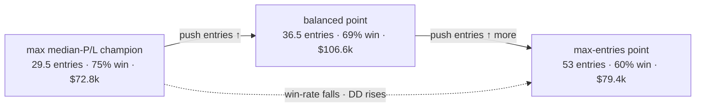

# wshent1 — NQ 4h cold L1, objective = **entries** (results)

First run of the new optimizer objective (`--objective entries`): instead of *(median-fold P/L ↑,
worst-fold DD ↓, **win-rate ↑**)*, this searched *(median-fold P/L ↑, worst-fold DD ↓, **median-fold
entries ↑**)* — i.e. reward configs that **trade more**. NQ · 4h · **cold start** (`--no-warm-start`) ·
L1 only · `--ind-1min` · NSGA-III · feasibility = full maxDD ≤ 25%·full P/L.

**Run:** 47,786 complete trials (of a 50k target — the box rebooted overnight; workers respawned and
reached 95.6%, ample for the front), **39,834 feasible**, Pareto front 2,008 points. Study `wshent1_4h`
(Postgres). Artifacts: `optimize/results/wshent1_4h_pareto.{csv,png}`, `wshent1_4h_summary.json`.

## The entries↔P/L↔DD trade-off (feasible)

Three reference points off the same front:

| Selected by | median-fold entries | full P/L | worst-fold DD | median-fold P/L | win% |
|---|--:|--:|--:|--:|--:|
| **max ENTRIES** (this run's objective) | **53.0** | $79,421 | $5,920 | $22,634 | 60% |
| **max full P/L** (best all-round point) | 36.5 | **$106,571** | $5,981 | $26,921 | 69% |
| max median-fold P/L (`report_wsi` champion) | 29.5 | $72,831 | $3,775 | $28,021 | 75% |

Feasible **median-fold entries** distribution: min 5 · p50 **18** · p90 **28** · **max 53**.

## What it means

- **Optimizing for entries does push the front to higher trade counts** — up to **53 median-fold entries
  (~1.8× the max-P/L-quality champion's ~29.5)** — but the extra entries are **lower quality**: win-rate
  falls **75% → 60%**, worst-fold DD rises **$3.8k → $5.9k**, and full P/L is *lower* than the balanced
  point. The current hard gate drops those signals for a reason.
- **A genuine mid-front win exists:** the **max-P/L feasible point trades MORE (36.5 vs 29.5 entries) AND
  makes more total money ($106,571 vs $72,831)** at a still-modest $5,981 DD — a mild Pareto improvement
  worth noting as an alternative profile.
- **But it does NOT beat the incumbent L1 on profit.** The best full P/L here ($106,571) is well below the
  canonical win-rate champion (**wsh4 $142,229**) and the cold champion (**wsh6cold $153,321**). *Brute-forcing
  entries as an NSGA objective inside the current architecture hits a quality wall around ~40–45% entry-rate
  / 60% win — it can't reach the ~75%-of-box-signals goal while holding quality.*

## Why this matters for the Kalman/fusion study

This is direct evidence for that study's core question: within the **current hard filter**, pushing entries
trades off payoff/win-rate. Reaching the user's **~75% entry-rate at held payoff** needs *smarter admission*
(better direction/timing on the currently-dropped signals), not just re-weighting the same gate — exactly
what the **M0 ceiling** (Phase 1 of the Kalman study) will quantify. wshent1 sets the empirical "brute-force"
baseline the fusion mechanisms must beat.

## Champion recipes (feasible)

**Max-entries** (53/fold · $79,421 · 60% win · $5,920 DD): box softSL 115.1 / hardSL 186.0 (Δ70.9) / TP
233.7 · gate 72.6% · dd-breaker $1,302 · cooldown 0 · flip False · cap_1min 200 · K=1 · 8 inds
(adx, bollinger, ema_trend, keltner, macd, obv, order_block, vwap).

**Max full-P/L** (36.5/fold · $106,571 · 69% win · $5,981 DD): box softSL 111.9 / hardSL 193.0 (Δ81.1) / TP
233.7 · gate 82.7% · dd-breaker $2,469 · cooldown 0 · flip False · cap_1min 200 · K=1 · 8 inds
(adx, bollinger, ema_trend, mfi, obv, order_block, sma_trend, vwap). Full params in `wshent1_4h_summary.json`.

## Caveats

- In-sample / n=1 (2025→2026 walk-forward folds); candidate generation, not proof. Re-validate any chosen
  profile on the exact dashboard engine before trust.
- Payoff *ratio* was **not** an objective here (this run predates the Kalman-study framing) — the honest
  payoff read comes from the Kalman study's rig.
- `report_wsi.py` labels the 3rd objective as "win-rate" and its champion as max-median-P/L; it does not
  surface entries. This report (from `wshent1_4h_summary.json`) is the entries-aware view. Canonical wsh4
  artifacts were regenerated on the server after the run.
