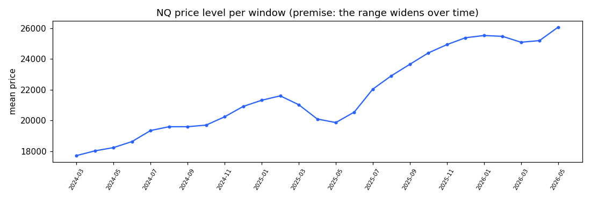
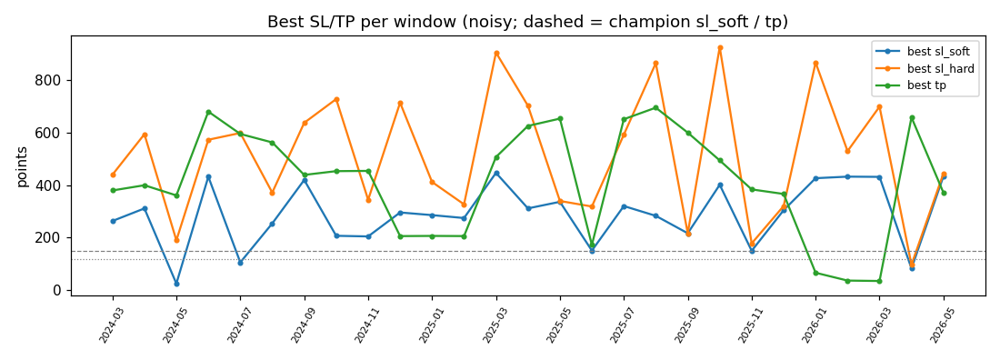
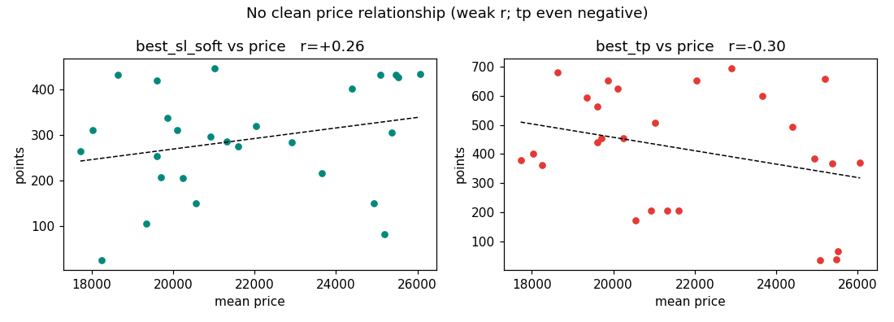
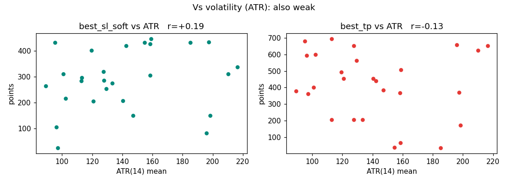
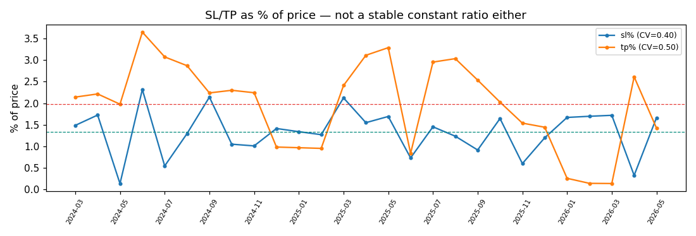
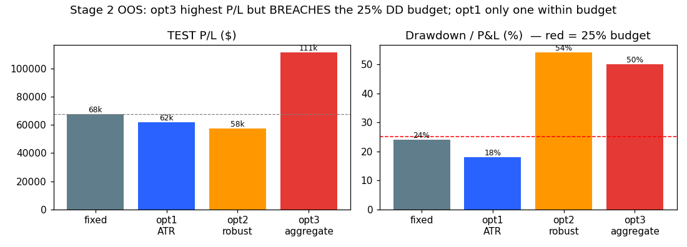

# The Dynamic SL/TP Study — end-to-end, with baby explanations

**What this is:** the complete story of the `sub_optimizer` study — the question, the data, every step of the
method (with the actual maths and worked numbers), the charts, the results, and the honest conclusion.
Written so a newcomer can follow it. **All numbers are the real run outputs** (`results/subopt_table.csv`,
`stage2.py`); charts are in `results/charts/`.

> **TL;DR.** We asked: *should the strategy's stop-loss / take-profit grow as the market's price-range grows?*
> We froze everything about the winning strategy except SL/TP, found the best SL/TP for each 3-month window
> across 2024–2026, and looked for a rule linking SL/TP to price/volatility. **Finding:** the per-window best
> SL/TP are mostly **noise** — no clean link to price. We then tried 3 dynamic rules out-of-sample: the only
> one that respects the strategy's drawdown discipline (an **ATR-multiple**) **lowers drawdown** but doesn't
> beat the fixed strategy on profit; the highest-profit rule **breaks the risk budget**. **Conclusion: keep
> the fixed SL/TP for now.**

---

## 0. Cast of characters (glossary, baby version)
- **SL (stop-loss):** how far against you price can go before you bail (a loss). Measured in **points** (NQ
  index points; 1 point = **$20**).
- **TP (take-profit):** how far in your favour before you cash out (a win), also in points.
- **The strategy ("champion"):** a pre-tuned trading recipe that watches 4-hour candles + 8 indicators and
  buys/sells "box" breakouts, with a volatility gate and a drawdown circuit-breaker. It's the **WS-G / WS-I
  drawdown-capped winner**.
- **Drawdown (DD):** the biggest peak-to-valley drop in the running profit. The strategy is *defined* by
  keeping this small (its "25% rule": DD ≤ 25% of profit).
- **Backtest:** replay history and see what the recipe would have done.

---

## 1. The question & the premise
The strategy uses **fixed** SL/TP (today: `sl_soft=149.8`, `sl_hard=167.1`, `tp=120.2` points). NQ's price has
climbed a lot — from ~17,700 (early 2024) to ~26,000 (mid-2026):



**The premise (baby):** a 150-point stop means something *different* at price 17,700 vs 26,000 — markets that
trade higher usually *swing wider*, so a stop sized for 2024 may be too tight for 2026 (and vice-versa). So:
**maybe SL/TP should scale with the price/range instead of being fixed.** This study tests that.

**Two stages:**
1. **Stage 1 — measure.** Freeze the recipe, optimise *only* SL/TP per time-window, tabulate best SL/TP vs
   price. (Are they related?)
2. **Stage 2 — model & test.** Try rules that make SL/TP dynamic, and check out-of-sample whether they beat
   the fixed strategy.

---

## 2. What we froze (the champion) and what we varied
**Frozen (untouched):** timeframe 4h · volatility gate `gate_pct=86.9` · drawdown breaker `dd_limit=4747` ·
cooldown 0 · no flip · K=1 · the 8 indicators (sma_trend, keltner, obv, cci, mfi, bollinger, structure_trend,
order_block) · `dd_cap=5000` · point value $20.
**Varied (the only knobs):** `sl_soft`, `sl_hard`, `tp`.

> **Baby:** we lock every dial on the machine except the three that set "where to bail" and "where to take
> profit", then ask the computer to spin only those three to find the best setting per period.

---

## 3. The data
- **29 months**, 2024-01 → 2026-05 (12 + 12 + 5), built from the per-year files into one continuous series:
  **3,663** 4-hour bars + **841,983** 1-minute bars (the 1-minute frame resolves exits + feeds indicators).
  Verified: **0 gaps > 5 days** across the year joins.

---

## 4. Methodology — every step, with the maths

### 4.1 The entry signal (param-independent)
For each 4h bar: `color = green if Close>Open, red if Close<Open`. A box level pair `(Bᵤ, Bₗ)` is **touched**
if `Low ≤ Bᵤ and High ≥ Bₗ`. Then:
```
long   if  green ∧ touched ∧ Close > Bᵤ
short  if  red   ∧ touched ∧ Close < Bₗ      (else hold)
```
This depends only on price + boxes — **not** on SL/TP — so we compute it **once** for the whole 29 months.

### 4.2 The gate (also param-independent) — "freeze-once"
- **Volatility gate:** threshold `gₜₕᵣ = Percentile₈₆.₉(vf)` over the whole-series HAR-RV forecast `vf`; a bar
  *passes* if `vfₜ ≤ gₜₕᵣ` (trade only in calm-enough regimes). On our data ~**12%** of bars pass.
- **Indicator layer:** each of the 8 indicators votes confirm / veto / neutral. The final per-bar **gate**:
```
gate_usedₜ  =  (vfₜ ≤ gₜₕᵣ)  ∧  ¬vetoₜ  ∧  (confirmsₜ ≥ K=1)
```
We compute `gate_used` **once** over the full series (active on **452 / 3,663** bars). Because SL/TP don't
change which bars pass the gate, every later optimisation **reuses this** — fast, and warm-up is correct.

> **Baby:** "should I be allowed to trade on this bar?" doesn't depend on the stop/target — so we work out the
> yes/no list for all 3,663 bars one time and reuse it for every experiment.

### 4.3 How a trade's profit is computed (the engine)
On a bar that fires `long`, with entry price `E` and a per-bar multiplier `mₜ` (=1 for fixed):
```
sl_soft_line = E − sl_soft·mₜ      tp_line = E + tp·mₜ      sl_hard_line = E − sl_hard·mₜ   (short = mirror)
```
Walking the 1-minute bars after entry, exits fire by **priority** (normal mode): **hard-SL → hard-TP →
soft-SL** (soft = 2 consecutive 1-min closes past the soft line). Profit:
```
pnl_points = fill − E   (long)   or   E − fill   (short);     pnl_$ = pnl_points × $20
```

### 4.4 The drawdown breaker (frozen)
Running equity `eq += pnl_$`; high-water `peak = max(peak, eq)`; `dd = peak − eq`. If `dd ≥ dd_limit (4747)`
the breaker **locks** (skips trades) for `cooldown` trades, keeping the global high-water mark. This is what
makes the strategy "drawdown-capped".

### 4.5 Rolling 3-month windows
We slice into **trailing 3-month windows stepped by 1 month**: window `k` = months `[k−2, k−1, k]`, anchored
to its last month. 29 months → **27 windows** (anchors 2024-03 … 2026-05), each ~340–400 4h bars. We chose
3-month (not 1-month) windows so each has enough trades to be less noisy.

### 4.6 The sub-optimizer (Stage 1)
For each window, an Optuna search (400 trials) over **only** `sl_soft, sl_hard=sl_soft+δ, tp`, maximising the
window's P/L (≥3 trades required). **Widened bounds** (premise: recent windows may want wider SL/TP):
```
sl_soft ∈ [lo, 3·hi]    δ ∈ [0, 3·hiₕₐᵣୢ]    tp ∈ [loₜₚ, 3·hiₜₚ]     (3× the full-history caps)
```
Each trial reuses `gate_used` + signal (no recompute) and runs the exact engine + breaker on the window — so
a trial is **milliseconds**.

### 4.7 Correctness gate
We proved the freeze-once path is **byte-exact**: running the champion's own SL/TP over the full 29 months via
freeze-once == the canonical recompute (P/L **$108,748**, **342** trades, win 62.9%, maxDD $34,411 — all
identical). So any difference later is the SL/TP change, not a plumbing artefact.

---

## 5. Stage 1 results — what the best SL/TP look like

A few real rows from `results/subopt_table.csv` (27 total):

| anchor | price_mean | best_sl_soft | best_sl_hard | best_tp | n | pnl | maxDD |
|--------|-----------:|-------------:|-------------:|--------:|--:|----:|------:|
| 2024-03 | 17,727 | 263.6 | 439.9 | 379.9 | 13 | 46,859 | 10,955 |
| 2024-08 | 19,602 | 254.3 | 371.7 | 562.7 | 16 | 81,155 | 10,320 |
| 2025-02 | 21,604 | 274.8 | 327.0 | 206.2 | 33 | 86,660 | 6,300 |
| 2026-02 | 25,467 | 432.5 | 529.7 | 36.7 | 38 | 27,896 | 0 |
| 2026-05 | 26,060 | 434.0 | 444.9 | 371.4 | 21 | 90,680 | 17,795 |

**The best SL/TP jump around wildly** — there is no smooth march upward with price:



### 5.1 Is there a relationship to price? (No.)
Pearson correlation `r` (≈ how straight-line-related two columns are; +1 perfect up, 0 none, −1 perfect down):

| best vs **price** | r |
|---|---:|
| sl_soft | **+0.26** (weak) |
| sl_hard | −0.00 (none) |
| tp | **−0.30** (weak, and **negative** — opposite of the premise) |



Versus **volatility (ATR)** it's just as weak (sl_soft +0.19, tp −0.13):



And SL/TP **as a % of price** isn't a stable constant either — it swings a lot (CV = std/mean ≈ **0.40** for
SL, **0.50** for TP):



### 5.2 Why so noisy? (worked example)
Each window has only **5–38 trades** (median 18). With so few trades and *wide* bounds, the optimiser can find
**degenerate** settings — e.g. 2026-01/02/03 picked **tiny TP (~35–66)** with **wide SL (~430)**: a "scalp
every tiny pop, almost never stop out" trick that wins on ~35 trades but is luck-fitting, not a law.

> **Baby read:** asking "what stop/target would have won best in *this* 3-month window?" gives mostly **lucky
> answers**, because there aren't enough trades for the answer to be stable. Lining those lucky answers up
> against price shows **no real pattern** — TP even drifts the *wrong* way. So fitting "SL/TP = formula(price)"
> would be fitting noise.

---

## 6. Stage 2 — three dynamic rules, judged out-of-sample

### 6.1 How we make SL/TP "dynamic"
The engine accepts a **per-bar multiplier** `mₜ` (`sl_tp_mult`) that scales the champion's SL/TP at entry:
`SL/TPₜ = champion_SL/TP × mₜ`. So a dynamic rule = a recipe for `mₜ`. (One factor scales SL & TP **together**;
Stage 1 showed they don't co-move cleanly, so independent scaling was not pursued.)

We **fit on TRAIN** (2024-01…2025-06) and **judge on TEST** (2025-07…2026-05) against the fixed champion on the
same test window. **Parity check:** `mₜ ≡ 1` reproduces the fixed champion exactly ($108,748/342) — harness verified.

### 6.2 The three rules (formulas)
- **opt1 — ATR-multiple (theory rule):** `mₜ = clip( a · ATRₜ / ATR_ref , 0.3, 3.0 )`, with `ATR_ref` = mean ATR
  over train and a single `a` fit on train (best `a=0.60`). Scales SL/TP up when the range is wide, down when narrow.
- **opt2 — robustified:** per train window, grid a single scale `s∈[0.4,2.0]` (min ≥8 trades), then linear-fit
  `s ≈ α·ATR + β` and apply.
- **opt3 — aggregate:** take Stage-1 per-window optimal scale `scale_w = ½(sl*_w/sl_c + tp*_w/tp_c)`,
  rolling-median smooth, linear-fit vs ATR, apply.

### 6.3 Out-of-sample results



| rule | P/L | maxDD | n | win% | DD/PL | ret/DD |
|------|----:|------:|--:|-----:|------:|-------:|
| **fixed champion** | $67,627 | $16,204 | 122 | 67.2 | 24% | 4.17 |
| **opt1 ATR-multiple** | $62,001 | **$11,057** | 141 | **70.2** | **18%** | **5.61** |
| opt2 robustified | $57,514 | $30,975 | 110 | 65.5 | 54% | 1.86 |
| opt3 aggregate | **$111,464** | $55,748 | 61 | 68.9 | 50% | 2.00 |

Risk maths: `DD/PL = maxDD ÷ P/L`; `ret/DD = P/L ÷ maxDD` (higher = more profit per unit of pain).

### 6.4 The honest verdict (drawdown-aware)
This is the **drawdown-capped** strategy, so **raw P/L is the wrong yardstick**:
- **opt3 has the highest P/L (+65%) but BREAKS the risk budget** — `DD/PL = 50%`, double the strategy's 25%
  discipline, on only **61 trades** (half). Its fit clips to ~3× SL/TP (much bigger bets). Not a clean win;
  for this strategy it's disqualified, and on 61 trades it's fragile.
- **opt2 is worst** (54% DD/PL, lower P/L).
- **opt1 (ATR-multiple) is the only rule inside the 25% budget (18%)** and the **best risk-adjusted**
  (`ret/DD 5.61` vs fixed 4.17): **−32% drawdown** ($16.2k→$11.1k) and **+3pt win-rate**, for a small −8% P/L.

> **Baby verdict:** the "most profit" rule wins only by **betting much bigger** — and that blows past the
> strategy's safety limit. The one *sane* dynamic rule (size stops by recent volatility) makes the ride
> **smoother (less drawdown)** but **not more profitable** than just leaving SL/TP fixed.

---

## 7. Conclusion & recommendation
- **The premise is not supported by the data**: optimal SL/TP do **not** scale cleanly with price (or
  volatility) at this granularity — the per-window optima are noise-dominated.
- **No dynamic rule safely beats the fixed champion on profit.** The fixed strategy ($67.6k, 24% DD/PL)
  remains competitive.
- **Recommendation: keep the fixed SL/TP for now.** Keep **opt1 (ATR-multiple)** documented as a *drawdown-
  reduction* fallback (lower DD, higher win-rate) — and only adopt it after **multi-split re-validation with a
  drawdown-constrained objective**. **Do not ship opt3** (it breaks the drawdown budget).

### Caveats
Single train/test split; test n = 61–141 trades → limited statistical power. opt3's edge is driven by a few
big trades after 3× clipping. More out-of-sample data would firm up any decision.

---

## 8. Appendix — formula sheet, files, reproduce
**Formulas:** signal (§4.1), gate `vf≤gₜₕᵣ ∧ ¬veto ∧ confirms≥K` (§4.2), SL/TP lines `E∓x·m` (§4.3), breaker
`dd=peak−eq, lock if ≥dd_limit` (§4.4), ATR(14) `RMA₁₄(max(H−L,|H−Cₚ|,|L−Cₚ|))`, rolling windows (§4.5),
widened bounds `[lo, 3·hi]` (§4.6), Pearson `r`, ATR-multiple `m=clip(a·ATR/ATR_ref,0.3,3)`,
aggregate `scale=½(sl*/sl_c+tp*/tp_c)→fit α·ATR+β`, `DD/PL`, `ret/DD` (§6).

**Files:** `data_2024_2026.py` (bundle) · `windows.py` (rolling) · `suboptimizer.py` (Stage 1 freeze-once +
search) · `check_freeze_parity.py` (correctness) · `stage2.py` (3 rules + OOS verdict) · `generate_charts.py`
(figures) · `results/subopt_table.csv` · `results/charts/*.png` · `REPORT_stage1.md` · `REPORT_stage2.md` ·
`../ACTION_PLAN_sub_optimizer.md`.

**Reproduce:** `python3 optimize/sub/suboptimizer.py --trials 400` → table; `python3 optimize/sub/stage2.py`
→ OOS verdict; `python3 optimize/sub/generate_charts.py` → figures; `python3 optimize/sub/check_freeze_parity.py`
→ correctness.
