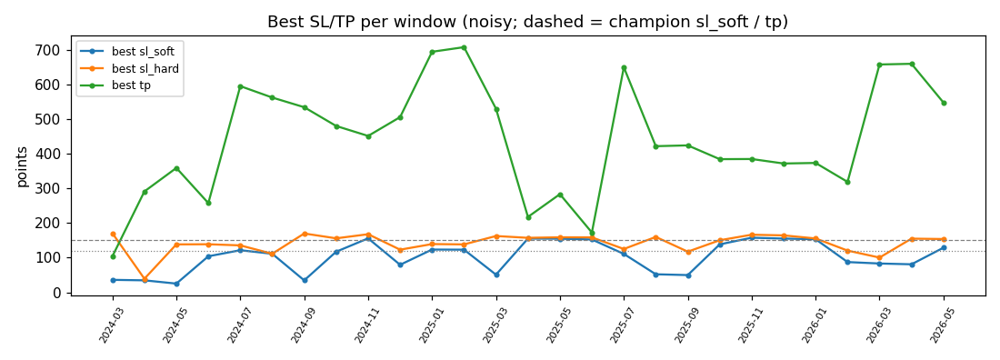
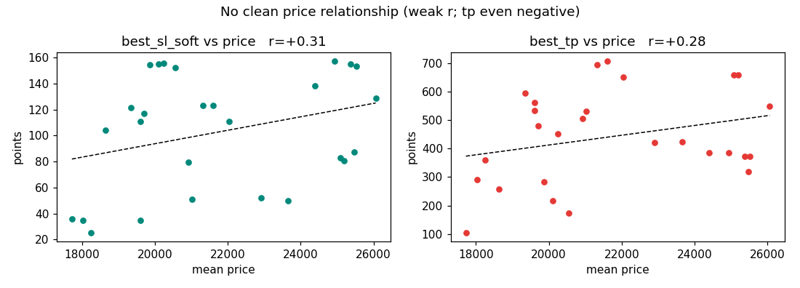
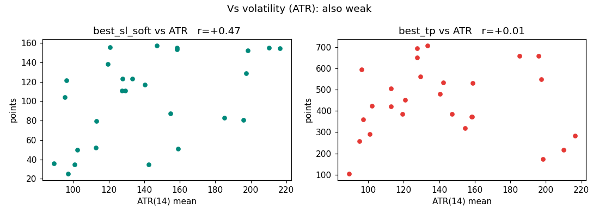
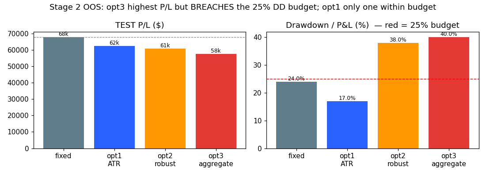

# The Dynamic SL/TP Study — CONSTRAINED re-run (SL ≤ 175, TP ≥ 40)

**What this is:** the same end-to-end study as `STUDY_sub_optimizer.md`, re-run under a **new hard
constraint** — the stop-loss may be **no more than 175 points** and the take-profit **no less than 40
points**. This was motivated by the original study's main flaw: with unconstrained wide bounds the optimiser
found **degenerate** settings (tiny TP ~35 + huge SL ~430–900) that fit noise. The constraint forbids those.
All numbers are the real constrained run (`results/subopt_table_c175_40.csv`, constrained `stage2.py`); charts
in `results/charts_c175_40/`.

> **TL;DR.** Constraining the search **fixed the noise problem** and the data finally behaves like the
> premise: **SL grows with volatility (ATR r = +0.47)** and TP's relation to price flips from −0.30 to
> **+0.28**. Out-of-sample, the **ATR-multiple rule (opt1) is now the clear best dynamic rule** — highest P/L,
> best risk-adjusted, and the only one inside the 25 % drawdown budget. **But it still does not beat the
> fixed champion on raw profit** (−8 %); what it buys is **−33 % drawdown** + higher win-rate. Verdict: opt1
> is now a *credible drawdown-reduction* option; fixed still wins on profit.

---

## 1. The new condition (and exactly how it's applied)
- **SL ≤ 175 points** — interpreted as the **hard stop** line (`sl_hard`, the real max-loss; champion = 167.1).
  Implemented in Stage 1 as `sl_soft ∈ [25, 175]` and `sl_hard = sl_soft + δ ≤ 175`.
- **TP ≥ 40 points** — a floor; `tp ∈ [40, 3×cap]`.
- **For the dynamic rule (Stage 2)** the shared multiplier `m` must keep champion·m inside the limits:
  `m ≤ 175/167.1 = 1.047` (SL cap) and `m ≥ 40/120.2 = 0.333` (TP floor) ⇒ **m ∈ [0.33, 1.05]** (it can shrink
  a lot, but barely widen — SL is already near the cap). Everything else (recipe, data, freeze-once, engine,
  windows, parity) is **identical** to the original study. Parity re-confirmed: `m≡1` = fixed champion $108,748.

> **Baby:** we told the optimiser "your stop can't be wider than 175 and your target can't be smaller than
> 40." That kills the silly "never-stop-out, take-tiny-profits" tricks it was abusing before.

---

## 2. Stage 1 — the relationship IMPROVED once the degenerate optima were banned

**Correlations (best SL/TP vs the predictor) — original → constrained:**

| best vs **price** | orig → con | best vs **ATR (vol)** | orig → con |
|---|:--:|---|:--:|
| sl_soft | +0.26 → **+0.31** | sl_soft | +0.19 → **+0.47** |
| sl_hard | −0.00 → +0.13 | sl_hard | −0.08 → +0.28 |
| tp | **−0.30 → +0.28** | tp | −0.13 → +0.01 |

- **TP vs price flipped from negative to positive (+0.28)** — the tiny-TP degeneracy that caused the wrong
  sign is gone, so TP now (weakly) grows with price as the premise predicts.
- **SL vs ATR is the strongest signal in the whole study (+0.47)** — when the market's range is wider, the
  best stop is wider. That is *exactly* the premise.
- Trades/window rose (median 18 → **24**); no more degenerate windows (TP now 104–707, SL_hard 39–170).

Charts (constrained): `results/charts_c175_40/`

> **Read:** still only *weak-to-moderate* correlations (best ≈ 0.47), so it's a tendency, not a law — but it
> is now **pointing the right way**, unlike the original run.

---

## 3. Stage 2 — three dynamic rules, out-of-sample (TEST 2025-07…2026-05)

| rule | P/L | maxDD | n | win% | DD/PL | ret/DD | vs fixed |
|------|----:|------:|--:|-----:|------:|-------:|---------:|
| **fixed champion** | $67,627 | $16,204 | 122 | 67.2 | 24% | 4.17 | — |
| **opt1 ATR-multiple** | **$62,267** | **$10,791** | 141 | **70.2** | **17%** | **5.77** | −$5,360 |
| opt2 robustified | $60,868 | $23,143 | 126 | 66.7 | 38% | 2.63 | −$6,759 |
| opt3 aggregate | $57,577 | $23,143 | 119 | 65.5 | 40% | 2.49 | −$10,050 |

**With the constraint the verdict is clean** (contrast the original run, where opt3 posted a wild
$111k/50%-DD by clipping to 3× — now impossible):
- **opt1 (ATR-multiple) is the best dynamic rule on every sane axis** — highest P/L, best ret/DD (5.77), and
  the **only one inside the 25 % budget** (17 %). It **cuts drawdown −33 %** ($16.2k→$10.8k) and lifts win-rate
  (+3 pts).
- It **still does not beat fixed on raw P/L** (−8 %). The gain is **risk reduction**, not more profit.
- opt2/opt3 breach the budget (38–40 % DD/PL) and underperform — fitting the (still-noisy) optima doesn't help.

> **Baby verdict:** sizing the stop by recent volatility (opt1) gives a **smoother ride for the same-ish
> money** — about a third less drawdown and a few more winners — but it doesn't make *more* money than the
> simple fixed setting.

---

## 4. Constrained vs original — side by side
| | Original (wide bounds) | **Constrained (SL≤175, TP≥40)** |
|---|---|---|
| Stage-1 degenerate optima | yes (tiny-TP/huge-SL) | **none** |
| best SL vs ATR | +0.19 (noise) | **+0.47** (premise-aligned) |
| best TP vs price | −0.30 (wrong sign) | **+0.28** (right sign) |
| Stage-2 "best P/L" rule | opt3 $111k **but 50 % DD (breaks budget)** | opt1 $62k, 17 % DD (within budget) |
| Honest conclusion | noise; keep fixed | **opt1 a credible drawdown-reducer; fixed still best on profit** |

The constraint is the better way to run this study: it turns a noisy "no signal" into a modest but
**premise-consistent** signal, and yields a dynamic rule that is *safe* (within the drawdown discipline).

---

## 5. Conclusion & recommendation (constrained)
- **The premise gets its first real support** under the constraint: optimal SL widens with volatility/price
  (weak-to-moderate). 
- **opt1 (ATR-multiple)** is the **recommended dynamic rule** *if the objective is lower drawdown* — within
  budget, best risk-adjusted (ret/DD 5.77 vs 4.17), −33 % DD, +3 pt win-rate. **It does not increase profit.**
- **For raw profit, keep the fixed champion** ($67.6k vs opt1's $62.3k).
- **Decision:** if drawdown is the priority → adopt **opt1** (after multi-split re-validation + a
  DD-constrained fit). If profit is the priority → **keep fixed**. Either way, the constraint should be kept
  (it removes the degenerate regime).

### Caveats (unchanged)
Single train/test split; TEST n = 119–141; weak-to-moderate correlations (a tendency, not a law). The shared
multiplier can barely widen SL (cap 1.05) — an independent SL/TP engine extension could test asymmetric
scaling, but the signal is currently too weak to justify it.

---

## 6. Artifacts
- `results/subopt_table_c175_40.csv` (constrained Stage-1 table) · `results/charts_c175_40/*.png`
- Reproduce: `SUBOPT_SL_MAX=175 SUBOPT_TP_MIN=40 python3 optimize/sub/suboptimizer.py --trials 400 --out optimize/sub/results/subopt_table_c175_40.csv`
  then `SUBOPT_SL_MAX=175 SUBOPT_TP_MIN=40 SUBOPT_TABLE=optimize/sub/results/subopt_table_c175_40.csv python3 optimize/sub/stage2.py`
  then the `SUBOPT_*`-env `generate_charts.py` (see header). Original (unconstrained) study unchanged in
  `STUDY_sub_optimizer.md`.
