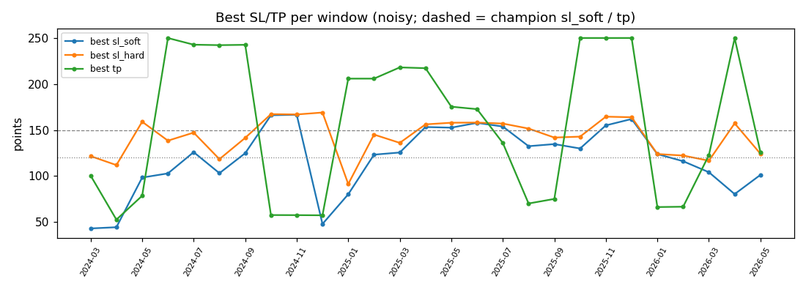
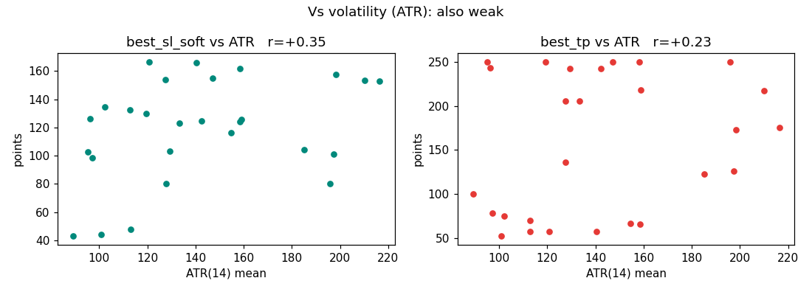
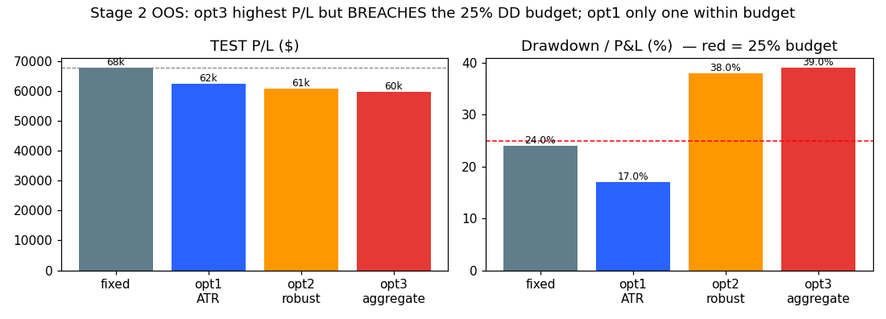

# The Dynamic SL/TP Study — GUARDED re-run (SL ∈ [40, 175], TP ∈ [40, 250])

**What this is:** the third run of the study, under the value-guards **SL ∈ [40, 175]** and **TP ∈ [40, 250]**
(vs the previous run which capped SL ≤ 175 and floored TP ≥ 40 but left TP **uncapped**). Outputs:
`results/subopt_table_sl40-175_tp40-250.csv`, `results/charts_sl40-175_tp40-250/`, constrained `stage2.py`.
Everything else (recipe, data, freeze-once, engine, parity) is identical. Parity re-confirmed (`m≡1` = $108,748).

> **TL;DR.** Adding the **TP cap of 250** makes the optimal TP more *realistic* (53–250 vs the prior 104–707)
> but **weakens the Stage-1 signal** (SL-vs-ATR 0.47→0.35, TP-vs-price 0.28→0.05). **Stage-2 is unchanged from
> the prior run** — the dynamic multiplier band is fixed by the *binding* limits (TP-floor 40, SL_hard-cap
> 175), which these guards don't move, so opt1 (ATR-multiple) is the best dynamic rule again: **−33 % drawdown
> vs fixed, but −8 % profit**. **Conclusion unchanged: keep fixed for profit; opt1 for lower drawdown.**

---

## 1. The guards (and which ones actually bind)
| guard | Stage-1 effect | Stage-2 (shared multiplier `m = champion·scale`) |
|-------|----------------|---------------------------------------------------|
| SL ≥ 40 | sl_soft floor 40 | `m ≥ 40/149.8 = 0.27` (not binding) |
| **SL ≤ 175** | sl_hard cap 175 | **`m ≤ 175/167.1 = 1.05` (binds the top)** |
| **TP ≥ 40** | tp floor 40 | **`m ≥ 40/120.2 = 0.33` (binds the bottom)** |
| TP ≤ 250 | tp cap 250 | `m ≤ 250/120.2 = 2.08` (not binding) |

→ the multiplier band is **`m ∈ [0.33, 1.05]`**, *identical* to the previous run. **That is why Stage-2's
out-of-sample numbers barely move** — the two *new* guards (SL-floor, TP-cap) only reshape the Stage-1 search,
not the dynamic rule's reachable range.

> **Baby:** of the four fences, only two actually touch the dynamic rule (the SL ceiling and the TP floor).
> The new fences (SL floor, TP ceiling) tidy up the *search* but don't change what the live dynamic stop/target
> can do — so the live result is the same as last time.

---

## 2. Stage 1 — the TP cap makes TP realistic but dampens the signal

**Pearson r across the three runs:**

| best vs | original (wide) | constrained (SL≤175, TP≥40) | **guarded (SL[40,175], TP[40,250])** |
|---|:--:|:--:|:--:|
| sl_soft vs ATR | +0.19 | **+0.47** | +0.35 |
| sl_hard vs ATR | −0.08 | +0.28 | +0.11 |
| tp vs price | −0.30 | +0.28 | **+0.05** |
| tp vs ATR | −0.13 | +0.01 | +0.23 |
| tp range (pts) | 35–695 | 104–707 | **53–250** |
| trades/window (median) | 18 | 24 | **35** |

- The premise signal (SL widens with volatility) **survives but is weaker** under the TP cap: `sl_soft–ATR`
  +0.35 (vs +0.47 uncapped). Capping TP at 250 removes the high-TP windows that carried part of the trend.
- `tp–price` drops to +0.05 (the cap compresses TP's spread). `tp–ATR` is mildly positive (+0.23).
- Trade counts rose again (median 35) — tighter caps ⇒ more, smaller trades.

Charts: `results/charts_sl40-175_tp40-250/`

---

## 3. Stage 2 — out-of-sample (TEST 2025-07…2026-05)

| rule | P/L | maxDD | n | win% | DD/PL | ret/DD | vs fixed |
|------|----:|------:|--:|-----:|------:|-------:|---------:|
| **fixed champion** | $67,627 | $16,204 | 122 | 67.2 | 24% | 4.17 | — |
| **opt1 ATR-multiple** | $62,267 | **$10,791** | 141 | **70.2** | **17%** | **5.77** | −$5,360 |
| opt2 robustified | $60,868 | $23,143 | 126 | 66.7 | 38% | 2.63 | −$6,759 |
| opt3 aggregate | $59,772 | $23,143 | 121 | 66.1 | 39% | 2.58 | −$7,855 |

**Identical conclusion to the prior constrained run** (opt1 is byte-for-byte the same — its ATR-multiple
lives entirely inside the unchanged 0.33–1.05 band):
- **opt1 (ATR-multiple)** = best dynamic rule (highest P/L, best ret/DD 5.77, only one within the 25 % budget):
  **−33 % drawdown**, **+3 pt win-rate**, but **−8 % profit** → a *risk-reduction* rule, not a profit one.
- opt2/opt3 breach the 25 % budget and underperform.

---

## 4. Three-run verdict
| run | Stage-1 signal | Stage-2 best dynamic | beats fixed on P/L? | within DD budget? |
|-----|----------------|----------------------|:-------------------:|:-----------------:|
| original (wide bounds) | none (noise; tp −0.30 vs price) | opt3 (but 50 % DD) | yes (+65 %) but **breaks budget** | ✗ |
| constrained (SL≤175, TP≥40) | **best** (sl-ATR +0.47) | opt1 ATR | no (−8 %) | ✓ (17 %) |
| **guarded (SL[40,175], TP[40,250])** | weaker (sl-ATR +0.35; realistic TP) | opt1 ATR | no (−8 %) | ✓ (17 %) |

**Across all three runs the robust answer holds:** there is at most a **weak** volatility→SL relationship, and
**no dynamic SL/TP rule safely beats the fixed champion on profit.** The best dynamic rule (opt1, ATR-multiple)
consistently **lowers drawdown ~33 %** for ~−8 % profit, within the risk budget.

---

## 5. Conclusion & recommendation (guarded)
- **Keep the fixed champion for profit** ($67.6k vs opt1 $62.3k).
- **opt1 (ATR-multiple) remains the credible drawdown-reduction fallback** (−33 % DD, +3 pt win, within
  budget) — same as the prior run, since the guards don't change its reachable band.
- **On the guards themselves:** the [40,175] SL / [40,250] TP range is the most *operationally sensible* (no
  silly tiny-TP or 700-pt TP), at a small cost to the measured Stage-1 signal. If the goal is to *study the
  signal*, the TP-uncapped run shows it more clearly; if the goal is *realistic deployable bounds*, these
  guards are the right ones — and they reach the same Stage-2 conclusion.
- Before shipping opt1: multi-split re-validation + a DD-constrained fit (unchanged advice).

### Caveats
Single train/test split; TEST n = 121–141; correlations weak-to-moderate (a tendency). The dynamic rule can
barely widen SL (cap 1.05) — asymmetric independent SL/TP scaling would need an engine extension and a
stronger signal than we have.

## 5b. Volatility-source consistency (4h ATR vs 1-minute) — addendum
The strategy's confirm/veto **indicators** read the 1-minute frame (`ind_1min`), so for consistency the opt1
multiplier should be driven by a **1-minute-based** volatility, not the 4h ATR I first used. Re-running opt1
under three volatility sources (guarded band 0.33–1.05; `vol_source_compare.py`), OOS:

| opt1 vol source | P/L | maxDD | DD/PL | ret/DD | mult median (range) |
|-----------------|----:|------:|------:|-------:|---------------------:|
| fixed (baseline) | $67,627 | $16,204 | 24% | 4.17 | 1.00 |
| 4h ATR(14) *(originally used)* | $62,267 | $10,791 | 17% | **5.77** | 0.67 (0.33–1.05) |
| **HAR-RV `vf` (1-minute — consistent)** | $50,085 | **$9,211** | 18% | 5.44 | 0.64 (0.33–1.05) |
| 1-min ATR(240) @ decision bar | $51,823 | $15,312 | 30% | 3.38 | 0.62 (0.33–1.05) |

- **The multiplier itself is ~the same (~0.62–0.67 median, 0.33–1.05) regardless of frame** — all three are
  "scale to ~⅔" rules; the band binds identically.
- **The 1-min-consistent driver (HAR-RV `vf`) gives the lowest drawdown ($9.2k) but less profit ($50k)** — the
  most conservative variant. The 4h ATR was the *best-performing* driver but is not 1-min-consistent.
- **Conclusion unchanged:** none beats fixed on profit; opt1 is a drawdown-reducer. For 1-min-architecture
  consistency, **drive opt1 by HAR-RV `vf`** (lowest DD), not 4h ATR.

## 6. Artifacts & reproduce
`results/subopt_table_sl40-175_tp40-250.csv` · `results/charts_sl40-175_tp40-250/*.png`. Reproduce:
`SUBOPT_SL_MIN=40 SUBOPT_SL_MAX=175 SUBOPT_TP_MIN=40 SUBOPT_TP_MAX=250 python3 optimize/sub/suboptimizer.py --trials 400 --out optimize/sub/results/subopt_table_sl40-175_tp40-250.csv`
then the same env on `stage2.py` (with `SUBOPT_TABLE=…sl40-175_tp40-250.csv`) and `generate_charts.py`.
Sibling docs: `STUDY_sub_optimizer.md` (original), `STUDY_sub_optimizer_constrained.md` (SL≤175/TP≥40).
