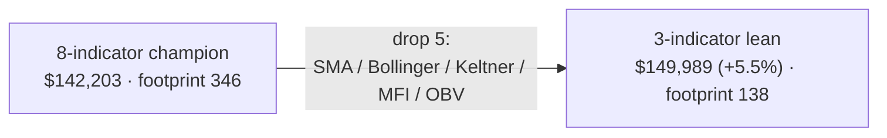

# The Lean Strategy — Playbook
### NQ "Box + 1-Minute-Indicator" system · 4h · **3-indicator** lean variant (cci / order_block / structure_trend)

A complete, shareable description of the **lean** strategy: the 4-hour champion stripped to its three
highest-value indicators. Same engine, same box, same risk knobs as the full 8-indicator champion — just
**five indicators removed**. It trades on **less live data** (a 138-candle warm-up footprint vs 346) and, on
the full research period, actually **earns more**. No insider context required.

> **Headline (4-hour lean, full research period):**
> **net P/L ≈ $149,989 · max drawdown ≈ $15,491 (10.3% of P/L) · 255 trades · 67.8% win · profit factor 1.56.**
> Reproduced **byte-for-byte** by the bundled `backtest.py` ($149,989). Instrument: **NQ** (E-mini Nasdaq-100
> futures), $20 per index point. Single contract. **One historical period (n=1) and a full-period ablation —
> read §9 caveats.**

---

## 1. Why a lean variant exists

The full 4h champion uses **8** indicators. A goal was *fewer indicators, with little or no P/L sacrifice* —
both for simplicity and because each extra indicator needs more past candles before it can vote (more live
data to warm up, more that can go wrong). So we ran an **exhaustive ablation**: all 2⁸ = 256 on/off subsets of
the champion's 8 indicators, scored on the full period.

The standout subset keeps just **three**: **CCI**, **Order Block**, and **Structure Trend** — dropping
Bollinger, Keltner, MFI, OBV, and SMA-trend. On the full research period this lean subset scored
**$149,989 (+5.5%)** vs the 8-indicator champion's $142,203, while cutting the **warm-up footprint from 346
candles to 138** (the longest look-back any enabled indicator needs). Fewer moving parts, less data, more P/L
— on this period.

**Important:** the +5.5% is a **full-period** result; it has **not** been re-validated on walk-forward folds /
out-of-sample. Treat the lean variant as a strong *candidate* (lighter and at least as profitable in-sample),
**not** a proven upgrade over the 8-indicator champion. See §9.

---

## 2. The idea in one paragraph

Each trading day the market defines a **"box"** — reference support/resistance levels from prior
weekly/monthly structure. When price interacts with the box it implies a **direction** (long or short). That
raw signal is then **filtered**: a **volatility gate** (only trade in a calm-enough regime), a small committee
of **three technical indicators** voting **confirm/veto** under a **K-of-N rule**, and a portfolio-level
**drawdown circuit breaker**. Entries are taken on the **4-hour** decision frame; **exits are resolved on the
1-minute frame** with a dual soft/hard stop and a take-profit. The **indicators are computed on the 1-minute
frame** (sampled causally at each 4h decision bar) — the "1-min-trained" regime this champion came from.

---

## 3. Vocabulary (plain)

| Term | Meaning |
|------|---------|
| **Decision frame** | The timeframe whose bars trigger trade decisions. Here = **4h**. |
| **1-minute frame** | The fine frame used to (a) **resolve exits** intrabar and (b) **compute indicator votes**. |
| **Box** | Per-day support/resistance levels (from weekly/monthly structure). The directional trigger. |
| **Volatility gate** | A HAR-RV forecast of volatility; trade only when it's ≤ a percentile threshold. |
| **K-of-N confirm rule** | Of the N enabled confirm-capable indicators, at least **K** must agree to enter. Here K = 1. |
| **Veto** | An indicator can also block an otherwise-valid entry. |
| **Drawdown breaker** | After equity falls `dd_limit` from its peak, halt for `cooldown` trades. |
| **Soft / hard SL** | Two stops: soft (closer, exit on bar close beyond it) and hard (farther, absolute). |
| **Footprint** | The longest look-back (in 1-minute candles) any enabled indicator needs before it can vote. Lean = **138**. |

---

## 4. The decision pipeline (exactly, in order)

For every decision bar (4h):

1. **Box trigger.** From the day's box levels, derive `long` / `short` / `none`. No box interaction → skip.

2. **Volatility gate.** A **HAR-RV** model (from 1-minute returns) forecasts the bar's volatility `vf`. The
   threshold = the **`gate_pct`-th percentile** of in-sample volatility. **Trade only if `vf ≤ threshold`.**
   Bars above are logged `NOENTRY (vol gate)` and never traded.

3. **Indicator committee (K-of-N confirm + veto) — three indicators.** Each enabled indicator votes on the
   **1-minute frame**, sampled at the decision bar's **last closed 1-minute candle** (strictly causal):
   - **Confirm:** entry allowed only if **at least `K = 1`** of the enabled confirm-capable indicators agrees
     with the box direction.
   - **Veto:** an indicator in veto mode that disagrees can **block** the entry (logged `NOENTRY (veto)`).
   - Warm-up: each indicator stays neutral until it has enough 1-minute history (≤ 138 candles here).

4. **Entry.** Box gives a direction, gate passes, K-rule satisfied, no veto → **enter at the decision bar** in
   the box direction (`flip` off).

5. **Exit (resolved on the 1-minute frame).** Three lines are active from entry:
   - **Take-profit (`tp`)** — exit at +`tp` points.
   - **Soft stop (`sl_soft`)** — nearer stop; exit at bar close once breached.
   - **Hard stop (`sl_hard`)** — farther, absolute stop.
   The 1-minute candles after entry are scanned in order; the **first** line touched sets the exit.

6. **Drawdown circuit breaker.** When the running **drawdown ≥ `dd_limit`**, **lock** for `cooldown` candidate
   trades (logged `SKIP`), then unlock, keeping the global high-water mark.

7. **One position at a time, single contract.**

---

## 5. The lean parameters (4h, 1-min-trained)

**Box / risk knobs are identical to the 8-indicator champion** (points are NQ index points; $20 each):

| Param | Value | Meaning |
|-------|------:|---------|
| `sl_soft` | 149.8 | soft stop distance (points) |
| `sl_hard` | 167.1 | hard stop distance (points) |
| `tp` | 120.2 | take-profit distance (points) |
| `gate_pct` | 86.9 | volatility-gate percentile (trade when vf ≤ 86.9th pct) |
| `dd_limit` | 4747 | breaker trips at $4,747 drawdown |
| `cooldown` | 0 | trades halted after a trip |
| `flip` | false | trade the box direction (not reversed) |
| `K` | 1 | at least 1 confirm-capable indicator must agree |

**Indicator committee — only THREE enabled**, tuned on the 1-minute frame:

| Indicator | Tuned params | Role | Look-back |
|-----------|--------------|------|----------:|
| **CCI** | n 138, threshold 35 | momentum / extreme | 138 |
| **Order Block** (SMC) | swing_l 10 | smart-money supply/demand zone | small |
| **Structure Trend** (SMC) | swing_l 6 | market-structure (HH/HL vs LH/LL) bias | small |

**Dropped vs the 8-indicator champion:** SMA-trend (was the 346-candle footprint driver), Bollinger, Keltner,
MFI, OBV. Dropping SMA-trend is what shrinks the footprint **346 → 138** (now CCI is the longest look-back).
The exact machine-readable spec is `champions/lean_4h.json`.



---

## 6. Measured performance (full research period, single contract)

| Metric | 3-ind lean | 8-ind champion | Δ |
|--------|-----------:|---------------:|---|
| Net P/L | **$149,989** | $142,203 | **+5.5%** |
| Max drawdown | $15,491 (**10.3%** of P/L) | $14,082 (9.9%) | +$1,409 |
| Trades taken | 255 (100% of candidates) | 214 | +41 |
| Win rate | 67.8% | 69.2% | −1.4pp |
| Profit factor | 1.56 | 1.67 | −0.11 |
| Avg win / avg loss | +$2,404 / −$3,243 | +$2,404 / −$3,236 | ~= |
| Breaker locks | 72 | 57 | +15 |
| Longest no-entry streak | 35 signals / 14.2 days | 35 / 14.2d | = |
| **Warm-up footprint** | **138 candles** | 346 | **−60%** |

The lean variant trades a bit more (255 vs 214) at a slightly lower win rate and profit factor, but a higher
net P/L and a 60%-smaller data footprint. The ~14-day longest no-entry pause is unchanged — it's a structural
property of the box + gate cadence, not of the indicator set.

---

## 7. How it was found

The 8-indicator champion came from a multi-objective **NSGA-III** evolutionary search (Optuna, ~5,000+ trials,
5-fold walk-forward, objectives = median fold P/L, −worst-fold DD, median win-rate, under a ≤25%-of-P/L
drawdown feasibility constraint). The **lean** variant was then found by an **exhaustive 256-subset ablation**
of that champion's 8 indicators on the full period — `cci + order_block + structure_trend` was the best
small subset. (Ablation = turn indicators off and re-score; it does **not** re-tune the survivors.)

---

## 8. Reproduce it — run the bundled backtester

```bash
pip install -r requirements.txt          # numpy, pandas

python3 backtest.py \
  --decision  NQ_4h.csv \                # decision-frame candles: Date,Open,High,Low,Close
  --minute    NQ_1m.csv \                # 1-minute candles:        Date,Open,High,Low,Close
  --box       NQ_full_data.csv \         # per-day box levels (weekly/monthly level columns)
  --champion  champions/lean_4h.json \   # the LEAN 3-indicator strategy
  --out       trades_lean_4h.csv
```

It prints the summary (P/L, DD, win, PF, …) and writes a per-trade CSV. `--insample-year` (default 2025) sets
which year's bars seed the volatility-gate percentile — set it to your data's first/in-sample year. **This
bundle ships the exact parity-locked research engine**, so its numbers match the canonical system (not an
approximation) — verified here to **$149,989** on the research data.

---

## 9. Honest caveats — read before trading

- **The +5.5% is FULL-PERIOD ablation only.** It has **not** been re-validated on walk-forward folds or
  out-of-sample. The lean variant is a lighter, in-sample-competitive *candidate* — **not** a proven upgrade
  over the 8-indicator champion. Re-run the fold/OOS validation before treating it as better.
- **n = 1.** In-sample-optimised parameters on **one** historical period; a large search overstates live
  expectancy. Research result, not a deployment-ready edge.
- **Single contract, no costs modelled.** Gross of commissions, slippage, financing; idealised $20/pt fills
  (exit at the touched line on 1-minute data).
- **Drawdown is path-dependent** and scales linearly with contracts (~$15.5k worst-case here at 1 contract).
- **Indicator regime matters.** Tuned with indicators on the **1-minute** frame; decision-frame indicators
  will NOT reproduce the result.
- **Box construction is part of the edge** — results depend on the exact `--box` weekly/monthly level file.
- **Selection bias (twice).** The champion is the winner of thousands of trials, and the lean subset is the
  winner of 256 ablations — both selection steps inflate apparent performance.

---

## 10. Files in this bundle

```
backtest.py                standalone CLI runner (calls the real engine)
champions/lean_4h.json     the LEAN 3-indicator strategy preset (full machine-readable spec)
strategy.py engine.py box_lookup.py loader.py volatility.py config.py   the parity-locked engine
indicators/                the indicator library (classic + SMC) + the 1-minute voting layer
optimize/                  timeframes + the box-signal/fast-exit helpers the engine needs
requirements.txt           numpy, pandas
README.md                  quick start
PLAYBOOK.md                this document
```
