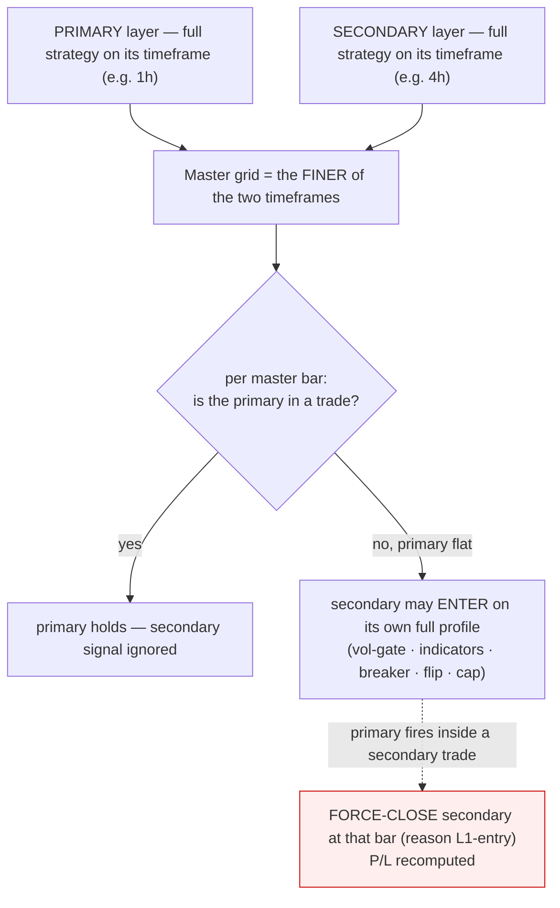

# Multi-Timeframe Layer-Fusion Playbook (primary + secondary, one instrument)

Trade **two timeframes of the same instrument at once**, each with its **own profile**. One timeframe is
the **primary** (it has priority); the other is the **secondary**, which trades only in the primary's idle
windows. One shared account, **1 contract**.

> This bundle ships the **exact parity-locked research engine** and reproduces the numbers below
> **byte-for-byte** (`backtest_mtf.py`) — it is not a re-implementation.

## Results (full research period, 1 contract)

| Instrument | Primary | Secondary | **Combined P/L** | Trades | L1 part | L2 part |
|---|---|---|--:|--:|--:|--:|
| **ES** ($50/pt) | 1h champion | 4h champion | **$71,800** | 264 | $52,185 (210) | $19,615 (54) |
| **NQ** ($20/pt) | 1h champion | 4h champion | **$173,789** | 481 | $99,172 (315) | $74,617 (166) |

Each layer is profitable **alone**. Fusion beats the **best single layer** but is **far below the naive
sum** — see "Why it's not additive" below.

## How the fusion works

The **secondary** is just a full strategy on its own timeframe. It is **eligible to enter only while the
primary holds no position**, and a primary entry that lands inside an open secondary trade **force-closes**
the secondary at that bar (reason `L1-entry`), P/L recomputed honestly. They share one position; the primary
always wins.



**Master grid** = the finer timeframe. The **primary must be finer-or-equal** to the secondary (make your
higher-frequency layer the primary; e.g. 1h primary + 4h secondary).

## Why it's not additive (the key intuition)

The two layers **share one contract**, so combined P/L is `full primary + the slice of secondary trades that
fit in the gaps` — not `primary + secondary`. For ES 1h+4h the 4h secondary's large standalone P/L shrinks to
**$19,615** as a secondary, because most of its trades are **dropped** (primary already holding) or
**force-closed early** (primary fired). You are *eligible* on both timeframes; the primary wins every tie.

## Parameters (what each layer is)

- **Primary** = the instrument's optimized **1h champion**; **Secondary** = its **4h champion** — the
  per-timeframe champions bundled in `optimize/results/wsh4_champions_full{,_ES}.json`; the script loads them
  automatically. NQ's 4h primary uses the frozen lean champion path.
- Each champion carries its full recipe: soft/hard SL, TP, K (min indicator confirms), vol-gate percentile,
  drawdown breaker, cooldown, `flip`, `cap_1min`/`cap_mode` (max-hold), and the enabled indicator set with
  tuned params. They are **not** shared between layers — each timeframe has its own.

## Reproduce it

```bash
pip install -r requirements.txt                 # numpy, pandas
python3 backtest_mtf.py                          # ES 1h+4h  → COMBINED $71,800 (264)
python3 backtest_mtf.py --instrument NQ          # NQ 1h+4h  → COMBINED $173,789 (481)
```

Data is external (the bundle ships code + champions, not the multi-year CSVs) — see `README.md` for the
`WSH_DATA_BASE` / `WSG_DATA_ROOT` env vars. Each run writes the full per-candle log (the single source of
truth) to `<prefix>_mtf_log.csv`.

## Honesty / validity caveats

- **Single shared position, 1 contract** — not two simultaneous positions. The primary preempts the secondary.
- The **primary must be the finer timeframe** (the engine rejects a coarser primary). "4h-primary + 1h-fills-
  gaps" is not supported here.
- These are **full-period, in-sample** numbers on a **~16-month bull sample**, **n=1**, selected across many
  optimizer trials — **no true out-of-sample / walk-forward validation**. Treat as exploratory, not a
  deployable edge. The secondary champions were optimized to run as a *primary* layer, not as residual
  gap-fillers, so their fused contribution is especially exploratory.
