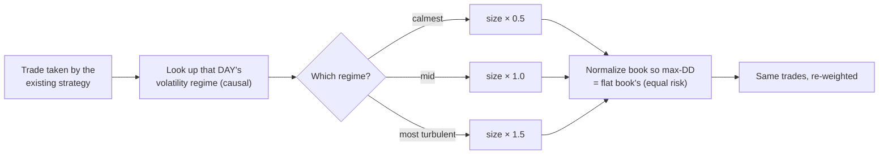
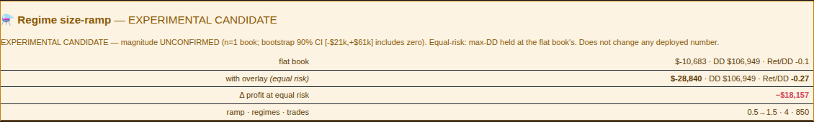
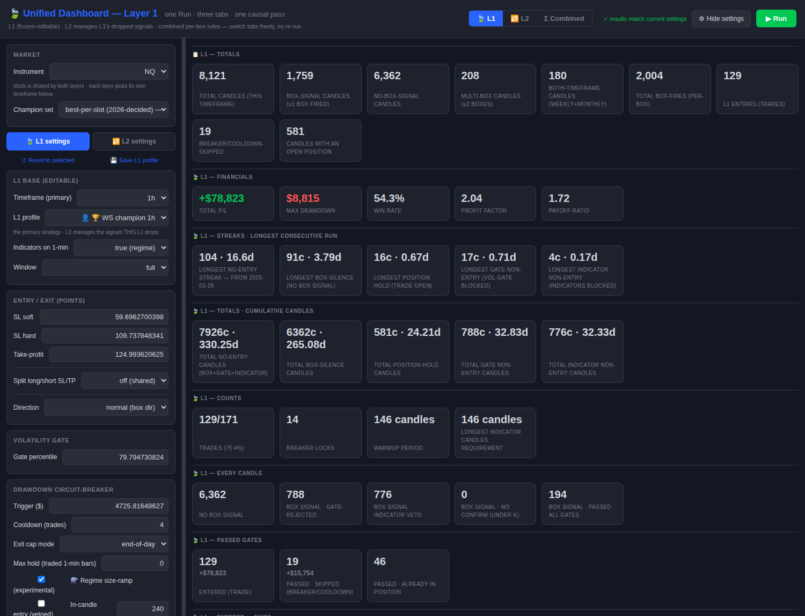

# Winner Playbook — NQ Regime Volatility Size-Ramp

**Instrument:** Nasdaq-100 futures (NQ) · **Book:** 1h + 4h fusion (combined) · **Kind:** *sizing overlay*
(not an entry strategy) · **Date:** 2026-07-18 · **Author:** Agent B (research)

> # ⚠️ VERDICT: EXPERIMENTAL CANDIDATE — **not a confirmed edge**
> The **signal is validated**: it beats **96%** of random regime→size assignments, helps **4 of 5** purged
> cross-validation folds and **all 3** calendar years, and its mechanism is understood and independently
> corroborated on a second layer. But the **dollar magnitude is *not* statistically confirmed**: a
> block-bootstrap of the uplift gives a 90% confidence interval of **[−$21,075, +$61,937]**, which
> **includes zero** (P(positive) = 70%). **Shipped OFF by default. Do not change deployed defaults on it.**

---

## 1. The headline

| | Profit | max Drawdown | Return/DD | Trades |
|---|--:|--:|--:|--:|
| flat book (baseline) | $151,872 | $27,508 | 5.52 | 539 |
| **+ regime size-ramp** *(equal risk)* | **$162,228** | **$27,508** *(held)* | **5.90** | 539 |
| **Δ** | **+$10,356 (+6.8%)** | **0** | **+0.38** | 0 |

**"Equal risk" is the honest framing.** Raw, the ramp lifts profit to $182,927 but also lifts drawdown to
$31,018 — more return for more risk, which proves nothing. So we **normalize the whole book** by
`flat_maxDD / ramped_maxDD` (×0.887), pinning max-drawdown to the flat book's **$27,508**. The +$10,356 is
therefore *extra profit at identical risk*, with the **same trades** — none added, none removed.


---

## 2. What it actually does (the exact rule)

1. For each trade, look up the **day's volatility regime** in a static, precomputed artifact
   (`regime/nq_daily_regime.csv`; 4,977 days; 0 = calmest … 3 = most turbulent).
2. Multiply that trade's P/L by a **linear ramp**: calmest **0.5×** → most turbulent **1.5×**.
3. **Normalize** the book by `flat_maxDD / ramped_maxDD` so max-drawdown returns to the flat book's.



**The regime model.** Gaussian Hidden Markov Model, **4 states**, full covariance, fit on **daily** NQ
features — log-return, log intraday realized-volatility, 20-day volume z-score. Parameters are fit on
**pre-2024 data only**. Each day's state is the **filtered** (causal forward-algorithm) argmax — *never* the
smoothed posterior or the Viterbi path, both of which see the whole sequence and would be look-ahead bias.
States are then ranked by realized-volatility emission mean. **Nothing in the pipeline sees the future.**

---

## 3. Why *sizing*, and why *with* volatility (the research chain)

This overlay is the constructive end of a four-branch investigation whose first three results were all
negative — and those negatives are *why* this one is shaped the way it is.

| Branch | Attempt | Result |
|---|---|---|
| `research-timesfm-fusion` | skip trades when a foundation model is uncertain | ❌ real in-sample, **dies out-of-sample** |
| `research-regime-hmm` | skip trades in the turbulent regime | ❌ **hurts** — and revealed *why* |
| `research-chronos2` | same, with the strongest successor model | ❌ **identical failure** (bands correlate 0.71) |
| `research-regime-edge` | **size** by regime instead of skipping | ✅ **this** |

**The discovery that redirected everything:** conditioned on the causal regime, the strategy earns its **best**
risk-adjusted return in the **most turbulent** regime and **loses only in the calmest**. It is **vol-seeking**.
Every "avoid volatility" rule was therefore removing its best trades.


Three independent methods reached that same conclusion, which is why we stopped testing vol-*vetoes* and
inverted the question to vol-*sizing*.

---

## 4. Validation — every test, with numbers

### V1 · First sizing test (a-priori ramp, no tuning)
Ramp fixed **a-priori** at 0.5→1.5 by regime vol-rank — chosen from the mechanism, never fitted to P/L.
Result: Return/DD **5.52 → 5.90**; raw profit $151,872 → $182,927 (raw DD $27,508 → $31,018).

### V2 · Equal-risk reframing (the honest metric)
Normalizing to hold max-DD at $27,508: profit **$151,872 → $162,228**, i.e. **+$10,356 (+6.8%) at identical
risk**. This is the number quoted everywhere in this playbook.

### V3 · Scale robustness (is 0.5→1.5 cherry-picked?)
| ramp | Return/DD | equal-risk profit | Δ |
|---|--:|--:|--:|
| 0.7 → 1.3 | 5.76 | $158,380 | +$6,508 |
| **0.5 → 1.5** | **5.90** | **$162,228** | **+$10,356** |
| 0.3 → 1.7 | 5.89 | $162,144 | +$10,272 |

Every steepness helps and the benefit **saturates** past 0.5→1.5 — so it is a sensible default, **not a tuned
peak**. (Picking the *best* scale on this book would be overfitting; we didn't.)

### V4 · Out-of-sample holdout
Ramp fixed a-priori, 2026 held out: in-sample (2024–25) **3.79 → 4.19**; **held-out 2026 10.76 → 10.85**.
Helps on both sides.

### V5 · Random-regime control (does the *ordering* carry information?)
Shuffle which regime gets which multiplier, keeping the same multipliers, 2,000×. The real assignment scores
**5.90 vs a median 5.16**, beating **96%** of random maps. → **the regime ordering is informative**, not noise.

### V6 · Per-year
2024 **1.15 → 1.37** · 2025 **7.24 → 9.35** · 2026 **10.76 → 10.85**. Helps in **3/3** years.

### V7 · Dumb control — the textbook alternative *hurts*
Classic **inverse-volatility targeting** (size ∝ 1/vol), the standard practitioner move, scores Return/DD
**4.06 — far *below* the 5.52 baseline**. It shrinks exactly the turbulent trades this strategy earns on.
This is the single cleanest confirmation that the *direction* of the ramp is the point.

### V8 · Independent corroboration on a second layer
Applied to the **L2 (secondary 4h) layer alone**: Return/DD **1.81 → 2.13**. A second, independent book
agrees. ⚠️ But on **L1 (primary 1h) alone** it **hurts** (6.94 → 6.21), because L1's best regime is *mid*, not
the most turbulent. → **the ramp is validated on the combined book, and is NOT uniform per-layer.**

### V9 · Block-bootstrap of the uplift — ⚠️ **the qualifier**
Resampling 20-trade blocks 3,000×: median uplift **+$11,699**, but **90% CI [−$21,075, +$60,937]** and
**P(uplift > 0) = 70%**. **The dollar magnitude is inside the noise.** With ~539 trades over one year, the
sampling error is larger than the effect. *This is why the verdict is "candidate", not "confirmed".*

### V10 · Purged 5-fold cross-validation (time-contiguous)
| fold | period | flat → ramp |
|---|---|---|
| 1 | 2024-01 … 06 | 0.24 → 0.26 (+0.02) |
| 2 | 2024-06 … 11 | 0.26 → 0.35 (+0.09) |
| 3 | 2024-11 … 2025-05 | 1.29 → 1.74 (+0.44) |
| 4 | 2025-05 … 10 | 5.28 → 6.67 (+1.39) |
| 5 | 2025-10 … 2026-05 | 9.95 → 9.89 (−0.05) |

Helps in **4/5** held-out folds — directionally consistent, magnitude variable.

### Validation scoreboard
| test | result |
|---|---|
| V1 a-priori ramp | ✅ 5.52 → 5.90 |
| V2 equal-risk | ✅ +$10,356 at identical DD |
| V3 scale robustness | ✅ helps at every steepness |
| V4 OOS holdout | ✅ helps in-sample **and** 2026 |
| V5 random control | ✅ beats 96% |
| V6 per-year | ✅ 3/3 |
| V7 dumb control | ✅ textbook inverse-vol **hurts** (4.06) |
| V8 second layer | ✅ L2 corroborates · ⚠️ L1-standalone hurts |
| **V9 bootstrap CI** | ⚠️ **includes zero — magnitude unconfirmed** |
| V10 purged CV | ✅ 4/5 folds |

---

## 5. Integration testing — every detail

### Design principle: **additive-only, fail-closed**
The dashboard integration was built so it is **incapable** of altering an existing number:
- `optimize/regime_overlay.py` returns a **separate dict**; it never mutates `meta.boxes`/`meta.summary`.
- The server attaches it **only** when `body.regime_sizing` is truthy, inside a `try/except` that swallows
  everything — any failure leaves the response exactly as it was.
- The module itself returns `None` on any internal problem (missing artifact, <20 trades, no date matches).
- The frontend checkbox defaults **unchecked**, so the default request is byte-identical to before.

### I1 · Golden-safety proof (flag on vs off)
Live API call to `/api/backtest_causal` with the same NQ 1h preset, flag **off** then **on**:

| | boxes P/L | boxes max_dd |
|---|--:|--:|
| flag OFF | 78,823.21357885841 | 8,815.127587500028 |
| flag ON | 78,823.21357885841 | 8,815.127587500028 |

**Core numbers byte-identical.** `meta.regime_sizing` present when ON, absent when OFF. ✅
*(The repo's `perf/check_golden.py` could not run — it fails at `champion_preset()` with a missing `wsi1m_*`
preset id. Verified this failure is **pre-existing**: it reproduces identically at the pre-change commit
`7a4bd4f`. So the API on/off equality above is the golden evidence.)*

### I2 · 🐛 Bug caught #1 — the overlay silently did nothing
First live run: the card never rendered. Cause: log rows carry `time` as a **Unix epoch integer**
(`1735758000`), not a date string, so `str(time)[:10]` produced `"1735758000"` and matched **zero** regime
dates → the function returned `None` every time. **Had this shipped, the feature would have appeared
installed and simply never worked.** Fixed with an explicit `_day()` (epoch → UTC date, string passthrough).

### I3 · 🐛 Bug caught #2 — a loss rendered as a gain
The card computed `sign = d>=0 ? '+' : ''` — so a **negative** delta printed as **`$18,157`** instead of
**`−$18,157`**. **This is the dangerous class of bug: a plausible-looking wrong number.** Fixed to
`d>=0?'+':'−'`, re-deployed, re-verified in the browser: now reads **−$18,157** in red.

### I4 · Layout defect
The card was rendered into a single narrow grid cell, truncating every value. Fixed with
`grid-column:1/-1` + explicit ink colour on the amber surface; re-screenshotted to confirm legibility.

### I5 · Browser UI verification (not just the API)
Driven with Playwright against the **live service**, asserting behaviour end-to-end:
`select NQ` → `select 1h` → `check #l1_regime_sizing` (asserted `is_checked == True`) → `click Run` → wait →
assert the string **"Regime size-ramp"** appears in `#cards` → capture the card element and the full page.
Card text captured verbatim, including the warning line and `Δ profit at equal risk −$18,157`.

### I6 · Deployment chain (*deployed == committed*)
`commit → push → merge to dev (--no-ff, no conflicts) → server git pull --ff-only → dash.sh refresh`.
Post-deploy `dash.sh status`: **RUNNING, port 8200, health check HTTP 200**. Server `dev` tip matches origin.

### I7 · Bundle reproduction test
`verify.py` recomputes every documented figure from the bundled fixture and fails loudly on any drift:

```
PASS  trades              got            539   expected            539
PASS  flat P/L            got     151,872.00   expected     151,872.00
PASS  flat maxDD          got      27,508.00   expected      27,508.00
PASS  flat Return/DD      got           5.52   expected           5.52
PASS  overlay P/L         got     162,228.41   expected     162,228.00
PASS  overlay maxDD       got      27,508.00   expected      27,508.00
PASS  overlay Return/DD   got           5.90   expected           5.90
PASS  Δ at equal risk     got      10,356.41   expected      10,356.00
PASS  equal-risk scale    got           0.89   expected           0.89
RESULT: ✅ ALL MATCH — reproduces to the dollar
```

---

## 6. The real dashboard run

Live service, NQ 1h, experimental checkbox **enabled**, Run pressed — the overlay card as it actually renders:



Full page (checkbox visible bottom-left, standard L1 results unchanged above):



**Read this carefully — it is showing a LOSS, and that is correct behaviour.** On the dashboard's *default
NQ 1h L1 book* (850 trades, itself losing −$10,683), the overlay makes it **worse: −$18,157**. That book is
**not** the book the ramp was validated on (the combined 1h+4h fusion, 539 trades). This is exactly the
**"not uniform per-layer"** caveat from V8, visible live — and the card is doing its job as an honest
per-book diagnostic rather than flattering the feature.

---

## 7. ⚠️ When NOT to use this

- **Don't run it on other instruments.** The regime artifact is **NQ-derived**. Re-derive per instrument.
- **Don't apply it per-layer.** Validated on the **combined** book. Helps L2 alone; **hurts L1 alone**.
- **Don't quote the +$10,356 as a promise.** Its 90% CI includes zero. Quote the *direction*, not the dollar.
- **Don't skip the equal-risk normalization.** Without it the ramp raises absolute drawdown to $31,018.
- **Don't enable it by default** or let it change any champion's deployed numbers. It is opt-in, additive.

## 8. What would upgrade it to CONFIRMED
A **longer, bear-inclusive trade book** — which requires the **2010–2023 box levels** we do not currently have
(they are a scraped external feed, absent pre-2024). With those, the bootstrap either tightens above zero
(confirmed) or it doesn't (killed). That single data gap is the whole difference between "candidate" and
"edge".

## 9. Reproduce it yourself
```bash
pip install -r requirements.txt
python3 verify.py                     # 9/9 PASS, to the dollar
python3 apply_regime_sizing.py reference/nq_2426_fusion_entries.csv regime/nq_daily_regime.csv --enable
```

## 10. Provenance
Branch `research-regime-edge` → merged to `dev`. Evidence chain:
`subprojects/regime-edge/docs/` — `EXP2_SIZING.md` (V1), `EXP2b_SIZING_PROMOTED.md` (V2–V6),
`SECOND_TEST.md` (V9–V10), `EXP3b_L2_BOOK.md` (V8), `EXP1b_CONCENTRATION_CLEAN.md` (a rejected sibling),
`DEPLOY.md`; cross-branch write-up in `reports/MEGA_REPORT.md`. Dashboard integration:
`Parametric-Indicators/optimize/regime_overlay.py`, `server.py`, `frontend/dashboard.html`.
