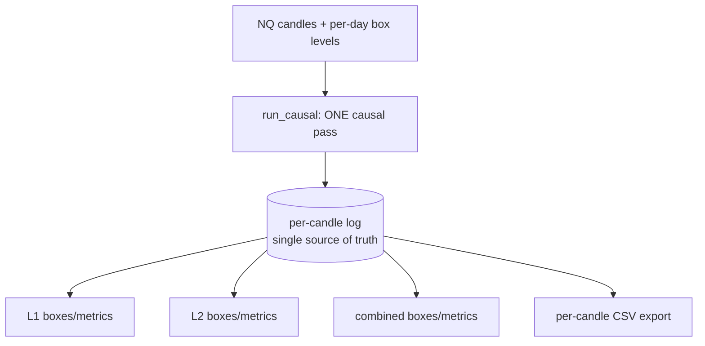
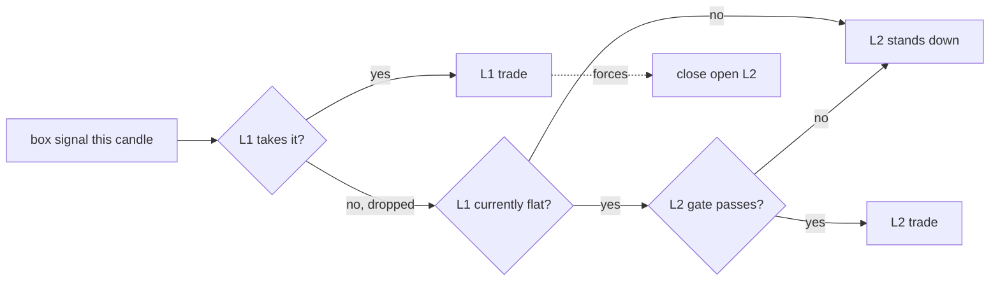
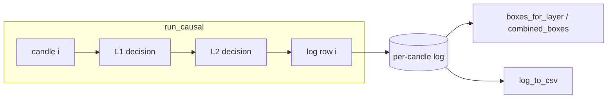

# Two-Layer Causal Backtester — Playbook

The complete NQ box system as **two cooperating layers** sharing one account, computed by a single
**causal pass** that emits one **per-candle log** — the single source of truth every box, chart and
CSV is derived from. This playbook explains the system end to end, in professional terms with a short
*in plain words* note per section.

---

## 1. The system at a glance



| Layer | Net P/L | Trades | Max DD | Win | PF |
|---|--:|--:|--:|--:|--:|
| **L1** frozen lean 4h champion | $149,989 | 255 | $15,491 | 67.8% | 1.56 |
| **L2** manages L1's dropped signals | $78,391 | 80 | $8,961 | 87.5% | 3.97 |
| **Combined** one shared account | $228,380 | 335 | $20,303 | 72.5% | 1.78 |

*In plain words:* one machine reads the chart once, writes down what happened on every candle, and
then we add up that notebook three different ways — just L1, just L2, and both together.

---

## 2. Layer 1 — the primary strategy

L1 is the **frozen lean 4h champion**: the box strategy gated by a volatility filter and a small set
of 1-minute indicators (CCI · Order Block · Structure Trend), with a drawdown circuit-breaker. It is
the proven money-maker and it always has **priority** on the shared 1-contract account.

*In plain words:* L1 is the boss strategy. When it wants to trade, it trades — nobody gets in its way.

---

## 3. Layer 2 — the second-chance layer

Every candle, L1 either takes the box signal or **drops** it (a veto, or the volatility gate blocking
it). Those dropped signals are normally lost opportunity. **L2 picks them up** — but only:

- on signals **L1 dropped** (veto + vol-gate), and
- **only while L1 is flat** (no open L1 trade).

The instant L1 enters a trade, any open L2 position is **force-closed** (L1 owns the account).



*In plain words:* L2 is the understudy. It only plays the parts the boss skipped, and only when the
boss is off-stage. The moment the boss walks on, the understudy steps aside immediately.

---

## 4. The causal log-first model (why the numbers always agree)

Older versions ran the layers in separate passes and reconciled the results afterwards — which is
where drift and disagreements crept in. This system runs **one causal pass** (`run_causal`) that
interleaves L1 and L2 per candle and writes **one log row per candle**. Boxes are then computed
**from that log** (`aggregate.boxes_for_layer` / `aggregate.combined_boxes`). Parity is *by
construction*: there is only one history, so the three views can never disagree.



*In plain words:* one notebook, written once, read three ways. The L1 page, the L2 page and the
combined page are all the same notebook — so they can't contradict each other.

---

## 5. Combined view — the per-box combine rules (NOT uniform)

The combined view is **not** "take the bigger of the two" for everything. Each box combines by its
own correct rule:

| Box(es) | Rule | Why |
|---|---|---|
| P/L, # trades, breaker locks | **SUM** | L1 and L2 trades are disjoint, so totals add |
| max drawdown | **RECOMPUTE** from the merged book (exit-ordered equity) | underwater depth of the *combined* equity ≠ sum of the two DDs |
| win rate, profit factor, exposure | **RECOMPUTE** from the combined trade set | percentages/ratios can't be summed or maxed |
| no-entry streaks, position-hold, box-silence | **MAX(L1, L2)** + producing-layer tag | the longest run across either layer, labeled by who produced it |
| warmup, indicator requirement | **MAX(L1, L2)** + layer tag | the binding warm-up is the larger of the two |
| `*_total` cumulative-candle boxes | **dropped** from combined (kept in the individual views) | summing per-layer totals double-counts shared bars |
| L1-only DD, uplift, DD-not-worse | **guardrails** (kept, additive) | show L2's marginal contribution + that combining didn't worsen L1's DD |

So in the headline run: combined P/L `$228,380` = `$149,989` + `$78,391` (**sum**); combined max DD
`$20,303` is **recomputed** from the merged equity (less than `$15,491 + $8,961`); warmup `357` is
`max(138, 357)` and tagged **L2**.

*In plain words:* money and trade counts add up. Percentages and drawdown have to be recalculated
from scratch on the combined book — you can't just add them. Streaks and warm-up take whichever layer
had the longer one.

---

## 6. Running it

See **README.md** for the quickstart. The short version:

```bash
pip install -r requirements.txt
export WSH_DATA_BASE=/path/to/trading
export WSG_DATA_ROOT=/path/to/trading/data
python3 backtest.py --view all --tf 4h
```

Every run also writes the **per-candle log CSV** (`out_all_log.csv` by default) — open it in a sheet,
filter the `layer` column, and you can audit every single candle's decision: which layer acted, why a
signal was dropped, the running equity and drawdown, and each trade's P/L.

---

## 7. Caveats

- **n = 1.** These are full-research-period numbers, not fold/out-of-sample-validated. Treat them as a
  ceiling, not an expectation.
- **One contract, $20/pt, NQ.** No slippage/commission modelled.
- **Data not bundled.** The package ships the engine + champions; you supply the candle/box CSVs via
  the two environment variables above. Different data → different numbers (that's expected).
