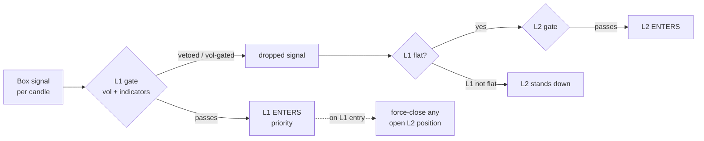

# NQ Two-Layer Causal Backtester (L1 + L2 + combined)

The full **two-layer** NQ box system in one self-contained package. It bundles the EXACT
parity-locked research engine (the causal log-first stack under `optimize/l2/`) and reproduces the
canonical numbers byte-for-byte — this is **not** a re-implementation.

| Layer | What it is | Net P/L | Trades | Max DD | Win | PF |
|---|---|--:|--:|--:|--:|--:|
| **L1** | frozen lean 4h champion (box + 1-min indicators) | **$149,989** | 255 | $15,491 | 67.8% | 1.56 |
| **L2** | manages L1's *dropped* signals while L1 is flat | **$78,391** | 80 | $8,961 | 87.5% | 3.97 |
| **Combined** | one shared account, L1 priority | **$228,380** | 335 | $20,303 | 72.5% | 1.78 |

> NQ, $20/pt, 1 contract, full research period. Combined max DD is **recomputed** from the merged
> book (it is not the sum of the two DDs). **Full-period result — n=1; not yet fold/OOS-validated.**

## How the two layers interact (the oracle)



L1 always has priority on a shared 1-contract account. L2 only acts on the signals **L1 threw away**
(veto + vol-gate) and only while L1 is flat; the instant L1 enters, any open L2 trade is force-closed.

## Run it

```bash
pip install -r requirements.txt          # numpy, pandas

# point the bundled loader at your NQ data (it ships code + champions, not the multi-year CSVs):
export WSH_DATA_BASE=/path/to/trading            # Full_Canldes_Data/<RAW_DIR>/NQ_<tf>.csv + NQ_1m.csv
export WSG_DATA_ROOT=/path/to/trading/data       # full_data/NQ_full_data.csv (per-day box levels)

python3 backtest.py --view all --tf 4h           # prints L1, L2 and combined summaries
python3 backtest.py --view combined --out-prefix run
python3 backtest.py --view l2                     # one layer only
```

Each run writes the **per-candle log** (`<prefix>_<view>_log.csv`) — the single source of truth every
box/metric is derived from (one row per candle, with a `layer` column so L1/L2 separate in a sheet).

### Expected output (acceptance numbers)

```
LAYER 1   P/L $149,989   255 trades   DD $15,491   win 67.8%   PF 1.56
LAYER 2   P/L  $78,391    80 trades   DD  $8,961   win 87.5%   PF 3.97
COMBINED  P/L $228,380   335 trades   DD $20,303   win 72.5%   PF 1.78
```

If your numbers differ, your `WSH_DATA_BASE` / `WSG_DATA_ROOT` are pointing at different data.

## What's inside

- `backtest.py` — the runner (argparse CLI).
- `champions/` — `wsh_lean_4h_champion.json` (L1) · `l2v1_4h_champion.json` (L2 extend).
- `optimize/l2/` — the causal log-first engine: `logbook.run_causal` (one pass → one per-candle log),
  `aggregate` (boxes/CSV derived from the log), `engine` (L2), `l1_runner` (L1).
- `optimize/`, `indicators/`, `config.py`, `engine.py`, `box_lookup.py`, … — the bundled L1 engine stack.

See **`PLAYBOOK.md`** for the full system explanation, the per-box combine rules, and the design.

## Requirements

`python3`, `numpy`, `pandas`. No network, no GPU, no optimizer/optuna dependencies (the one optuna
import in `counterfactual_pause.py` is made lazy in this bundle so the causal path loads clean).
