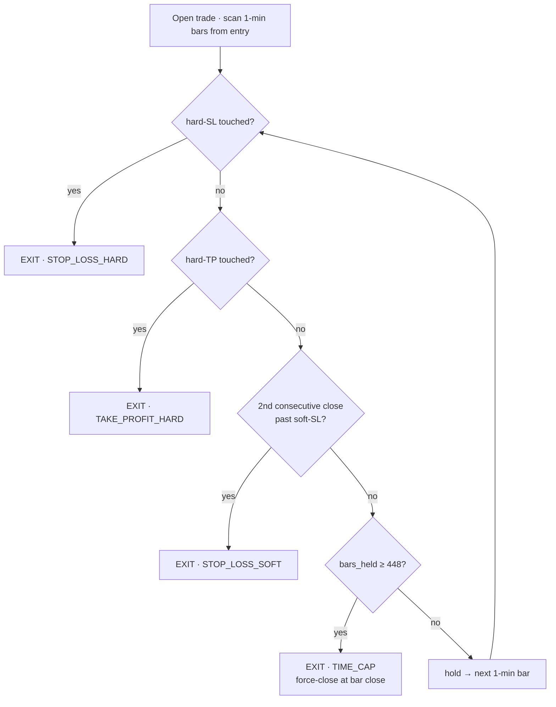
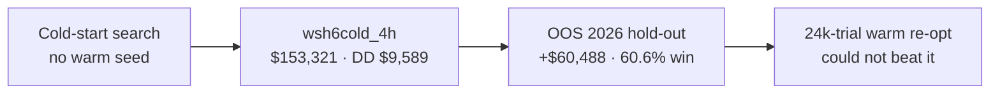

# The wsh6cold Strategy — Playbook
### NQ "Box + 1-Minute-Indicator" system · 4h · **7-indicator** confirm/veto gate + **448-bar time cap**

A complete, shareable description of `wsh6cold_4h` — a 4-hour box-breakout strategy whose entries are
filtered by a **7-indicator committee computed on the 1-minute frame**, and whose trades are force-closed
by a **448-bar max-hold time cap** (`cap_1min=448`, ≈ ~1.5 trading sessions). The cap is not a footnote: it
is the mechanism that keeps the worst-case drawdown to **$9,589** instead of the ~$18.8k the *same*
strategy reaches uncapped. No insider context required.

> **Headline (4-hour, full research period, single contract):**
> **net P/L ≈ $153,321 · max drawdown ≈ $9,589 (6.3% of P/L) · 211 trades · 58.3% win · profit factor 1.99
> · payoff ratio 1.43.**
> Reproduced **byte-for-byte** by the bundled `backtest.py` ($153,321 / $9,589). Instrument: **NQ** (E-mini
> Nasdaq-100 futures), $20 per index point.
> **Out-of-sample 2026 (held out from the search): +$60,488 · DD $8,280 · 60.6% win · PF 2.02 · payoff
> 1.32, n=71.** Read §8 caveats.

---

## 1. What it is, in one paragraph

Each trading day the market defines a **"box"** — reference support/resistance levels from prior
weekly/monthly structure. When price interacts with the box it implies a **direction** (long or short).
That raw signal is **filtered**: a **volatility gate** (only trade in a calm-enough regime), a committee of
**seven technical indicators** voting **confirm/veto** under a **K-of-N rule** (here K = 3), and a
portfolio-level **drawdown circuit breaker**. Entries are taken on the **4-hour** decision frame; **exits
are resolved on the 1-minute frame** with a dual soft/hard stop, a take-profit, and — uniquely — a
**448-one-minute-bar maximum hold** that force-closes any trade that overstays. The **indicators are
computed on the 1-minute frame** (`ind_1min=true`), sampled causally at each 4h decision bar.

---

## 2. Vocabulary (plain)

| Term | Meaning |
|------|---------|
| **Decision frame** | The timeframe whose bars trigger trade decisions. Here = **4h**. |
| **1-minute frame** | The fine frame used to (a) **resolve exits** intrabar, (b) **compute indicator votes**, and (c) **count the time cap**. |
| **Box** | Per-day support/resistance levels (from weekly/monthly structure). The directional trigger. |
| **Volatility gate** | A HAR-RV forecast of volatility; trade only when it's ≤ a percentile threshold. |
| **K-of-N confirm rule** | Of the N enabled confirm-capable indicators, at least **K = 3** must agree to enter. |
| **Veto** | An indicator can also block an otherwise-valid entry. |
| **Drawdown breaker** | After equity falls `dd_limit` from its peak, halt for `cooldown` trades. |
| **Soft / hard SL** | Two stops: soft (closer, exit on 2 consecutive bar closes beyond it) and hard (farther, absolute touch). |
| **Time cap (`cap_1min`)** | Max **traded 1-minute bars** a position may stay open. At the 448th bar it is force-closed at that bar's close as `TIME_CAP`. |

---

## 3. The decision pipeline (exactly, in order)

For every decision bar (4h):

1. **Box trigger.** From the day's box levels, derive `long` / `short` / `none`. No box interaction → skip.

2. **Volatility gate.** A **HAR-RV** model (from 1-minute returns) forecasts the bar's volatility `vf`. The
   threshold = the **`gate_pct = 97.69`-th percentile** of in-sample volatility. **Trade only if
   `vf ≤ threshold`.** (Here the gate is very permissive — it removes only the most violent ~2% of bars.)

3. **Indicator committee (K-of-N confirm + veto) — seven indicators.** Each enabled indicator votes on the
   **1-minute frame**, sampled at the decision bar's **last closed 1-minute candle** (strictly causal):
   - **Confirm:** entry allowed only if **at least `K = 3`** of the enabled confirm-capable indicators agree
     with the box direction.
   - **Veto:** an indicator in veto mode that disagrees can **block** the entry (logged `NOENTRY (veto)`).
   - Warm-up: each indicator stays neutral until it has enough 1-minute history.

4. **Entry.** Box gives a direction, gate passes, K-rule satisfied, no veto → **enter at the decision bar**
   in the box direction (`flip` off).

5. **Exit (resolved on the 1-minute frame).** Four exit lines are active from entry, in strict precedence:
   **hard-SL > hard-TP > soft-SL > 448-bar time cap.** See §5.

6. **Drawdown circuit breaker.** When the running **drawdown ≥ `dd_limit = $1,766`**, **lock** for
   `cooldown = 1` candidate trade (logged `SKIP`), then unlock, keeping the global high-water mark.

7. **One position at a time, single contract.**

---

## 4. The parameters (4h, 1-min-trained)

Points are NQ index points; $20 each.

| Param | Value | Meaning |
|-------|------:|---------|
| `sl_soft` | 123.30 | soft stop distance (points) — 2 consecutive 1-min closes confirm |
| `sl_hard` | 190.45 | hard stop distance (points) — absolute touch |
| `tp` | 230.74 | take-profit distance (points) — touch fill |
| `gate_pct` | 97.69 | volatility-gate percentile (trade when vf ≤ 97.69th pct) |
| `dd_limit` | 1766.21 | breaker trips at $1,766 drawdown |
| `cooldown` | 1 | candidate trades halted after a trip |
| `flip` | false | trade the box direction (not reversed) |
| `K` | 3 | at least 3 confirm-capable indicators must agree |
| **`cap_1min`** | **448** | **max hold in traded 1-min bars (≈ ~1.5 sessions); force-close as `TIME_CAP`** |
| `cap_mode` | bars | time-cap mode (bars = count traded 1-min bars) |
| `ind_1min` | true | indicators read the **1-minute** frame (sampled causally per decision bar) |
| `dd_cap` | 5000 | manual max-drawdown kill-switch goal |
| `pv` | 20 | $ per index point per contract |

---

## 5. The seven indicators and their roles

Computed on the **1-minute** frame (sampled at each 4h decision bar's last-closed minute):

| Indicator | Mode | Tuned params | Role |
|-----------|------|--------------|------|
| **EMA-trend** | confirm | fast 172, slow 362 | trend-direction agreement (fast vs slow EMA) |
| **MACD** | confirm | fast 95, slow 39, signal 98 | momentum / trend-acceleration confirm |
| **OBV** | confirm | slope 128 | volume-flow slope confirm |
| **CCI** | both | n 139, threshold 50 | momentum extreme (confirm + veto) |
| **Bollinger** | veto | n 108, k 4.0 | volatility-band veto (block entries at band extremes) |
| **ADX** | veto | n 38, threshold 17 | trend-strength veto (block weak/choppy regimes) |
| **CISD** | both | — | change-in-state-of-delivery structural confirm/veto (SMC) |

Four of the seven (**EMA-trend, MACD, OBV, CCI**) can satisfy the **K=3 confirm** rule; **Bollinger** and
**ADX** act as **vetoes**; **CISD** does both. All other registry indicators are `enabled:false`. The exact
machine-readable spec is `champions/4h.json`.

---

## 6. Exit precedence and the time cap



The time cap is the **lowest-priority** exit — it only fires when no SL/TP/soft has triggered. On the
research data it is also the **most frequent** exit: **127 of 211 trades** close via `TIME_CAP`. Removing it
(`cap_1min=0`) drops net P/L to **$114,438** and inflates max DD to **$18,755** — i.e. the cap *raises* P/L
**and** roughly halves drawdown. It is the strategy's defining feature.

---

## 7. Measured performance & provenance

**Full research period vs the two segments (single contract):**

| Metric | Full period | 2025 (in-sample) | 2026 (out-of-sample) |
|--------|------------:|-----------------:|---------------------:|
| Net P/L | **$153,321** | $90,513 | **$60,488** |
| Max drawdown | $9,589 (6.3%) | $9,589 | $8,280 |
| Trades | 211 | 139 | 71 |
| Win rate | 58.3% | 56.8% | 60.6% |
| Profit factor | 1.99 | — | 2.02 |
| Payoff (avg win / avg loss) | 1.43 | — | 1.32 |

The 2026 segment was **held out** from the optimizer search. The strategy **earns more per trade and wins
more often out-of-sample** (60.6% vs 56.8%) — the opposite of the usual in-sample-decay pattern, which is
the main reason to take it seriously.

**Provenance (triple-confirmed):**
1. **Discovered** by a **no-warm-start cold-start** optimizer search (hence "cold") — found without seeding
   any prior champion, so it is not a perturbation of an existing winner.
2. **Verified to hold out-of-sample** on the held-out 2026 segment (+$60,488, win-rate *up*).
3. A subsequent **24k-trial warm-started re-optimization** (seeded with this very champion) **could not beat
   it** — the search converged back to it. Found cold, survived OOS, survived a warm re-search.



---

## 8. Honest caveats — read before trading

- **n = 1.** In-sample-optimised parameters on **one** instrument over **one** historical period; a large
  search overstates live expectancy even with a clean OOS segment. Research result, not a deployment edge.
- **Single contract, no costs modelled.** Gross of commissions, slippage, financing; idealised $20/pt fills
  (exit at the touched line / bar close on 1-minute data).
- **Drawdown is path-dependent** and scales linearly with contracts (~$9.6k worst-case here at 1 contract).
- **The time cap is load-bearing.** The edge depends on `cap_1min=448` and on indicators read on the
  **1-minute** frame — decision-frame indicators or no cap will NOT reproduce the result.
- **Box construction is part of the edge** — results depend on the exact `--box` weekly/monthly level file.
- **Selection bias.** This champion is the survivor of a large multi-trial search; selection inflates
  apparent performance even after an OOS check.

---

## 9. Reproduce it — run the bundled backtester

```bash
pip install -r requirements.txt          # numpy, pandas

python3 backtest.py \
  --decision  NQ_4h.csv \                # decision-frame candles: Date,Open,High,Low,Close
  --minute    NQ_1m.csv \                # 1-minute candles:        Date,Open,High,Low,Close
  --box       NQ_full_data.csv \         # per-day box levels (weekly/monthly level columns)
  --champion  champions/4h.json \        # the wsh6cold_4h strategy
  --out       trades_4h.csv
```

It prints the summary (P/L, DD, win, PF, …) and writes a per-trade CSV. `--insample-year` (default 2025)
sets which year's bars seed the volatility-gate percentile. **This bundle ships the exact parity-locked
research engine** (refreshed to the time-cap-aware version), so its numbers match the canonical system
(not an approximation) — verified here to **$153,321 / $9,589 DD** on the research data.

---

## 10. Files in this bundle

```
backtest.py                standalone CLI runner (calls the real engine)
champions/4h.json          the wsh6cold_4h strategy preset (full machine-readable spec, incl. cap_1min=448)
strategy.py engine.py box_lookup.py loader.py volatility.py config.py   the parity-locked engine (time-cap aware)
indicators/                the indicator library (classic + SMC, incl. CISD) + the 1-minute voting layer
optimize/                  timeframes + box-signal/fast-exit helpers + trading_days (time/eod cap support)
requirements.txt           numpy, pandas
README.md                  quick start
PLAYBOOK.md                this document
```
