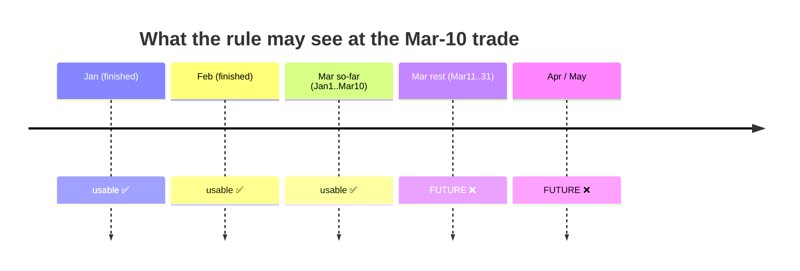
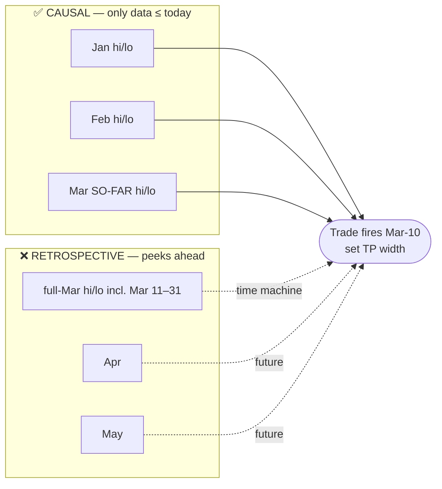

# Decision Q1 — Causal (live) vs Retrospective (analysis-only) ranges

**The one choice that decides whether this can ever become a live rule.** Read the baby version, look at the
picture, pick an option at the bottom.

---

## 👶 Baby version
We want to use "the highest and lowest price of each month/quarter/year" to decide how wide to set our
take-profit. But there's a catch about **time**:

- You only know **"March's high"** *after March is over*.
- If our trade happens on **March 10**, we do **not yet** know the March high — it might happen March 25.
- If we let the rule peek at the full-March high to decide the March-10 trade, we are **cheating with a time
  machine** (using the future). It looks amazing in a backtest and then **fails with real money**. This is
  exactly the mistake that made the earlier "ATR mode" look like +21% when it was really worthless.

So: a rule we can actually trade may only look **backwards** (months that already finished, plus how far this
month has gone *so far*). A "look at the whole finished month" version is fine for *drawing pictures and
understanding the market*, but it can **never** be the live rule.

---

## 🖼️ The picture

**What is "known" at a trade fired on Mar-10:**

**Which inputs each approach feeds to that trade:**

Same idea for quarter/year: a *completed* quarter is fine to use once it's closed; the *current* quarter may
only be used "so far".

---

## The options

| Option | What it means | Pros | Cons |
|---|---|---|---|
| **A. Causal for the rule; retrospective only for charts** *(recommended)* | The live rule uses only completed prior periods + the running current period. We may *also* draw full-period extremes in reports to understand the market, but those never feed a trade. | Deployable; honest; avoids the look-ahead trap; still get pretty explanatory charts. | A little more bookkeeping (must track "so far" extremes). |
| **B. Causal only** | Never even compute full-period extremes; everything strictly backward-looking from day one. | Zero chance of accidental leakage. | Lose the easy "whole-month" visuals that help intuition. |
| **C. Retrospective first** | First characterise the data with full finished-period extremes to find patterns; build the causal/tradeable version later. | Fastest insight; good for "does any pattern exist at all?". | The headline numbers are **not tradeable**; risk of falling in love with a look-ahead result (we've been burned before). |

**Recommendation: A.** It's the only one that can become a real rule, and we still get the explanatory charts
from the retrospective view — clearly labelled "insight only, not tradeable."

> **Why this matters so much:** two expert-council reviews and two studies already showed that *any* dynamic
> SL/TP idea lives or dies on this. A retrospective "edge" is the #1 way these studies fool themselves.

---

## ✅ Your choice
- [ ] A — causal rule + retrospective charts *(recommended)*
- [ ] B — causal only
- [ ] C — retrospective first
- Notes: __________________________________________________
