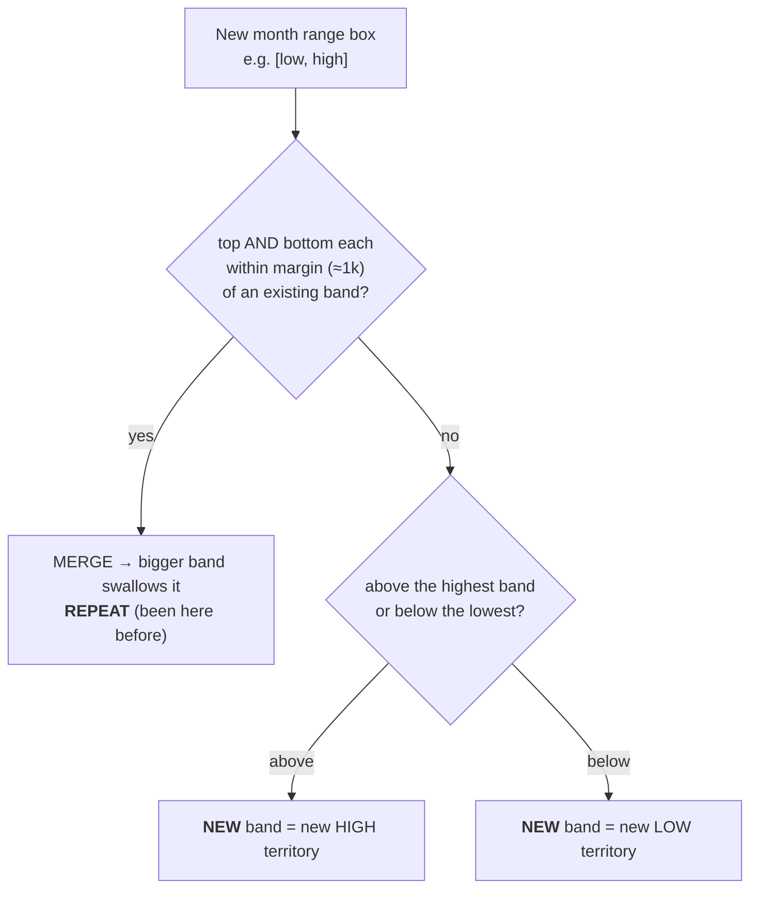
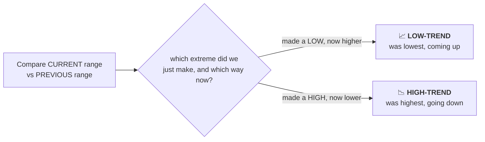

# Decision Q2 — How we define the price RANGE & the REGIME (new/repeat + trend)

Covers proposal points 1–3: per-period high/low, the "combine within 1k" merge, "new vs repeated" range, and
the "high-trend / low-trend" label. Two sub-decisions need your call: **(Q2a) the merge margin** and **(Q2b)
which timeframe drives the regime**.

---

## 👶 Baby version
1. For each **month / quarter / year** we mark the **highest** and **lowest** price → that's a **range box**
   (e.g. "March lived between 18,000 and 20,000").
2. Two boxes that are **almost the same** should count as **one** band. "Almost the same" = their top and
   bottom are each within a **margin** (you proposed **1,000 points**). The bigger box **swallows** the
   smaller. If a box is **further** than the margin → it's a **different** band.
3. The **first** time we see a band → "**NEW**" (we hit fresh territory — a new high or a new low). When a
   later month lands in an already-known band → "**REPEAT**" (we've been here before; doesn't have to be the
   very next month).
4. **Trend (looking backwards):**
   - **LOW-TREND** = we just made a **low** and price is **coming up** (`\_/`).
   - **HIGH-TREND** = we just made a **high** and price is **going down** (`/‾\`).
   The point of all this is to **announce "we just hit a new high / new low"** and which way we're turning.

---

## 🖼️ Picture 1 — monthly high/low bands (illustrative)
The top line = each month's HIGH, bottom line = each month's LOW; the gap between them is that month's band.
Jun pokes above the earlier ceiling → that's a **NEW high** band.

```mermaid
xychart-beta
    title "Monthly high & low — bands and a new-high breakout (illustrative k-points)"
    x-axis [Jan, Feb, Mar, Apr, May, Jun]
    y-axis "NQ price (k)" 16 --> 23
    bar [20.0, 20.8, 20.6, 19.5, 21.0, 22.5]
    bar [18.0, 18.5, 18.2, 17.8, 19.0, 20.5]
```

## 🖼️ Picture 2 — merge / new / repeat decision (the "1k" rule)

Worked example: `A=[18.0,20.0]` & `B=[18.5,20.8]` → tops differ 0.8k, bottoms 0.5k → **within 1k → MERGE**
(union 18.0–20.8). `C=[20.5,22.5]` → >1k above → **NEW high**. `D=[18.2,20.6]` → inside the A/B band → **REPEAT**.

## 🖼️ Picture 3 — the trend label (look back, not forward)

---

## Q2a — the MERGE MARGIN (the "1k")
Context: NQ **median monthly range ≈ 2,002 pts** (min 1,048 / max 4,008); whole 2025–26 span 16,460→29,782.
So **1,000 pts ≈ half a typical month** — a fairly *wide* glue that merges many neighbours.

| Option | Meaning | Effect |
|---|---|---|
| **A. Tunable, start at 1,000** *(recommended)* | Treat the margin as a knob the study sweeps; seed at your 1k. | Lets the data say what tolerance actually separates "new" vs "repeat". |
| **B. Fixed 1,000 pts** | Hard-code exactly 1k. | Simple, but arbitrary; may over-merge. |
| **C. Relative** (% of price, or × the range) | e.g. 5% of price, or 0.5× the period range — scales as price climbs 16k→30k. | More robust across the big uptrend, but one more formula to define. |

## Q2b — which TIMEFRAME drives the regime
Data span = 17 months → **yearly ≈ 2 points** (too few), **quarterly ≈ 6**, **monthly ≈ 17**.

| Option | Meaning | Trade-off |
|---|---|---|
| **A. Monthly primary, quarter/year as context** *(recommended)* | Monthly = the signal; quarter/year = slower confirmation filters. | Most data points + keeps big-picture filters. |
| **B. All three as a hierarchy** | Act only when month & quarter (& year) agree. | Richer, but very few quarterly/yearly points to validate. |
| **C. Monthly only** | Ignore quarter/year for the rule. | Simplest; loses big-picture context. |
| **D. Quarterly primary** | Quarter = signal. | Smoother regime, only ~6 points. |

---

## ✅ Your choices
- **Q2a merge margin:** [ ] A tunable@1000 *(rec)*  [ ] B fixed 1000  [ ] C relative → ______
- **Q2b regime timeframe:** [ ] A monthly+context *(rec)*  [ ] B hierarchy  [ ] C monthly-only  [ ] D quarterly
- **Price source** (assumed): candle **High/Low** (true extremes), not Close — change? ______
- Notes: __________________________________________________
