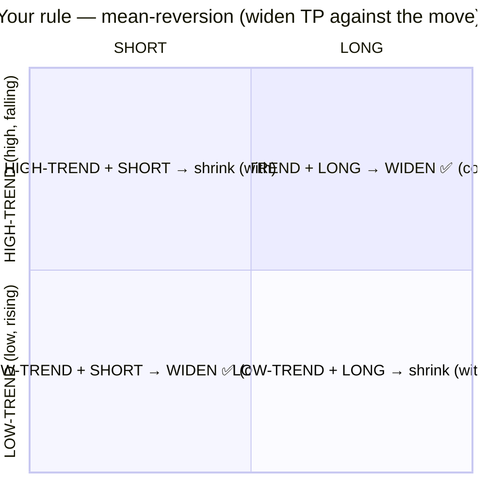
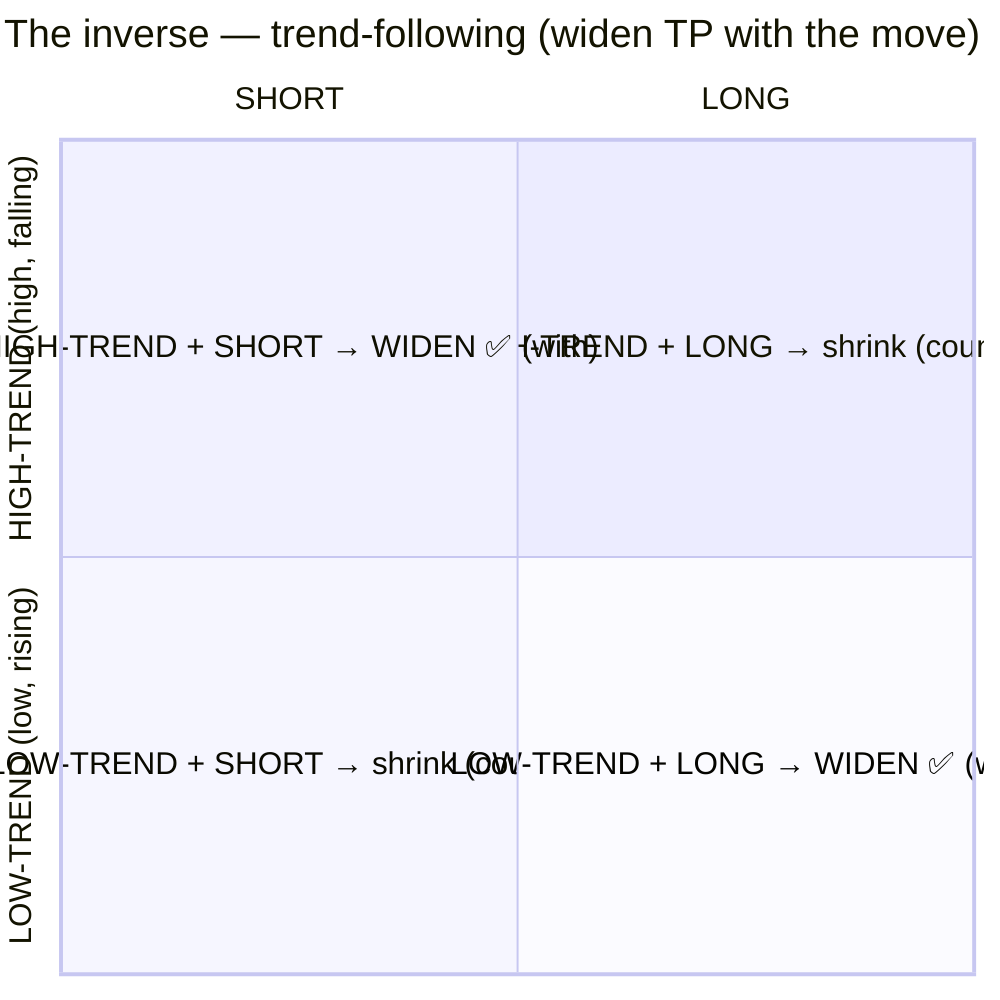

# Decision Q3 — The SL/TP rule (widen/shrink TP, pin-or-move SL, split long/short)

Covers proposal points 4–6: the regime→TP rule, whether SL stays pinned or moves too, and splitting
long-vs-short SL/TP.

---

## 👶 Baby version
Once we know the **regime** (high-trend = made a high & turning down; low-trend = made a low & turning up) and
our **trade direction** (long/short), your rule changes the **take-profit (TP)** width:
- **Widen TP** = "let this one run further before banking."
- **Shrink TP** = "grab the profit quickly."

Your stated rule (let me restate it as a grid so we can sanity-check the logic):

```
                      LONG (buy)              SHORT (sell)
 HIGH-TREND          WIDEN  TP                shrink TP
 (high, falling)     = counter-trend          = with-trend
 LOW-TREND           shrink TP                 WIDEN  TP
 (low, rising)       = with-trend              = counter-trend
```

**Notice the pattern:** you **widen** TP when the trade goes **against** the recent move (counter-trend) and
**shrink** when it goes **with** it. That is a **mean-reversion** bet ("price overshot an extreme, so a trade
betting on the bounce-back has lots of room → let it run"). It's the **opposite** of the usual
"let trend-following winners run." That can be 100% intentional — I just need to confirm it isn't a label mix-up,
because the whole rule flips if it is.

For the **stop-loss (SL)** you said it stays constant "for the human eye," but you want to investigate. And you
asked whether **longs and shorts** should each get their **own** SL/TP.

---

## 🖼️ Picture — the two competing theses
Axes: left→right = SHORT→LONG trade; bottom→top = LOW-TREND→HIGH-TREND regime. Each quadrant = one
(regime × direction) cell and what it does to TP.

**Your rule (mean-reversion): counter-trend → WIDEN, with-trend → shrink**



**The inverse (trend-following): with-trend → WIDEN, counter-trend → shrink**



We don't have to guess which is right — we can **test both** and let the data pick.

---

## Q3a — rule direction
| Option | Meaning |
|---|---|
| **A. Confirm as written, AND test the inverse** *(recommended)* | Use your mean-reversion grid as the hypothesis, but also run the trend-following inverse; deploy whichever wins out-of-sample. |
| **B. Exactly as written (mean-reversion), tune magnitudes only** | Lock the grid; only optimise *how much* to widen/shrink. |
| **C. I meant the opposite (trend-following)** | Flip the grid (with-trend widens). |

## Q3b — the stop-loss (SL)
| Option | Meaning |
|---|---|
| **A. Study both: pinned-SL vs SL-also-dynamic** *(recommended)* | First keep SL fixed and only move TP (clean test of your idea); then also test moving SL by regime; compare. |
| **B. Pin SL, only TP moves** | SL always fixed; only TP reacts to regime. Simplest. |
| **C. Both dynamic from the start** | SL and TP both react to regime. Most flexible, most overfit risk. |

## Q3c — split long vs short SL/TP (point 5)
> ⚠️ **Needs an engine change.** Today one SL/TP set serves both directions (the engine mirrors it under
> flip); separate long-SL/long-TP/short-SL/short-TP is a real (small) extension. So this is a *sequencing*
> question, not free.

| Option | Meaning |
|---|---|
| **A. Shared first, split later if it helps** *(recommended)* | Prove the regime→TP idea with one shared SL/TP; only build the long/short split if the shared version shows promise. |
| **B. Split from the start** | Build the engine extension now; optimise long and short SL/TP independently. |
| **C. Never split** | Keep one shared set. |

---

## 🎯 The ultimate goal (point 6) & how we'll judge it
Make SL/TP **react to price regime** — but it only ships if, **out-of-sample**, it beats the fixed champion on
**return ÷ drawdown** (not raw P/L), under the causal rule from Q1. Otherwise the fixed champion stays. (This is
the same bar the councils set; it's why we treat this as a *research study* first, deployment second.)

---

## ✅ Your choices
- **Q3a direction:** [ ] A confirm+test inverse *(rec)*  [ ] B mean-reversion only  [ ] C flip to trend-following
- **Q3b SL:** [ ] A study both *(rec)*  [ ] B pin SL  [ ] C both dynamic
- **Q3c split L/S:** [ ] A shared-first *(rec)*  [ ] B split now  [ ] C never
- Notes: __________________________________________________
