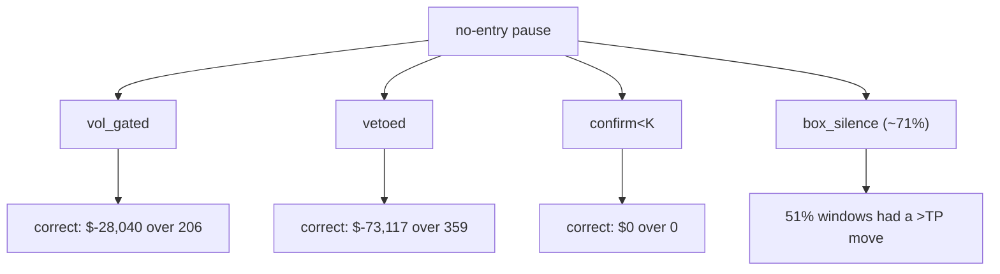

# Counterfactual pause attribution — 4h champion

Read-only. Each blocked box signal simulated as an ISOLATED trade with the champion's exact SL/TP exit (reused `fast_backtest`). Benchmark = champion avg trade **$665** over 214 trades. Displacement horizon = **2 bars** (median real-trade hold).

## Per-filter ledger

| filter | blocked n | win% | avg P/L | total P/L | verdict |
|---|--:|--:|--:|--:|---|
| vol_gated | 206 | 55.3% | $-136 | $-28,040 | correctly filtering (accept the pause) |
| vetoed | 359 | 53.8% | $-204 | $-73,117 | correctly filtering (accept the pause) |
| confirm<K | 0 | 0.0% | $0 | $0 | n/a (no blocked signals) |

## Box-silence (no signal — cannot simulate a trade)

- silent entry bars: **1290** · median MFE 75 pts · median MAE 88 pts
- fraction whose max move exceeded the champion TP (120 pts): **51.5%** (a real directional move was available there).

## Verdict ledger

## A note on `confirm<K = 0` (vs the old `diagnose_pause`)

`diagnose_pause.py` reported confirm<K ≈ 22% of the longest gap (369 bars full-period). That used a
**same-bar** pairing — the box signal, vol gate, veto and confirm masks all read at the same index `i`. The
**engine** (and so this study) pairs the box signal at bar `idx-1` with the gate at the entry bar `idx`
(`fast_backtest`: `raw = sig[idx-1]`, gated by `gate[idx]`). Under the **engine-faithful** pairing,
`would_enter` reproduces the champion's real entries exactly (every taken trade is a `would_enter`; the only
extras are overlap-suppressed signals), and **confirm<K collapses to 0**: whenever the gate blocks for a
confirmation reason (vol OK), an indicator is actively **vetoing** — there is no "all-neutral, too-few-
confirmers" case. So confirmation-blocking is **100% veto-driven**, not a K-threshold problem. (The 369
same-bar figure is an artifact of the off-by-one mis-pairing.)

## Conclusion

**The no-entry pause does NOT cost money — the filters that cause it are saving money.**

- **vol gate** blocked 206 would-be trades that net **−$28,040** (avg −$136, 55% "win" but losers on average).
  Relaxing it adds losers. **Correctly filtering.**
- **veto** blocked 359 would-be trades that net **−$73,117** (avg −$204). The veto is the single biggest
  money-saver in the system. Relaxing it would be the most destructive change available. **Correctly filtering.**
- **confirm<K** is a non-issue (0 bars under the faithful pairing) — nothing to relax.
- **box-silence (71%, the dominant cause)**: 1,290 silent entry bars. Over the next 2 bars (median hold),
  median MFE 75 pts vs median MAE **88 pts** — adverse excursion is *larger* than favorable, and the champion
  TP is 120 pts. 51.5% of windows saw *some* move exceed TP, but that counts **either** direction
  (`max(MFE,MAE) ≥ TP`) — and with MAE ≥ MFE the moves are roughly **symmetric with a slight adverse tilt**.
  There is no free directional edge to harvest: capturing these would require a brand-new directional trigger,
  and the displacement profile says the silent windows are **not** obviously profitable.

**Recommended lever: ACCEPT the pause.** Every simulable filter (vol gate, veto) is correctly avoiding losing
trades — the α verdict (11.5-day pause is structural) plus this counterfactual jointly say the pause is the
strategy *working*, not a defect. The only remaining lever is a new box-entry trigger for the silent windows,
which the data does **not** endorse (symmetric, adverse-tilted moves; no edge without a directional signal).
If pursued later it is a speculative research bet, not a fix — and should be gated on finding a *directional*
predictor for silent windows, not just "price moved."

**Not pursued (consistent with this verdict):** the Approach-B system-relaxation sweep (no filter is
over-filtering, so there is nothing to relax) and the box-trigger redesign (no demonstrated edge).

