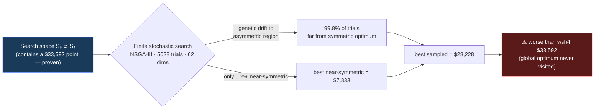
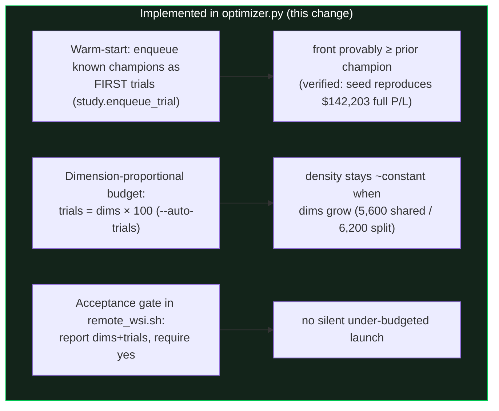
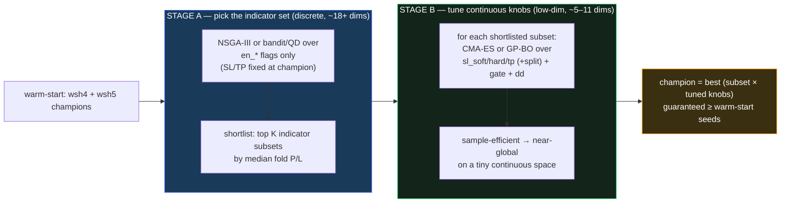
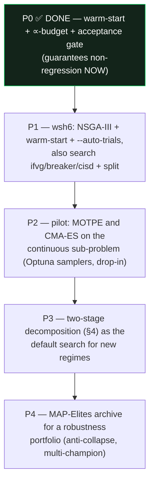

# Optimizer algorithms — escaping the "bigger space → worse result" trap

**Why this exists:** wsh5 (split SL/TP) searched a *superset* of wsh4's space yet returned a *worse* champion,
because NSGA-III is a **finite-budget, population-based genetic** search — it returns the best point it *sampled*,
not the set maximum (full proof: `REPORT_optimizer_superset_paradox_and_system_breakdown.md`). Two mitigations
are now **implemented** (warm-start + dimension-proportional budget). This report surveys *algorithm* changes
that structurally reduce the failure and recommends a staged plan.

## 1. The failure mode (one picture)

Root cause = **density**: dimensions ↑ (volume ↑ exponentially) while trials stayed flat (even dropped). Any
finite optimizer degrades as density falls; genetic samplers also **collapse toward one basin**, starving others.

## 2. What's already implemented (mitigations, not new algorithms)

These guarantee **non-regression** and **right-sized budget**, but NSGA-III is still the engine. The rest of this
report is about *replacing or augmenting the engine* so it explores high-dim mixed spaces better.

## 3. Candidate algorithms for THIS problem

Our problem is hard in a specific way — **mixed** variables (continuous SL/TP + categorical indicator on/off +
their params), **multi-objective** (median P/L, −DD, win), **expensive** per eval (1-min indicators × 5 folds),
**deceptive** (many indicator combos look similar; the optimum is a narrow basin), **~52–62 dimensions**.

| Algorithm | Type | Multi-obj | Mixed vars | Sample-eff. | Scales to ~60d | Avoids basin-collapse | Fit for us |
|---|---|:--:|:--:|:--:|:--:|:--:|---|
| **NSGA-III** (current) | Genetic / EA | ✅ native | ✅ | low | ✅ | ✗ (collapses) | baseline; keep w/ mitigations |
| **TPE / MOTPE** | Bayesian (kernel density) | ✅ (MOTPE) | ✅ | medium | ⚠ degrades | partial | good ≤~30d; pairs well w/ stage-2 |
| **CMA-ES** | Evolution strategy | ✗ (scalarize) | ✗ continuous-only | medium-high | ✅ (continuous) | partial (restarts) | **ideal for the continuous sub-problem** |
| **GP-BO (BoTorch, qEHVI)** | Gaussian-process Bayesian | ✅ (qEHVI) | ⚠ (one-hot) | **high** | ✗ (≤~20–50d, costly) | ✅ (acquisition) | **best once dims are reduced** |
| **MAP-Elites / QD** | Quality-Diversity | ✅ (as behavior axes) | ✅ | medium | ✅ | ✅✅ (archive by niche) | **directly anti-collapse; gives a portfolio** |
| **Two-stage decomposition** | hybrid | ✅ | ✅ | **high** | ✅ | ✅ | **recommended** (see §4) |
| Hyperband / ASHA | budget scheduler | n/a | n/a | n/a | n/a | n/a | already approximated by fold pruning |

Notes that matter here:
- **GP-BO and TPE are far more sample-efficient than genetic search in moderate dims** — but both degrade past
  ~30–50 dims and dislike many categoricals. They shine *after* the dimension count is cut.
- **CMA-ES** is the gold standard for **continuous** optimization but does not handle the categorical
  indicator on/off flags — so it fits the *SL/TP + box* sub-problem, not the whole thing.
- **MAP-Elites (Quality-Diversity)** keeps an **archive of the best solution per "niche"** (e.g. binned by
  drawdown and by #indicators). It cannot collapse into one basin because it is *rewarded for diversity* — this
  is the most direct structural answer to "won't go in this trap again," and it yields a *portfolio* of champions
  (low-DD, high-return, few-indicator, …) instead of one point.

## 4. Recommended path — **two-stage decomposition** (cuts dimensions, then optimizes hard)

The single highest-leverage change: stop optimizing 62 mixed dimensions at once. Split the problem so each stage
is in a regime where a strong sampler works.

Why it works: Stage B optimizes only ~5–11 **continuous** dimensions — exactly where CMA-ES/GP-BO get close to
the global optimum with few evaluations. Stage A's discrete search is also easier with SL/TP held fixed. The
dimensionality that broke wsh5 never appears in a single search.

## 5. Staged recommendation (lowest risk → highest reward)

- **P0 (done):** can't regress; budget scales with dimensions; nothing launches without a reported, accepted plan.
- **P1 (next run):** wsh6 inherits warm-start + `--auto-trials` automatically (one flag); cheapest real test.
- **P2:** Optuna ships `TPESampler`, `CmaEsSampler`, and `BoTorchSampler` — drop-in `sampler=` swaps, so a pilot
  is low-effort. Scalarize the 3 objectives (or use MOTPE/qEHVI) for the continuous sub-problem.
- **P3/P4:** structural wins; more engineering, but they make "bigger space → worse" essentially impossible.

## 6. Bottom line
- The trap was **search-budget/density**, not the space. **Warm-start + dimension-proportional trials (now
  implemented) already guarantee equal-or-better**, and are enough for the immediate next run.
- For a *structural* fix, **decompose** (discrete indicator-selection → continuous CMA-ES/GP-BO tuning) and/or
  adopt **MAP-Elites** for an anti-collapse portfolio. Both are staged experiments, not a rewrite — NSGA-III
  remains a valid baseline and the warm-start makes every variant safe to trial.
