# Why more search dimensions gave a WORSE result — proof, mechanism, and full system breakdown

**Question (verbatim intent):** *"We are searching the whole parameter space. The wsh5 space is wsh4's space
PLUS the split long/short SL/TP. A superset can only do **equal or better** — so how did wsh5 return a WORSE
champion ($28,228) than wsh4 ($33,592)? With the same data it should at least numerically match the old best."*

This is a **correct and important** intuition — and the resolution is precise, provable, and already verified
on the live studies. Short version:

> **Your superset reasoning is right about the *space*, but not about the *search*. The wsh4 champion
> provably lives inside wsh5's space (it scores the same $33,592 there — measured below). NSGA-III is a
> finite-budget *stochastic* optimizer, NOT an exhaustive search. Adding 6 continuous dimensions expanded the
> search VOLUME while the trial budget stayed the same (actually fewer: 5028 vs 5483), so the same effort was
> spread thinner. The genetic search drifted into the asymmetric region and spent only 0.2 % of its trials
> near the symmetric point where wsh4's optimum sits — so it never re-found it.**

The fix is mechanical (warm-start the next run with the known champion) and is spelled out in §6.

---

## 1. The paradox, stated precisely

Let **S₄** = wsh4 search space (shared SL/TP) and **S₅** = wsh5 search space (= S₄ **plus** `long_*`/`short_*`).
Setting `long = short = shared` inside S₅ reproduces every point of S₄, so **S₄ ⊂ S₅** — S₅ is a genuine superset.

For the *global optimum* the intuition holds: `max over S₅ ≥ max over S₄`. **But an optimizer does not return the
global optimum** — it returns the *best point it sampled* within a finite budget. NSGA-III (the sampler here,
`optimizer.py:205`) is a population-based **genetic** algorithm: it samples ~5000 points guided by evolutionary
selection. There is **no guarantee** it visits the global optimum, and **no guarantee** that a run on a bigger
space visits as good a point as a run on a smaller space. The theorem `max(S₅) ≥ max(S₄)` is about the *sets*;
the optimizer compares *samples*, and `best_sample(S₅, 5028 trials) ≥ best_sample(S₄, 5483 trials)` is **false**
in general — exactly what we observe.

---

## 2. Empirical proof (measured on the live wsh4 / wsh5 studies, AMD-server Postgres)

### 2.1 The wsh4 champion IS a point inside wsh5's space — and scores the same there
I took wsh4's champion parameters and re-evaluated them through the **split** engine with `long = short = shared`
(the exact code path wsh5 trials use), using the optimizer's own `score_walkforward`:

```
shared-form medianPnL          = 33591.5   (== stored wsh4 champion 33591.5)
split-form (long==short==shared) = 33591.5   IDENTICAL
⇒ wsh4's champion is a literal point in wsh5's search space scoring $33,592.
```

So S₅ provably **contains** a $33,592 configuration. The space is not the problem.

### 2.2 wsh5's search never sampled anything that good
Scanning **all 5028 completed wsh5 trials** (feasible *and* infeasible) for the best median fold P/L:

```
wsh5 best-ever medianPnL over ALL complete trials (any feasibility) = 28,228
wsh4 best-ever medianPnL over ALL complete trials                   = 33,592
```

wsh5's single best point — ignoring the DD constraint entirely — is **$28,228**. The optimizer never visited
*any* point matching wsh4's $33,592, even though one exists in its space. This is a **sampling miss**, not a
space deficiency.

### 2.3 Why it missed: it barely explored the symmetric region
Classifying wsh5 trials by long↔short asymmetry (sum of |long−short| over soft/hard/TP < 30 pts ≈ "near-symmetric"):

```
near-symmetric completed trials : 11 / 5028   (0.2 %)
best medianPnL among them       : 7,833
```

The 6 new dimensions invited the genetic search to explore asymmetric long/short combinations; **99.8 % of the
budget went there**, and the tiny 0.2 % that stayed near-symmetric happened to land on poor indicator/box combos
(best $7,833). The region of S₅ that equals S₄ — where the $33,592 optimum lives — was effectively starved.

### 2.4 Dimensionality + budget made it worse, not better
| | wsh4 (shared) | wsh5 (split) |
|---|--:|--:|
| Search dimensions (run-time, 15 indicators) | **52** | **58** (+6 split) |
| Completed trials | **5,483** | 5,028 |
| Champion median fold P/L | **$33,592** | $28,228 |
| Best-ever median P/L (any feasibility) | $33,592 | $28,228 |

(Counts: base 5 continuous + 1 categorical + 2 integer = 8; +15 indicator on/off flags; +29 indicator params =
52. Split adds 6 continuous = 58. The *current* codebase searches 18 indicators ⇒ 56 / 62 with split — wsh5 ran
before the ifvg/breaker/cisd votes were wired.) wsh5 explored a **bigger** space with **fewer** trials → lower
sampling density → a worse best-found point. This is the curse of dimensionality acting on a fixed budget.

**Conclusion:** there is no contradiction and no bug. The result is the expected behaviour of a finite,
stochastic, multi-objective optimizer on an enlarged space. The deployed wsh4 champion remains the best known
configuration; the wsh5 split champion is kept only as a lower-return / lower-drawdown *alternative* profile.

---

## 3. The two best-known configurations, side by side (your "best previous values")

### wsh4 — DEPLOYED champion (shared SL/TP) — the best known strategy
- **Selection metrics:** median fold P/L **$33,592** · worst fold DD $13,925 · win 71.1 % · full P/L **$142,229**
  · full DD $14,075 (9.9 %).
- **Box/risk:** sl_soft `149.8` · sl_hard `167.1` · tp `120.2` · gate_pct `86.9` · dd_limit `$4,747` · cooldown
  `0` · flip `False` · K `1`.
- **Indicators (8):** bollinger(45, k4.3) · cci(138, thr35) · keltner(40, m5.0) · mfi(39/26/87) · obv(slope18) ·
  order_block(swing_l10) · sma_trend(346/339) · structure_trend(swing_l6).
- Dashboard profile: **`⏱ WS-I 4h · 1-min-trained`** (id `wsi1m_4h`). Source `optimize/results/wsh4_champions_full.json`.

### wsh5 — split long/short SL/TP champion (NEW alternative, not deployed)
- **Selection metrics:** median fold P/L $28,228 · worst fold DD **$6,162** · win **86.5 %** · full P/L $88,993
  · full DD $12,594 (14.2 %).
- **Shared base:** 80.3 / 106.2 / 70 · **Long:** 151.6 / 171.6 / 37.6 · **Short:** 113.6 / 253.4 / 116.5 ·
  gate 72 · dd_limit `$574` · cooldown 0 · K 2. 8 indicators (sma_trend, vwap, keltner, obv, bollinger, adx,
  order_block, fvg).
- Dashboard profile: **`⚖ WS split 4h · long/short SL/TP`** (id `wsh5split_4h`). Source
  `optimize/results/wsh5_4h_split_champion.json`. See `REPORT_wsh5_4h_split_champion.md`.

It trades **−16 % median / −37 % full return** for **≈ half** the worst drawdown and a higher win-rate — a
different point on the risk curve, not a strict improvement.

---

## 4. FULL SYSTEM BREAKDOWN — every block: INPUTS · INNER LAYERS · OUTPUTS (with file:line)

The pipeline is a chain of pure-ish transforms. Data is loaded once; signals/indicators are precomputed;
the engine turns gated signals into trades; metrics → walk-forward folds → 3 objectives → NSGA-III → feasible
Pareto front → champion → dashboard profile.

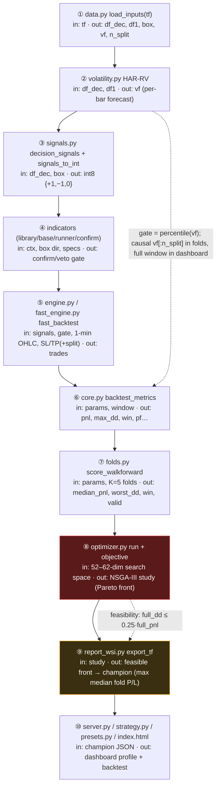

> Block ⑧ (NSGA-III) is where the paradox lives — a finite stochastic search whose returned front depends on the
> random trajectory and the space size. Everything upstream is deterministic given the params.

### BLOCK 1 — Data loading · `optimize/data.py::load_inputs(tf)` (≈ L46–54)

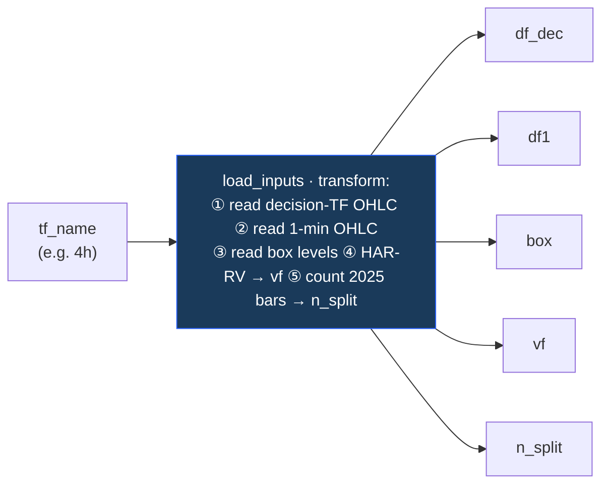
- **Inputs:** `tf_name` (e.g. "4h").
- **Inner layers:** ① load decision-frame OHLC `Full_Canldes_Data/NQ_<tf>.csv`; ② load shared 1-minute OHLC
  `NQ_1m.csv`; ③ load box levels (`data/full_data/NQ_full_data.csv`, indexed by Date); ④ compute HAR-RV forecast
  `vf` (Block 2); ⑤ compute `n_split` = # of decision bars in segment-1 (2025) — the causal boundary.
- **Outputs:** `df_dec, df1, box, vf (np.ndarray, 1:1 with df_dec), n_split (int)`.

### BLOCK 2 — Volatility forecast (HAR-RV) · `volatility.py` (≈ L21–77)

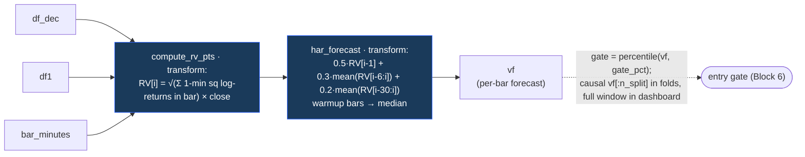
- **Inputs:** `df_dec, df1, bar_minutes`.
- **Inner layers:** ① **RV in points** per decision bar = √(Σ 1-min squared log-returns in the bar) × close
  (`compute_rv_pts`); ② **HAR forecast** = causal blend `0.5·RV[i-1] + 0.3·mean(RV[i-6:i]) + 0.2·mean(RV[i-30:i])`
  (`har_forecast`); ③ warmup bars filled with median.
- **Outputs:** `vf` — one forecast per decision bar. **Gate:** `core.py` thresholds `vf` at the `gate_pct`
  percentile of a **reference** slice — for folds/feasibility the reference is **frozen causally** on the
  in-sample slice (`gate_ref_vf` or `vf[:n_split]`), the dashboard uses the full window. *(This frozen-vs-full
  gate is exactly why the optimizer's `full_pnl` and the dashboard's full-window P/L differ slightly — see
  `REPORT_wsh5_4h_split_champion.md`.)*

### BLOCK 3 — Box trigger / Stage-1 signals · `optimize/signals.py::decision_signals` + `fast_engine.signals_to_int`

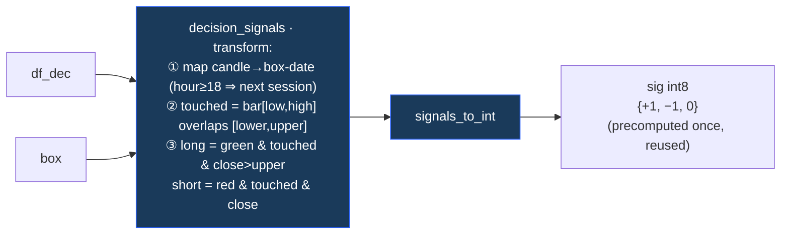
- **Inputs:** `df_dec, box`.
- **Inner layers:** ① map each candle to its box-date (hour ≥ 18 ⇒ next session); ② per level pair, "touched"
  iff bar [low,high] overlaps [lower,upper]; ③ **long** = green & touched & close > upper; **short** = red &
  touched & close < lower; else hold.
- **Outputs:** signal array `{long, short, hold}` → `signals_to_int` ⇒ int8 `{+1, −1, 0}`. Precomputed once
  (parameter-independent) and reused across all trials (`optimizer.py:136`).

### BLOCK 4 — Indicators (confirm/veto layer) · `indicators/library.py`, `base.py`, `runner.py`, `confirm.py`

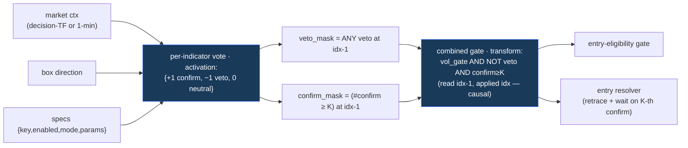
- **Inputs:** market context (decision-TF **or** 1-minute when `ind_1min=True`), box direction per bar, and the
  indicator specs `{key, enabled, mode, params}`.
- **Registry (18 keys):** ema_trend, sma_trend, macd, vwap, keltner, obv, cci (stance/trend); rsi, stochastic,
  mfi (zone); bollinger, adx (veto); structure_trend, order_block, fvg, **ifvg, breaker, cisd** (SMC).
- **Inner layers:** ① each enabled indicator emits a vote `{+1 confirm, −1 veto, 0 neutral}` (`runner.compute_votes`);
  ② **veto mask** = any veto at the just-closed bar; ③ **confirm mask** = `≥ K` confirms (K clamped to #confirmers);
  ④ combined gate = `vol_gate AND NOT veto AND confirm≥K`; ⑤ optional global retrace + wait timing on the K-th
  confirm's level. Masks are read at `idx-1` and applied at `idx` entry (causal).
- **Outputs:** a per-bar boolean **entry-eligibility gate** (folded into Block 6's gate) + an entry resolver.

### BLOCK 5 — Entry/exit engine · `engine.py::SimpleStrategy` (exact) & `optimize/fast_engine.py::fast_backtest` (vectorized)

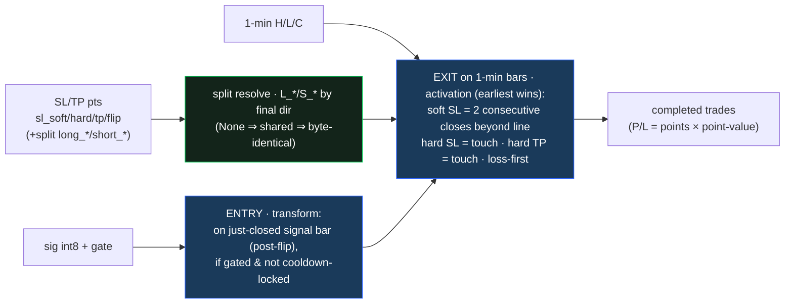
- **Inputs:** decision dates/closes, signal int8, the gate, 1-minute high/low/close, and SL/TP points
  `sl_soft, sl_hard, tp, flip` **+ optional split** `long_*/short_*` (None ⇒ shared).
- **Inner layers:** ① entry on the just-closed signal bar (post-flip) when gated & not cooldown-locked;
  ② exit resolved on 1-minute bars — **soft SL** = 2 consecutive 1-min closes beyond the soft line (fill at 2nd
  close); **hard SL** = touch (fill at line); **hard TP** = touch; priority loss-first; ③ **split resolution**
  (`fast_engine.py:69–98`): `L_* / S_*` chosen by the trade's final direction, each `None` ⇒ shared ⇒
  **byte-identical** when unset (golden-locked); ④ P/L in points × point-value.
- **Outputs:** list of completed trade dicts. *(Golden byte-match: 6/6 timeframes; fast≡exact trade-for-trade.)*

### BLOCK 6 — Single-window metrics · `optimize/core.py::backtest_metrics` (≈ L32–172)

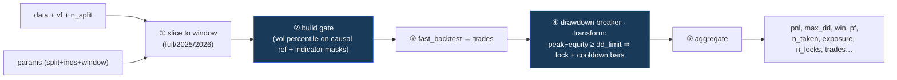
- **Inputs:** data + `vf`, `n_split`, the `params` dict (incl. split + indicators + `window`), bar duration;
  optional `gate_ref_vf`, precomputed `sig_int`.
- **Inner layers:** ① slice to the window (`full/2025/2026/…`); ② build the gate (vol percentile on the
  **causal reference** + indicator masks); ③ `fast_backtest`; ④ replay the **drawdown circuit-breaker**
  (peak-to-equity ≥ `dd_limit` ⇒ lock + `cooldown` bars) ; ⑤ aggregate.
- **Outputs:** `{pnl, pnl_2025, pnl_2026, max_dd, win, pf, n_taken, n_candidates, exposure, n_locks, trades…}`.

### BLOCK 7 — Walk-forward scoring · `optimize/folds.py::score_walkforward` (≈ L33–99)

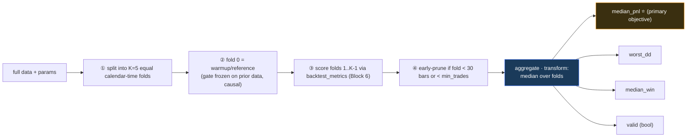
- **Inputs:** full data + `params`, `k` folds (5), `min_trades` (5), precomputed `sig_int`.
- **Inner layers:** ① split into K equal **calendar-time** folds; ② fold 0 = warmup/reference (gate frozen on
  prior data, causal); ③ score folds 1..K-1 via `backtest_metrics`; ④ early-prune if a fold has < 30 bars or
  < `min_trades` trades.
- **Outputs:** `{valid, median_pnl, worst_dd, median_win, total_pnl, folds[…]}`. **`median_pnl` is the primary
  objective and the champion-selection key.**

### BLOCK 8 — Optimizer · `optimize/optimizer.py::run` + `objective` (≈ L119–207)

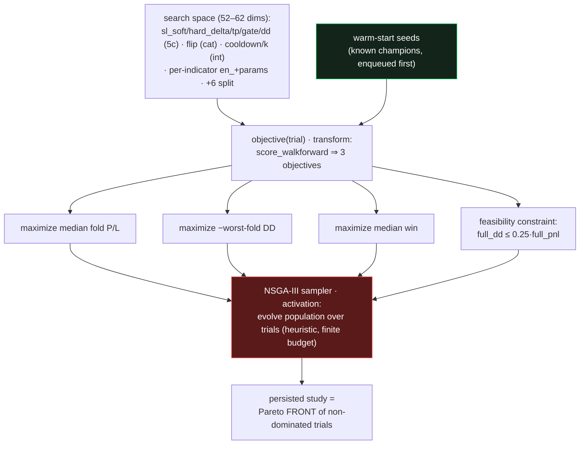

> ⚠ This block is where the superset paradox lives — NSGA-III returns the best *sampled* point, not the set
> maximum; warm-start (green) now guarantees the front ≥ the prior champion.
- **Inputs:** `tf_name, n_trials, folds=5, min_trades=5, seed, ind_1min, study_prefix, split_sltp`.
- **Search space (per trial):** `sl_soft`, `sl_hard_delta`, `tp`, `gate_pct`, `dd_limit` (5 continuous);
  `flip` (categorical); `cooldown`, `k` (integer); **per indicator** `en_<key>` (on/off) + its params; **+ if
  `split_sltp`**: `long_sl_soft, long_sl_hard_delta, long_tp, short_sl_soft, short_sl_hard_delta, short_tp`
  (6 continuous). **Totals: 52 dims (15-indicator run) / 56 (current 18-indicator code); +6 with split.**
- **Inner layers:** ① `score_walkforward` ⇒ 3 objectives **(maximize median fold P/L, −worst-fold DD, median
  win)**; ② a full-window backtest sets the **feasibility constraint** `full_dd ≤ 0.25·full_pnl`
  (`optimizer.py:178`); ③ **NSGA-III** sampler (`seed`, `constraints_func`) evolves a population over trials;
  ④ Postgres/SQLite study, resumable (`load_if_exists`).
- **Outputs:** a persisted multi-objective study (a *front* of non-dominated trials), not a single winner.
  **← This is the block where the paradox lives: NSGA-III is heuristic + finite-budget, so its returned front
  depends on the random trajectory and the space size.**

### BLOCK 9 — Champion selection + report · `optimize/report_wsi.py::export_tf`

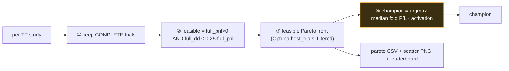
- **Inputs:** the per-TF study.
- **Inner layers:** ① keep **complete** trials; ② **feasible** = `full_pnl>0 AND full_dd ≤ 0.25·full_pnl`;
  ③ feasible Pareto front (Optuna `best_trials`, filtered); ④ **champion = max median fold P/L among feasible**.
- **Outputs:** `<tf>_wsi_pareto.csv` (+ scatter PNG) + leaderboard. *(Note: the stock CSV emits only shared
  sl_soft/sl_hard/tp; the split champion was extracted with a split-aware query — see the wsh5 report.)*

### BLOCK 10 — Dashboard + profiles · `server.py`, `strategy.py`, `presets.py`, `frontend/index.html`

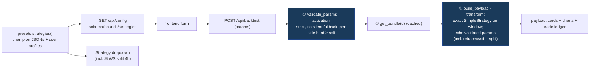
- **Inputs:** `GET /api/config` (schema/bounds/strategies) and `POST /api/backtest` (the form's params).
- **Inner layers:** ① `validate_params` (strict, no silent fallback; per-side hard ≥ soft); ② `get_bundle(tf)`
  (cached); ③ `build_payload` runs the **exact** `SimpleStrategy` on the chosen window, echoes the validated
  params back in `meta.params` (now incl. retrace/wait + split — the round-trip fix); ④ `presets.strategies()`
  assembles the dropdown from the champion JSONs + user profiles.
- **Outputs:** the full dashboard payload (cards, charts, trade ledger) and the Strategy dropdown (which now
  includes `⚖ WS split 4h`).

---

## 5. Root-cause chain (one line per link)
1. S₅ ⊃ S₄ — **true**; wsh4's champion scores **$33,592** inside S₅ (measured, §2.1).
2. The optimizer returns the **best sampled** point, not the set maximum (Block 8 is a heuristic).
3. +6 continuous dims enlarged the search **volume**; trials did **not** increase (5028 < 5483) ⇒ thinner sampling.
4. NSGA-III's population drifted toward asymmetric long/short; only **0.2 %** of trials stayed near-symmetric (§2.3).
5. ⇒ wsh5's best sample ($28,228) < wsh4's ($33,592), with **no point in wsh5 ever reaching $33,592** (§2.2).
6. ∴ Larger space + equal/less budget → a worse *found* optimum. Expected, not a bug.

## 6. How to GUARANTEE "equal-or-better" next time (warm-start)
The clean, deterministic fix — make the new run *start* from the known best so it can only improve:
1. **Seed the champion as a trial.** Before sampling, `study.enqueue_trial(<wsh4 champion params, with
   long=short=shared>)` (and the wsh5 split champion). NSGA-III then *begins* with a $33,592 point in its
   population ⇒ its returned front is **provably ≥ $33,592**. (Add this to `optimizer.run` for prefix wsh6.)
2. **Give the larger space more budget** (trials ∝ dimensions) so density doesn't drop when dims grow.
3. **Make split opt-in per side / coarser** (or fix long≡short unless an asymmetry actually helps) so the
   extra dimensions don't dilute the symmetric region.
4. **Carry elite points across runs** (transfer the prior front as seeds) — standard for iterative tuning.

> **Bottom line for deployment:** nothing regressed in production. The wsh4 shared champion ($33,592 median /
> $142,229 full) is still the best known and stays deployed; wsh5's split champion is an alternative profile.
> The "worse-from-a-bigger-space" outcome is a sampling artifact, and the next 4h run (wsh6) should **warm-start
> from the wsh4 champion** so it is mathematically guaranteed to match-or-beat it while also searching split
> SL/TP **and** the new ifvg/breaker/cisd votes.
