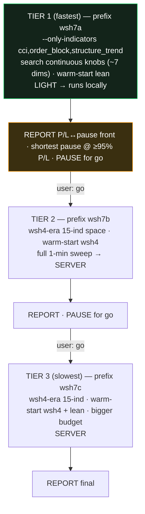

# α SPEC — decision-pause objective + escalating search ladder

## 0. Goal (issue 1)
The deployed champion ('wsi-4h-1m', $142,203) goes up to **11.5 days, decision-sourced** with no entry. β
proved no indicator subset shrinks this (0/256 < 3d) — it must be re-optimized. α **swaps the optimizer's
3rd objective from win-rate to MINIMIZE the recurring decision-pause** (`max_no_entry_days_decision`, the S0
metric — warmup excluded), to find the **shortest pause achievable** while keeping P/L within ~5% of the
champion. **Not** a hard ≤3-day cutoff — shortest possible (the Pareto front shows the P/L↔pause trade-off
and the user picks the knee).

## 1. Locked decisions
| # | Decision |
|---|---|
| D1 | **Swap** win-rate → min decision-pause (stay at 3 objectives: max median P/L, min worst-DD, **min decision-pause**) |
| D2 | **Soft** objective (minimize); **no hard pause threshold** — shortest possible |
| D3 | **−5% P/L** (≥ ~$31,900 median, 95% of the wsh4 champion's $33,587) is the **highlight/acceptance band**, NOT a filter |
| D4 | **Escalation ladder**, fastest→slowest; **user-gated between tiers** (report + wait for "go" each time; no auto-escalation) |
| D5 | Search space reverts to **wsh4-era** (exclude the 3 new ifvg/breaker/cisd; shared SL/TP — no split) |
| D6 | Each tier = a fresh study prefix; warm-started so the front is ≥ its seeds |

## 2. Engine / optimizer changes (build once; golden-safe, default-off)
- `optimize/optimizer.py`:
  - `--objective {winrate*|decision_pause}` (default `winrate` ⇒ **byte-identical** to today). When
    `decision_pause`: the 3rd returned objective becomes `−full["max_no_entry_days_decision"]` (maximize the
    negative ⇒ minimize the pause); `directions[2]` stays `"maximize"`; record `user_attr["decision_pause_days"]`.
    The full-period backtest already runs for feasibility and now carries the S0 key — no extra backtest.
  - `--exclude-indicators ifvg,breaker,cisd` (revert to the wsh4-era 15) and `--only-indicators <csv>`
    (restrict the search to a fixed subset, others forced off) in `_suggest_indicators`.
  - Front print/extraction gains a `decision_pause_days` column; sorting offers a pause-ascending view.
- `optimize/no_entry.py` already supplies the metric; `backtest_metrics` already returns it (S0). No engine
  logic change ⇒ **golden 6/6 must stay** (verified after the optimizer edit).
- Warm-start: reuse `warm_start_seeds`; add the **lean champion** (`wsh_lean_4h_champion.json`) as an extra
  seed when present.

## 3. The escalation ladder (user-gated)

- **Tier 1** is light (3 indicators fixed, ~7 continuous dims) → runs **locally** (~30–60 min) the moment α is
  built. **Tiers 2–3** are full 1-min sweeps → **server** launches the user triggers (like wsh6), one at a time.
- **Between every tier:** report the front (P/L↔decision-pause), highlight the shortest-pause point still ≥95%
  of champion P/L, and **wait** for the user's "go" before the next tier. No auto-escalation (D4).
- "Better" = a tier produced a shorter decision-pause (at acceptable P/L) than the prior best; "worse" = no
  improvement. The user decides at each pause whether the improvement is enough or to escalate.

## 4. Reporting (per tier)
A markdown report `study_range_regime/REPORT_alpha_<tier>_decision_pause.md` with the feasible front **sorted
by decision-pause ascending**: `decision-pause-days · median P/L · ΔP/L% vs champion · worst-DD · win · #ind ·
kept-indicators`. Highlight the **shortest pause with median P/L ≥ $31,900**. Mermaid trade-off sketch. The
chosen point can be exported as a profile (like the lean one) on the user's call.

## 5. Testing
- `--objective decision_pause` unit: directions length 3, 3rd objective == `−decision_pause`, user_attr set;
  `--objective winrate` (default) returns the original triple (byte-identical path).
- `--exclude-indicators` / `--only-indicators`: `_suggest_indicators` yields exactly the intended keys.
- Golden 6/6 unchanged (default objective). A Tier-1 smoke (small budget, local) produces a feasible front
  with a `decision_pause_days` column and a point shorter than the champion's 11.5d (expected, since gate/dd/
  cooldown/SL-TP are re-tuned).

## 6. Non-goals
- **Not** a champion swap — α surfaces candidates; the deployed champion stays until the unchanged OOS gate is
  met. Tiers 2–3 are **user-launched server runs**, not auto-run. No win-rate-as-4th-objective. No split SL/TP.

## 7. Files
```
optimize/optimizer.py                 # MODIFY: --objective, --exclude/--only-indicators, pause front column
optimize/run_alpha_ladder.py          # NEW: tier definitions + per-tier launch + report writer (user-gated)
optimize/test_alpha_objective.py      # NEW: objective-swap + indicator-scope unit lock
study_range_regime/REPORT_alpha_<tier>_decision_pause.md   # per-tier reports
```
