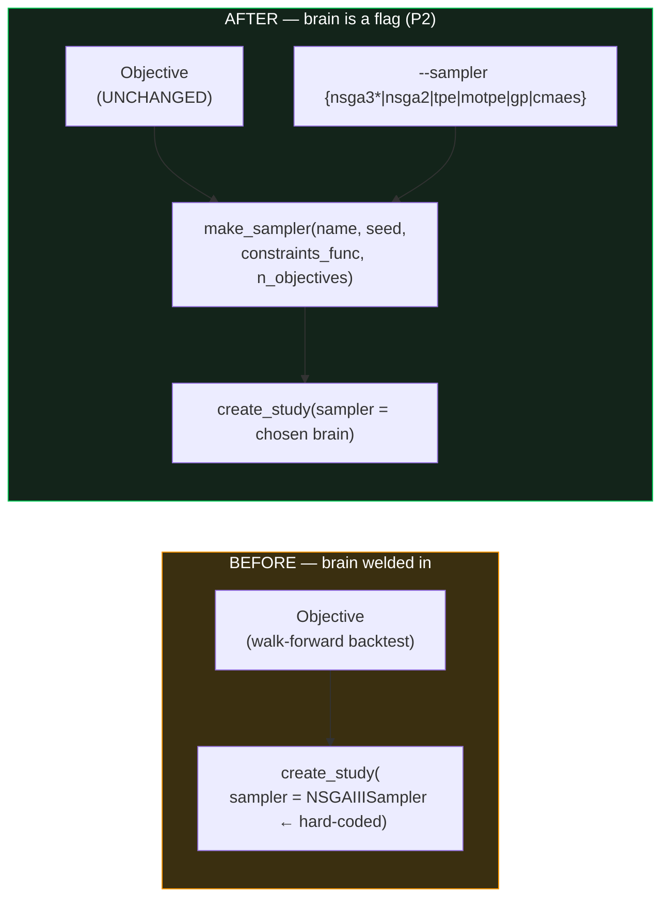
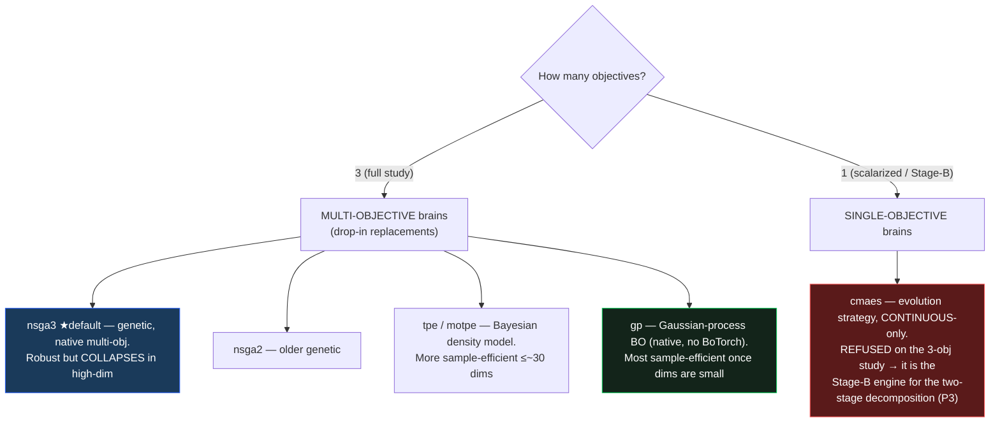
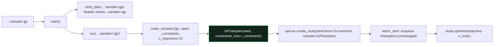

# P2 — Selectable optimizer sampler (the "brain" is now a flag)

> Part of the staged plan in `REPORT_optimizer_algorithm_alternatives.md`
> (**P0** warm-start + ∝-budget + acceptance gate ✅ → **P1** wsh6 launch → **P2 this doc** →
> **P3** two-stage decomposition → **P4** MAP-Elites).
> Sibling proof of *why* this matters: `REPORT_optimizer_superset_paradox_and_system_breakdown.md`.

---

## 1. Baby explanation — what changed and why

Optuna splits any optimization into **two independent halves**:

| Half | Role | In our system |
|---|---|---|
| **Objective** | *What* we score | the walk-forward backtest → `(median fold P/L, −worst-fold DD, median win)` + feasibility `DD ≤ 25%·P&L` |
| **Sampler** ("the brain") | *Which* parameters to try next, given all past trials | **was hard-coded to NSGA-III** |

The superset paradox (wsh5: a *bigger* space returned a *worse* champion) was caused by the brain, not
the objective: **NSGA-III is a genetic search whose population collapses toward one basin** in high
dimensions, starving the region where the $33,592 point lived.

**P2 makes the brain a one-flag choice** — `--sampler` (and `run(..., sampler=...)`). This is the
cheapest, lowest-risk step in the whole plan:

- **Default is `nsga3` ⇒ nothing changes** unless you ask (verified byte-identical: the seeded 4h
  champion still reproduces full P/L **$142,203**).
- It lets us *pilot* more sample-efficient Bayesian brains with **zero new code**.
- It hands **P3** the two continuous-optimization engines it needs (CMA-ES, GP).



---

## 2. The brains (and which problem each is for)



| `--sampler` | Optuna class | Multi-obj | Mixed vars | Why it's here |
|---|---|:--:|:--:|---|
| `nsga3` *(default)* | `NSGAIIISampler` | ✅ native | ✅ | unchanged baseline; reproduces every prior run |
| `nsga2` | `NSGAIISampler` | ✅ | ✅ | older genetic, comparison point |
| `tpe` / `motpe` | `TPESampler(multivariate, group)` | ✅ (MOTPE) | ✅ | sample-efficient in moderate dims |
| `gp` (aliases `gpbo`,`botorch`) | `GPSampler` | ✅ | ⚠ one-hot | most sample-efficient; **native** in Optuna 4.8 — no BoTorch install |
| `cmaes` (alias `cma`) | `CmaEsSampler` | ❌ single-obj, continuous-only | ❌ | **guarded** — raises on the 3-obj study; Stage-B engine for P3 |

> **Why CMA-ES is refused, not crashed:** `CmaEsSampler` has no `constraints_func` and cannot optimize
> ≥2 objectives or categorical (indicator on/off) variables. Used on the full study it would silently
> ignore the feasibility constraint and 2 of 3 objectives. `make_sampler` raises a **clear** `ValueError`
> telling you to use it via the two-stage decomposition (P3) instead. It builds fine for `n_objectives=1`.

---

## 3. Implementation (exact surface)

All in `optimize/optimizer.py`:

| Symbol | What it does |
|---|---|
| `SAMPLER_CHOICES = ("nsga3","nsga2","tpe","motpe","gp","cmaes")` | the allowed names (also the argparse `choices`) |
| `make_sampler(name, seed, constraints_func, n_objectives)` | factory → builds the Optuna sampler; refuses `cmaes` on multi-obj; raises on unknown |
| `run(..., sampler="nsga3")` | new kwarg; builds the brain via the factory and prints `sampler = <name> → <Class>` |
| `print_plan(..., sampler="nsga3")` | the plan header now shows `· sampler=<name>` |
| `main()` CLI | `--sampler {…}` (argparse rejects bad names) threaded into `run()` |

**The feasibility constraint is passed identically to every multi-objective brain**, so swapping the
sampler can only change *which points get sampled* — never which trials count as feasible, nor any
backtest number. The objective function is untouched.



---

## 4. Stress test & validation (all green)

### 4a. Factory unit lock — `optimize/test_sampler_factory.py` (6 checks)
`python3 -m optimize.test_sampler_factory` →
```
ok  test_aliases_resolve
ok  test_cmaes_allowed_single_objective
ok  test_cmaes_refused_on_multi_objective
ok  test_default_is_nsga3
ok  test_multi_objective_brains_build
ok  test_unknown_sampler_raises
P2 SAMPLER-FACTORY OK — 6 checks passed
```
Covers: every multi-obj brain maps to the right class; aliases resolve; `cmaes` refused on 3-obj /
allowed on 1-obj; unknown name raises with the choices listed; default is `nsga3`.

### 4b. CLI plumbing (`--plan` dry-run, no data)
- `--plan --sampler gp` → header `── OPTIMIZER PLAN [4h] shared SL/TP · sampler=gp ──`.
- `--sampler banana` → argparse error: `invalid choice: 'banana' (choose from nsga3, nsga2, tpe, motpe, gp, cmaes)`.

### 4c. End-to-end smoke — every multi-objective brain runs the full pipeline
10 trials each on 4h into a throwaway SQLite (`WSH_STORAGE_URL=sqlite:////tmp/p2_smoke.db`):

| sampler | trials | result | wall |
|---|--:|---|--:|
| nsga3 | 10 | ran, warm-start enqueued, front extracted | ~3 s |
| nsga2 | 10 | ran | ~2 s |
| tpe | 10 | ran | ~2 s |
| motpe | 10 | ran | ~2 s |
| gp | 10 | ran | ~2 s |

No crashes; each brain accepts the warm-start enqueue and the 3-objective + constraint study.

### 4d. Sampler-independence proof (the important one)
With `ind_1min=True` (the frame the wsh4 champion was tuned on) + warm-start, **two different brains
reproduce the champion to the dollar** — proving the objective/constraint pipeline is sampler-agnostic:

| sampler | front | median P/L | full P/L | full DD | win |
|---|--:|--:|--:|--:|--:|
| **nsga3** | 1/1 | $33,587 | **$142,203** | $14,082 (10%) | 71.1% |
| **gp** | 1/1 | $33,587 | **$142,203** | $14,082 (10%) | 71.1% |

`$142,203` is the **golden 4h full-period P/L** → the engine path is byte-unchanged; P2 only changes
*how the space is explored*, never *what a point scores*.

> **Test-harness note (honesty):** an earlier smoke with the **default** `ind_1min=False` showed
> `front=0` for all brains. That was **not** a P2 bug — the wsh4 champion was derived on the 1-minute
> indicator frame, so re-scored on decision-TF indicators it is (correctly) infeasible. Re-running on
> the correct frame (4d) gives `front=1` and the exact champion.

---

## 5. How to use it

```bash
# default (unchanged NSGA-III) — identical to every prior run
python3 -m optimize.optimizer 4h --auto-trials

# pilot a Bayesian brain (one flag), warm-started + dimension-proportional budget
python3 -m optimize.optimizer 4h --auto-trials --sampler gp
python3 -m optimize.optimizer 4h --auto-trials --sampler motpe

# dry-run the plan for any brain (no launch)
python3 -m optimize.optimizer 4h --plan --sampler gp

# cmaes on the full study is refused with a clear message (use it via P3 Stage-B):
python3 -m optimize.optimizer 4h --sampler cmaes      # ValueError: cmaes is SINGLE-objective …
```

`remote_wsi.sh` is unaffected (still launches the default brain); a `WSH_SAMPLER` wiring can be added
when we actually want a non-default brain on the server — deferred until a brain proves itself in a pilot.

---

## 6. What P2 does and does NOT do

- ✅ Makes the optimizer brain swappable with **zero risk** (default unchanged, engine untouched).
- ✅ Unlocks pilots of TPE/MOTPE/GP and exposes CMA-ES for **P3**.
- ❌ Does **not** by itself solve the high-dimensional collapse — a Bayesian brain over **56–62 mixed
  dims** still struggles. The *structural* fix is **P3 (two-stage decomposition)**, which shrinks the
  continuous sub-problem to ~5–11 dims where GP/CMA-ES get near-global. P2 is the enabler for that.

**Next:** P3 — two-stage decomposition (discrete indicator pick → continuous CMA-ES/GP tuning).
