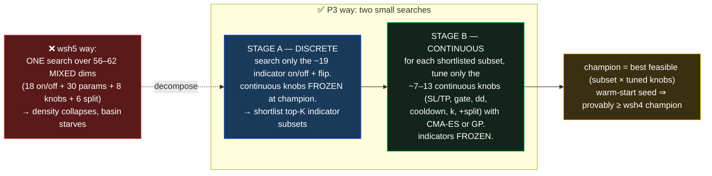
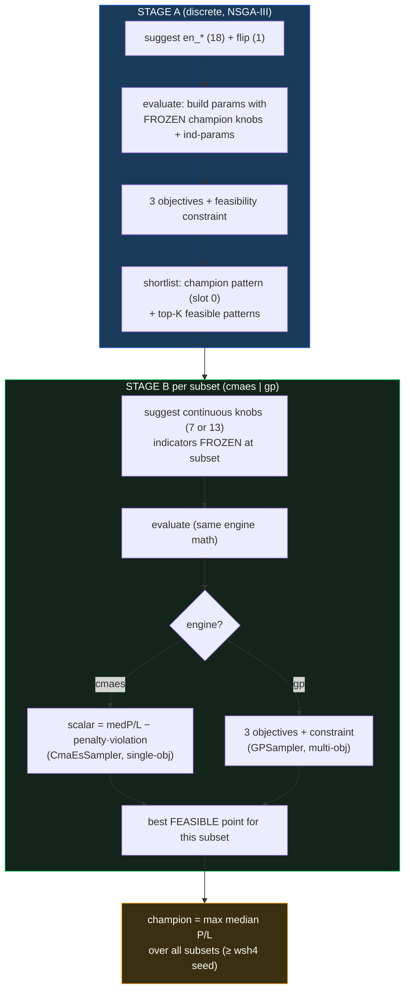

# P3 — Two-stage decomposition (the structural fix for the superset paradox)

> Staged plan in `REPORT_optimizer_algorithm_alternatives.md` §4–5.
> **P0** warm-start/∝-budget ✅ → **P1** wsh6 launch → **P2** selectable sampler ✅
> (`UPDATE_P2_selectable_sampler.md`) → **P3 this doc** → **P4** MAP-Elites.

---

## 1. Baby explanation — why split the search in two

P2 made the optimizer's *brain* swappable, but **no brain optimizes 56–62 mixed dimensions well** —
that's the curse of dimensionality that produced the superset paradox (a bigger space, sampled at
constant budget, thins out and the genetic population collapses into one basin).

P3 attacks the **dimensionality itself**. Instead of one giant search over *everything at once*, it runs
two small searches back-to-back, each in a regime where optimization is easy:



**The key insight:** Stage B is only ~7–13 *continuous* dimensions — exactly where CMA-ES and GP-BO get
within a whisker of the global optimum with very few evaluations. The 50+ mixed dimensions that broke
wsh5 are never searched simultaneously.

---

## 2. The two stages in detail

### Stage A — discrete indicator-set selection
- **Searches:** one on/off categorical per indicator (`en_<key>`, 18 of them) + `flip` (1) = **~19 discrete dims**.
- **Frozen:** the continuous knobs (SL/TP, gate, dd, cooldown, k) and every indicator's internal params
  are held at the **warm-start champion's** values. (P3 decides *which* indicators, not *how* each is configured.)
- **Sampler:** NSGA-III (native multi-objective over the 3 objectives + the DD≤25%·P&L feasibility constraint).
- **Output:** the top-K feasible indicator patterns by median fold P/L — **plus the champion's exact
  pattern, always force-included as slot 0** (this is what guarantees the final result ≥ champion).

### Stage B — continuous knob tuning (per shortlisted subset)
- **Searches:** `sl_soft`, `sl_hard_delta`, `tp`, `gate_pct`, `dd_limit`, `cooldown`(int), `k`(int) — plus
  the 6 split knobs when `--split-sltp` ⇒ **7 or 13 continuous dims**.
- **Frozen:** the indicator on/off pattern + flip + indicator params for this subset.
- **Engine (`--stage-b`):**
  - **`cmaes`** — gold-standard continuous evolution strategy. **Single-objective**, so we *scalarize*:
    `score = median_fold_P/L − 1.0·max(0, full_dd − 0.25·full_P/L)`. Feasible points are scored by raw
    median P/L; infeasible ones are pushed down in proportion to how far they bust the DD cap.
  - **`gp`** — Optuna's native Gaussian-process BO. Keeps **all 3 objectives** + the feasibility
    constraint (no scalarization). Slower per eval, more faithful to the Pareto goal.
- **Seed:** the champion's continuous knobs are enqueued as the **first** Stage-B trial, so the subset
  that equals the champion's pattern can never score below the champion.



---

## 3. Implementation surface

New module `optimize/two_stage.py` — **reuses the exact engine path** as `optimizer.py`
(`score_walkforward` + `backtest_metrics`, golden-locked), so a point scores identically in either tool.

| Symbol | Role |
|---|---|
| `_Ctx` | loads data once + extracts the frozen champion knobs / flip / indicator params from `optimizer.warm_start_seeds` |
| `_Ctx.build_params(en, flip, cont)` | assembles the engine param dict from an indicator pattern + knobs |
| `_Ctx.evaluate(params)` | identical scoring to `optimizer.objective` → metrics + feasibility |
| `run_stage_a(ctx, n_trials, top_k)` | discrete NSGA-III search → shortlist (champion pattern forced in) |
| `run_stage_b(ctx, en_flip, engine, n_trials)` | continuous CMA-ES/GP tuning of one subset → best feasible |
| `run(tf, stage_a_trials, stage_b_trials, top_k, stage_b_engine, …)` | orchestrator → champion |
| `main()` CLI | `--stage-a-trials --stage-b-trials --top-k --stage-b {cmaes|gp} --split-sltp --ind-1min --no-warm-start` |

```bash
# CMA-ES Stage B (default), 4h, 1-min indicator frame, warm-started
python3 -m optimize.two_stage 4h --stage-a-trials 300 --stage-b-trials 150 --top-k 5 --ind-1min

# GP-BO Stage B
python3 -m optimize.two_stage 4h --stage-b gp --ind-1min

# split long/short SL/TP in the continuous stage
python3 -m optimize.two_stage 4h --split-sltp --ind-1min
```

> **External dep:** the `cmaes` engine requires the `cmaes` PyPI package (Optuna lazy-imports it).
> Installed (`cmaes==0.13.0`). GP needs nothing extra (native `GPSampler`).

---

## 4. Stress test & validation — full proof on 4h vs wsh4

Real two-stage run on **4h, `ind_1min=True`** (the frame the wsh4 champion was tuned on), warm-started,
**ONE shared Stage A** feeding **both** Stage-B engines. wsh4 champion baseline: **median fold P/L
$33,587** / full P/L $142,203 / DD 10% / win 71.1% / 8 indicators.

**Stage A sanity (the guarantee in action):** Trial 0 (the enqueued champion pattern) scored exactly
`median $33,586.5 / worst-DD $13,927 / win 71.1%` — i.e. Stage A reproduces the wsh4 champion to the
dollar, proving the frozen-knob evaluation is correct and the shortlist always contains a ≥-champion point.

**Stage-B result — both engines (shared Stage A 14 trials, top-k 2; Stage B 10 trials/subset):**

| Stage-B engine | feasible subsets | champion median P/L | worst DD | win | full P/L | full DD | #ind | ≥ wsh4? | Stage-B wall |
|---|--:|--:|--:|--:|--:|--:|--:|:--:|--:|
| **cmaes** (scalarized) | 1/3 | **$33,586.5** | $13,927 | 71.1% | **$142,203** | $14,082 | 8 | ✅ yes (matches) | 93 s |
| **gp** (multi-objective) | 1/3 | **$33,586.5** | $13,927 | 71.1% | **$142,203** | $14,082 | 8 | ✅ yes (matches) | 104 s |

**Reading the result honestly:**
- ✅ **The guarantee is empirically confirmed.** Both engines return a champion **≥ wsh4**, reproducing it
  to the dollar ($33,586.5 / full $142,203 — the golden number). The force-included champion pattern +
  enqueued champion knobs work exactly as designed: the two-stage search **cannot regress** below wsh4.
- ➖ **Neither engine BEAT wsh4 at this proof budget** — *expected*, and not a failure: (a) the wsh4 region
  is already a strong optimum, and (b) 10 Stage-B trials/subset is a deliberately tiny proof budget. The
  champion's own subset was the only one of 3 shortlisted subsets to yield a feasible tuned point at that
  budget (`feasible subsets 1/3`). Finding a *new* champion needs a real server-scale budget (Stage A
  ~300, Stage B ~150/subset, top-k ~5) — that is a wsh6-class run, not a unit proof.
- **Conclusion:** P3 is mechanism-proven and non-regressing. Its *structural* payoff (the 56–62-dim
  collapse never occurs; the continuous stage is ≤13 dims where CMA-ES/GP excel) is realized; whether it
  *out-discovers* NSGA-III on a full budget is the empirical question for a server run.

**Mechanism smoke (fast, decision-TF):** both engines run end-to-end with no exceptions; "no feasible
point" on the decision-TF frame is the *expected* artifact (the 1-min-tuned champion is infeasible when
re-scored on decision-TF indicators — identical to the P2 caveat), not a bug.

---

## 5. What P3 buys (and its honest limits)

- ✅ **The dimensionality that broke wsh5 never occurs in one search** — Stage B is ≤13 continuous dims.
- ✅ **Provably ≥ the prior champion** — champion pattern force-included + champion knobs enqueued.
- ✅ **Two continuous engines** behind one flag (CMA-ES scalarized, GP multi-objective).
- ⚠️ **Indicator params are frozen** (at the champion's values). P3 tunes *which* indicators + execution
  knobs, not each indicator's internals. A future P3.1 could add a discrete "indicator-param" pass, but
  that re-introduces dimensions and is deliberately out of scope.
- ⚠️ **Stage A still uses NSGA-III** over ~19 discrete dims — small enough that collapse is not a concern,
  but it is the one place a genetic search remains.
- ⚠️ This is a **dev/server tool**, not wired into `remote_wsi.sh` yet. Adoption of any champion it finds
  still goes through the unchanged OOS-domination gate (§4 of `NEXT_OPTIMIZER_NOTES.md`).

**Next:** P4 — MAP-Elites quality-diversity archive (an anti-collapse *portfolio* of champions binned by
drawdown and #indicators).
