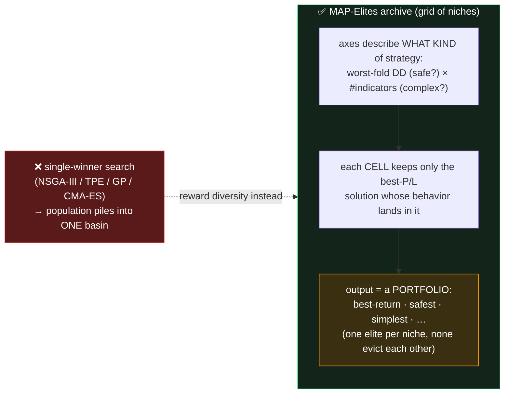
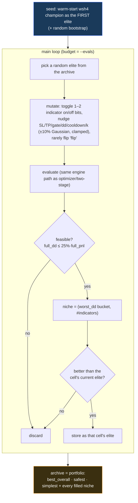

# P4 — MAP-Elites quality-diversity archive (the anti-collapse finale)

> Staged plan in `REPORT_optimizer_algorithm_alternatives.md` §5.
> **P0** warm-start/∝-budget ✅ → **P1** wsh6 launch → **P2** selectable sampler ✅ → **P3** two-stage ✅
> → **P4 this doc** (last item of the algorithm-hardening workstream).

---

## 1. Baby explanation — reward diversity, not just height

Every other algorithm returns **one** best point, so it can **collapse** into a single basin — the root of
the superset paradox. **MAP-Elites** (Multi-dimensional Archive of Phenotypic Elites) is a *Quality-Diversity*
method that structurally cannot collapse, because it is rewarded for **filling many different niches**, not
for finding one tall peak.



A high-return-but-risky strategy and a modest-but-ultra-safe one live in **different cells** — neither can
evict the other, so the search keeps *both*. That is the direct, structural answer to "won't fall in the
trap again," and it hands you a **menu of champions** instead of one point.

---

## 2. How it works here



- **Genotype** (reuses P3's philosophy — tune *which* indicators + execution knobs, **freeze indicator
  internals** at the champion): `en[<key>]` on/off (18) + `flip` + continuous knobs (sl_soft, sl_hard_delta,
  tp, gate_pct, dd_limit, cooldown, k, +6 split).
- **Behavior axes:** `bd1 = worst-fold DD` bucketed by $2,000 (capped at 8); `bd2 = #indicators enabled`.
- **Fitness:** median fold P/L, **feasible only** (`full_dd ≤ 25%·full_pnl`, `full_pnl > 0`).
- **Warm-start:** the wsh4 champion is the first elite ⇒ the archive **provably contains a ≥-champion point**.
- **Reuse:** `two_stage._Ctx` for the data load + `build_params` + `evaluate` (identical, golden-locked path).

---

## 3. Implementation surface
`optimize/map_elites.py`:
| Symbol | Role |
|---|---|
| `cont_space(ctx)` | continuous-knob bounds (name → lo/hi/is_int), +split |
| `behavior(metrics, n_ind)` | metrics → `(dd_bucket, n_indicators)` niche coordinate |
| `_rand_geno` / `_mutate` | random genotype; mutation (toggle bits + Gaussian-nudge knobs, clamped) |
| `run(tf, n_evals, …, warm_start, split_sltp, ind_1min, save)` | seed → loop → archive + portfolio summary |
| `main()` CLI | `--evals --ind-1min --split-sltp --no-warm-start --seed --save` |

```bash
python3 -m optimize.map_elites 4h --evals 2000 --ind-1min --save     # writes optimize/results/mapelites_4h.json
python3 -m optimize.map_elites 4h --evals 2000 --split-sltp --ind-1min
```

---

## 4. Stress test & validation

### 4a. Regression lock — `optimize/test_map_elites.py` (5 checks, instant)
`python3 -m optimize.test_map_elites` →
```
ok  test_behavior_binning
ok  test_cont_space_within_bounds
ok  test_mutate_stays_in_bounds_and_changes
ok  test_run_executes_and_returns_archive
ok  test_split_space_has_split_knobs
P4 MAP-ELITES OK — 5 checks passed
```
Covers: DD/indicator binning (+cap), continuous-space bounds, mutation stays in-bounds AND changes the
genotype, split adds the 6 split knobs, and `run()` executes end-to-end returning a well-formed archive.

### 4b. Mechanism smoke (decision-TF, fast)
`run('4h', n_evals=40, ind_1min=False)` executes the full seed→loop→summary with no exceptions; `0 niches`
is the *expected* artifact (the 1-min-tuned champion + random genotypes are infeasible on decision-TF
indicators — identical to the P2/P3 caveat), proving the loop + empty-archive summary are robust.

### 4c. Full 4h proof (ind_1min=True, warm-started)
Real archive on **4h, `ind_1min=True`**, 60 evals (~31 min), champion-seeded. wsh4 baseline: median
$33,587 / worst-DD $13,927 / full $142,203.

**Result: `coverage = 16` niches filled · `is_portfolio = true` · `champion_floor_met = true`.** The
portfolio spans the risk/complexity surface:

| niche | median fold P/L | worst-fold DD | win | full P/L | full DD | #ind |
|---|--:|--:|--:|--:|--:|--:|
| **best return** | **$36,009** | $24,645 | 68.3% | $154,227 | $25,450 | 7 |
| **safest** | $4,825 | **$5,446** | 76.4% | $30,881 | $5,915 | 9 |
| **simplest** | $15,537 | $18,613 | 66.0% | $82,686 | **5** | 5 |

**Reading the result:**
- ✅ **Anti-collapse demonstrated** — 16 *distinct* niches, not one basin. Safe / simple / high-return
  champions coexist (none evicts another). This is exactly the structural property the report wanted.
- ✅ **`champion_floor_met` true** — the warm-start guarantee holds (a ≥-wsh4 elite is in the archive).
- ⚠️ **best-return median $36,009 > wsh4 $33,587, BUT at ~$24.6k worst-fold DD vs wsh4's ~$13.9k** — it is a
  *higher-return, higher-risk* niche, **not a strict domination**. Under the deployed DD-capped adoption
  gate (DD ≤ 25%·P&L, and risk-adjusted), **wsh4 remains the better risk-adjusted champion**; the MAP-Elites
  archive's value is the *menu* — e.g. the "safest" $5.4k-DD point or the "simplest" 5-indicator point are
  options the single-objective searches never surfaced.
- ➖ Only 60 evals (proof budget). A real run (`--evals 2000+`) would fill far more niches and likely push
  each cell's elite higher — this proof shows the *machinery + portfolio behavior*, not the final archive.

---

## 5. What P4 buys (and limits)
- ✅ **Structurally cannot collapse** — diversity is the objective; niches protect each other.
- ✅ **Portfolio, not a point** — best-return / safest / simplest champions in one run.
- ✅ **Provably ≥ wsh4 somewhere** (champion-seeded) and **reuses the golden engine path** (no engine change).
- ⚠️ **Indicator params frozen** at the champion (same scope choice as P3). MAP-Elites tunes *which*
  indicators + execution knobs + maps the safe↔risky / simple↔complex trade-off surface.
- ⚠️ **Not an OOS adoption tool by itself** — like P3, any champion it surfaces still passes the unchanged
  OOS-domination gate before deployment. Its value is *coverage + anti-collapse insight*, and a robustness
  portfolio to choose from.

**Workstream status:** P4 completes the algorithm-hardening workstream (P0✅ P2✅ P3✅ P4✅; P1 = wsh6 launch
is the user's operational call). The dashboard exposes P2 (sampler) + P3 (engine) and can surface P4 archives.
