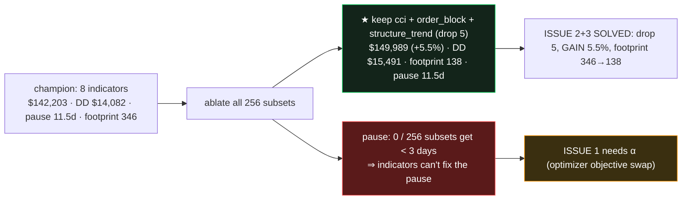

# S0 + β — no-entry metric & indicator ablation (RESULTS)

> Spec `SPEC_S0_no_entry_metric_and_beta_ablation.md` · Plan `PLAN_S0_no_entry_metric_and_beta_ablation.md`.
> Target = **'wsi-4h-1m'** (wsh4 1-min 4h champion, $142,203 / DD $14,082 / win 71.1% / 8 indicators).

## S0 — no-entry-streak metric (additive, golden-safe)
`optimize/no_entry.py` (pure) + additive keys in `optimize/core.py::backtest_metrics`. **Attributes each
pause to its source** (user's note): `warmup` (one-time startup while indicators fill lookback — NOT
optimized) vs `decision` (recurring gate/K/breaker pause — the real target). For `ind_1min` the warmup is in
1-min candles and converted to decision bars (≈ negligible). Keys: `max_no_entry_days`,
`max_no_entry_days_decision`, `longest_gap_source`, `warmup_days`, `data_footprint_candles`, `first_entry_bar`.
**Golden 6/6 unchanged** (dashboard path is separate from `backtest_metrics`); champion full P/L reproduces
**$142,203** exactly. Lock: `optimize/test_no_entry_metric.py` (4).

## β — exhaustive ablation (256 subsets, full-period, parallel)
`optimize/ablate_indicators.py` backtested all 2⁸ on/off subsets of the champion's 8 indicators. Baseline
(all-8) re-confirmed **$142,203** (hard anchor). Outputs: `optimize/results/ablation_wsi1m_4h.json` +
`study_range_regime/REPORT_indicator_ablation_wsi1m_4h.md`.

### Finding 1 (issues 2+3) — the champion is over-specified; drop 5 indicators
**Top subset: keep only `cci, order_block, structure_trend` (drop bollinger, keltner, mfi, obv, sma_trend)
→ $149,989 (+5.5%)**, DD $15,491 (~same), win 67.8%, **data footprint 346 → 138 candles** (dropping
`sma_trend`'s 346-bar lookback). You asked to trade ~5% P/L to shed 3–4 indicators; instead you can shed
**5** and **gain** +$7,786. Per-indicator marginal value (avg ΔP/L when removed):

| indicator | avg drop cost | verdict |
|---|--:|---|
| structure_trend | **+$37,001** | core — keep |
| order_block | **+$27,987** | core — keep |
| cci | **+$20,417** | core — keep |
| mfi | +$15,820 | useful, but redundant given the core 3 |
| obv | +$3,612 | low value |
| keltner | +$1,094 | low value |
| bollinger | $0 | inert |
| sma_trend | **−$300** | mildly harmful + biggest footprint (346) → drop first |

> **Honest caveat:** this is **full-period** P/L (per spec D4). The champion's 8 were selected by the
> optimizer on **median-fold P/L + win-rate** (walk-forward robustness), not max full-period P/L — so the
> lean 3-indicator set's full-period win does **not** automatically make it the better *deployable* strategy.
> Before swapping the deployed champion, re-check the lean set on the **walk-forward folds / OOS gate** (or let
> **α** re-optimize around it). The ablation answers "which indicators carry the result" — it is a *screen*,
> not a deployment decision.

### Finding 2 (issue 1) — the pause is decision-sourced; ablation can't fix it
The champion's worst no-entry gap = **11.5 days, source = `decision`** (warmup footprint is only 346 1-min
candles ≈ <1 decision day). Across **all 256 subsets, ZERO** get the decision pause under 3 days — turning
indicators off does not shorten it. **Confirmed: issue 1 must be solved by α** (re-optimize the gate / K /
SL-TP with **min `max_no_entry_days_decision`** as an objective), not by dropping indicators.

## Artifacts (exported)
| Artifact | Path |
|---|---|
| Raw trials (all 256, JSON) | `optimize/results/ablation_wsi1m_4h.json` |
| **Trials CSV (all 256, ranked)** | `optimize/results/ablation_wsi1m_4h.csv` |
| Detailed ranked report (all 256 + marginal table) | `study_range_regime/REPORT_indicator_ablation_wsi1m_4h.md` |
| **Lean champion profile (JSON)** | `optimize/results/wsh_lean_4h_champion.json` |
| Dashboard profile | `presets.py` → `🍃 WS lean 4h · 3-ind cci/OB/structure` (id `wshlean_4h`), live on `:8200` |
| Engine metric | `optimize/no_entry.py` + `optimize/core.py` |
| Tool | `optimize/ablate_indicators.py` |
| Tests | `optimize/test_no_entry_metric.py` (4) · `optimize/test_ablate.py` (4) |

## Process log (what happened, to the detail)
1. **S0 helper** `no_entry.py` written + 4 unit tests green (gap math, decision-vs-warmup split, no-trades,
   trailing-excluded).
2. **Wired into `backtest_metrics`** (additive): captured `entry_idx` into the taken-trade dict; computed the
   enabled-indicator warmup via `library.from_specs`, converted 1-min→decision bars for `ind_1min`, merged the
   `no_entry_metrics` keys + `data_footprint_candles` + `warmup_frame`.
3. **Bug caught by the run, not the test:** first ablation crash = `NameError: bar_td` — the `backtest_metrics`
   parameter is named **`bar_duration`**, not `bar_td`. Golden (which scores via `strategy.build_payload`, a
   *separate* engine path) did NOT exercise `backtest_metrics`, so it passed despite the bug — the **ablation’s
   direct `backtest_metrics` call surfaced it**. Fixed (3 refs) → re-verified: champion eval reproduces
   **$142,203** with the new keys.
4. **β tool** `ablate_indicators.py`: champion loader (fixed to the real `{key:params}` JSON shape), 256-subset
   enumeration, `ProcessPoolExecutor` parallel eval (8 workers), rank + marginal + report. 4 unit tests green.
5. **Full run** (8 workers, ~few min): 256 subsets, baseline assert `$142,203` passed; wrote JSON + CSV + the
   all-256 ranked report.
6. **Lean profile** extracted (`wsh_lean_4h_champion.json`) + imported into `presets.py`; dashboard restarted
   and verified the `🍃 WS lean 4h` entry is live on `:8200`.
7. **Golden 6/6 MATCH** throughout (engine/dashboard path untouched; S0 keys are additive).

## Status
- **S0 ✅** (metric + golden 6/6 + tests). **β ✅** (256-subset ablation + report + CSV + lean profile + tests).
- **α ⏸ HELD** (#227) — and now **well-motivated**: ablation proves the pause is decision-driven and that a
  lean **cci/order_block/structure_trend** core is viable, so α can search the wsh4-era space around that core
  with the decision-pause objective.
