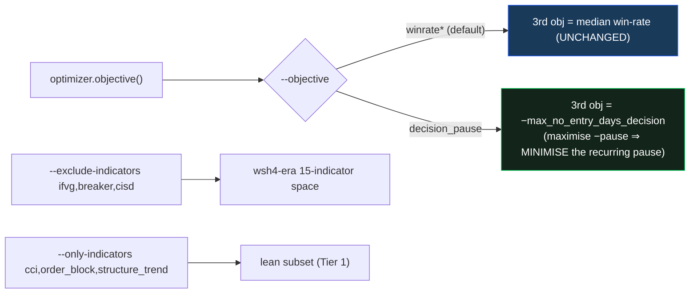
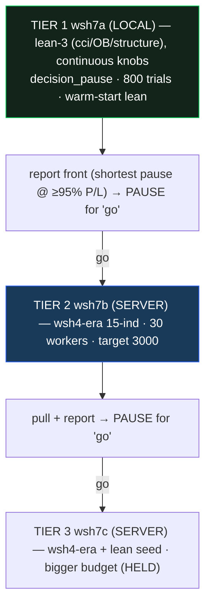

# α — decision-pause objective + escalating ladder (implementation & progress)

> Spec `SPEC_alpha_decision_pause_objective.md` · Plan `PLAN_alpha_decision_pause_objective.md`.
> Goal (issue 1): the champion pauses up to **11.5 days (decision-sourced)** with no entry; β proved no
> indicator subset fixes it (0/256 < 3d). α re-optimises with the pause AS an objective to find the
> **shortest pause achievable** while keeping P/L within ~5% of the champion.

## 1. What α changes (all default-off, golden-safe)

| Change | File | Note |
|---|---|---|
| `--objective {winrate*\|decision_pause}` swap | `optimize/optimizer.py` | reads S0 `max_no_entry_days_decision` from the full backtest (no extra cost); directions unchanged (returns `−pause`) |
| `--exclude-indicators` / `--only-indicators` scope | `optimize/optimizer.py` `_suggest_indicators` | excluded/non-whitelisted keys forced OFF + not suggested ⇒ fewer dims |
| lean champion warm-start seed | `optimize/optimizer.py` `warm_start_seeds` | seeds `wsh_lean_4h_champion.json` when present |
| `decision_pause_days` user-attr + front-print pause column | `optimize/optimizer.py` | front shows `pause N.Nd` |
| `WSH_OBJECTIVE` / `WSH_EXCLUDE` env (server) | `optimize/server/remote_wsi.sh` | additive; unset ⇒ unchanged |
| ladder runner | `optimize/run_alpha_ladder.py` | 3 tiers; Tier 1 local, Tiers 2-3 emit the server command |

**Validation:** `optimize/test_alpha_objective.py` (4) + sampler/two-stage/no-entry locks = **18 checks green**;
**golden 6/6 MATCH** (default path byte-identical; dashboard scores via a separate engine path).

## 2. Decisions (user)
- Objective: **swap** win-rate → min decision-pause (stay 3 objectives). **Soft** (minimise) — NO hard ≤3-day
  cutoff; "shortest possible". The **−5% P/L band** (≥ ~$31,900 median, 95% of $33,587) only **highlights** the
  recommended point, it is not a filter.
- Search space: revert to **wsh4-era** (exclude ifvg/breaker/cisd, shared SL/TP).
- Execution: **fastest→slowest ladder**, **user-gated between tiers** (report + wait for "go"); run the next
  slower tier only if the faster one didn't get the pause short enough.

## 3. The ladder + progress

**In flight (2026-06-16, run in parallel to use the wait):**
- **Tier 1 — LOCAL**, prefix `wsh7a`: running (~521/800 trials at time of writing, ~3.2 s/trial). On
  completion writes `REPORT_alpha_tier1_decision_pause.md` (feasible front sorted by decision-pause; ⭐ =
  shortest pause with median P/L ≥ $31,900) then **pauses for review**.
- **Tier 2 — SERVER**, prefix `wsh7b` (Postgres `wsh7b_4h`): launched (decision_pause objective,
  `--exclude-indicators ifvg,breaker,cisd`, 30 workers, target 3000, warm-started). Verified the server
  `launch.sh` carries `--objective decision_pause` + the exclude. Collect later via `remote_wsi.sh counts`/
  `pull` + `run_alpha_ladder._report('wsh7b','4h', …)`.
- **Tier 3 — HELD** (only if Tiers 1–2 don't get the pause short enough at acceptable P/L).

## 4. Adoption (unchanged gate)
α surfaces candidates; the deployed champion stays until a candidate **OOS-dominates** under the
pre-registered walk-forward rule. A chosen short-pause point can be exported as a profile (like the β lean
one) on request.
