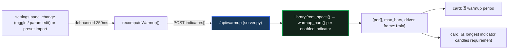

# Dashboard update — warmup/data-footprint cards + responsive metric row

Two user-requested additions to the **backtester dashboard** (`frontend/index.html` + `server.py`, served on
`:8200`) plus a responsiveness fix. Issue-3 (live-data footprint) made visible, interactively.

## 1. New endpoint — `POST /api/warmup` (single source of truth)
`server.py` gains a tiny endpoint: given the current indicator config it returns each ENABLED indicator's
required warmup candles + the max + which indicator drives it. The math lives ONLY in Python
(`indicators/library.warmup_bars()`) — the frontend never duplicates the per-indicator formulas, so there is
no Python↔JS drift.


Request: `{"indicators":[{key,enabled,params}, …]}` → Response:
`{"per":[{key,label,bars}…desc], "n_enabled", "frame":"1min", "max_bars", "driver":{key,label,bars}}`.
Bad params ⇒ 400 (no silent fallback). Empty/all-off ⇒ `max_bars:0, driver:null`.

## 2. Two live cards (in the MAIN metric row, beside "longest no-entry streak")
- **⏳ warmup period** — the candles + clock time the live trader must buffer before the system can start =
  the slowest enabled indicator (e.g. champion → `346 candles · 5h 46m`).
- **📊 longest indicator candles requirement** — *which* indicator drives it + its candles/time
  (e.g. `SMA trend — 346 candles · 5h 46m`).

They are rendered as cards in `#cards` (so they wrap with the rest), and kept **live** by `recomputeWarmup()`:
fires on any committed indicator change, on preset/profile import (`setForm`), and after every `render()`.
Guarded to no-op before the first render (the cards only exist once `#cards` is built — same lifecycle as the
no-entry-streak card). Frame note: the dashboard evaluates indicators on the 1-minute frame, so 1 candle =
1 minute (time = bars × 1 min).

## 3. Responsive metric-cards row
`.cards` was hard-coded `grid-template-columns:repeat(6,1fr)`; with no card min-width the 6 tracks could not
shrink below their content (`$142,203` at 20px) → they overflowed off-screen with a horizontal scroll.
Changed to:
```css
.cards { display:grid; grid-template-columns:repeat(auto-fit, minmax(150px, 1fr)); gap:10px; }
```
→ cards keep a consistent ~150px size and **wrap into 2/3/4 rows** as the window narrows (6-across when wide).
No hidden boxes, no left-right scrolling.

## 4. Safety
- **Golden 6/6 untouched** — `/api/warmup` only reads `library.warmup_bars()`; no engine/scoring change.
  The dashboard scores via `strategy.build_payload` (separate from the optimizer's `backtest_metrics`).
- No new dependency. Backend verified: champion → max 346 / driver SMA trend; all-off → graceful; the lean-3
  preset (`wshlean_4h`) remains in the dropdown (no regression).

## Files
`server.py` (`/api/warmup`) · `frontend/index.html` (`recomputeWarmup`, two cards in `render()`, responsive
`.cards`). Held (#3 from the user): a full dashboard sync audit (top boxes vs compacted report mismatch,
stale-value sweep, front↔backend consistency) — separate task.
