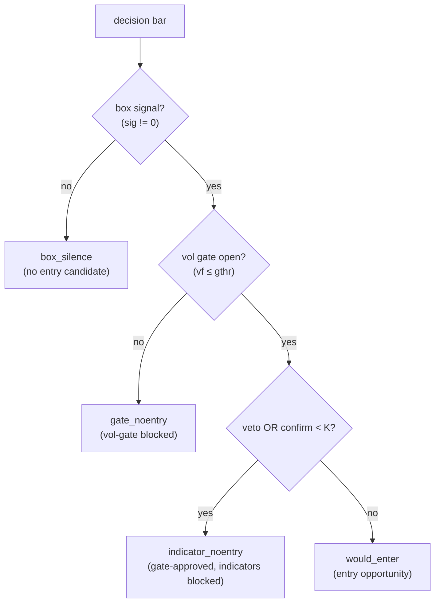
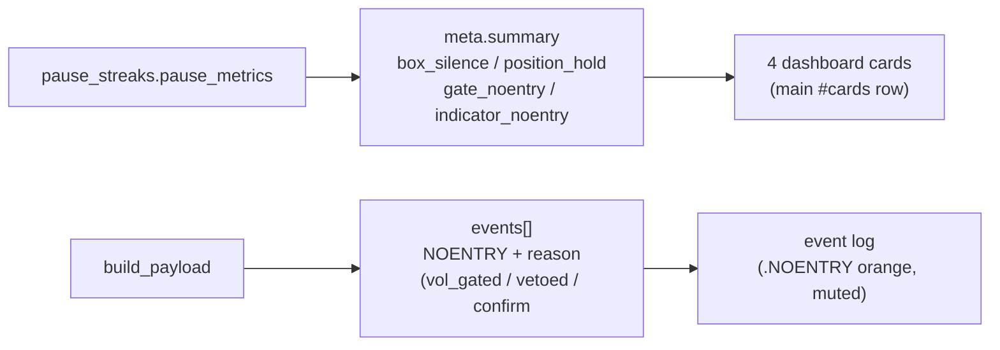

# UPDATE — Entry-pause visibility (dashboard + all-stocks)

## 0. Why
The α verdict and `diagnose_pause.py` showed the champion's ~11.5–14-day no-entry stretches are driven by
**box-signal sparsity (~71%) + the confirmation layer (~22%)**, NOT the volatility gate (~4%). This task makes
that decomposition **visible everywhere** so the (paused) gate/entry redesign is data-driven rather than a
guess. It is a **visibility-only** change: no trade, equity, drawdown, or P/L is touched.

## 1. What shipped
| Part | Deliverable |
|---|---|
| Helper | `optimize/pause_streaks.py` — pure per-bar cause attribution + longest-run helpers (no engine/data deps) |
| Backend | `strategy.build_payload` — 4 additive summary metrics + the missing `confirm<K` NOENTRY events + a `reason` tag on every NOENTRY event |
| Frontend | `frontend/index.html` — 4 new responsive cards + (existing) reason-styled NOENTRY log rows |
| all-stocks | `2_holds_dropped` gains a `holds_dropped` column; a per-instrument `PAUSE_SUMMARY.json`/`.md` sidecar is generated + bundled |

## 2. The decomposition (per decision bar)
Every decision bar is attributed to exactly one cause, by priority:



`pause_streaks.pause_metrics` returns the **longest consecutive run** of each of `box_silence`, `gate_noentry`,
`indicator_noentry` (plus `position_hold` = longest single open-trade span), each as `{bars, seconds, hours, days}`.

## 3. Where the numbers flow


The `confirm<K` branch was previously **silent** — the engine's `blocked_log` only carries `veto`/`vol_gate`,
so a box signal that passed the vol gate and had no veto but failed the K-confirmer test was dropped with no
log line. It is now emitted as a `NOENTRY` event with `reason: "confirm<K"`. On the wsh4 4h champion this
surfaced **369** previously-invisible non-entries (850 NOENTRY events total).

## 4. Champion sanity (wsh4 1-min 4h, full period)
| metric | longest run |
|---|---|
| box_silence | 23 bars · 3.83 d |
| gate_noentry | 5 bars · 0.83 d |
| indicator_noentry | 7 bars · 1.17 d |
| position_hold | 25 bars · 4.17 d |

Consistent with `diagnose_pause`: box-silence dominates; the vol gate is a minor contributor. (These are the
longest *single consecutive runs* by cause — distinct from `noentry_streak_n=35 / 14.2 d`, which is the longest
opportunity-gap between *taken* entries, mixing all causes.)

## 5. all-stocks delivery
- **`2_holds_dropped`** now has an 11th column `holds_dropped` = the count of consecutive `hold` rows removed
  immediately before each kept `long`/`short` row (the box-silence run that preceded that signal).
- **`PAUSE_SUMMARY.json` + `.md`** per instrument (collated into the bundle root): per (tf, preset) it reports
  `holds_dropped_total`, `longest_box_pause` (max consecutive `hold` run in `1_all_signals`), and
  `reverse.longest_pause` (max `holds_between` in `3_reverse_signals`) — each in bars + hours + days.
- Example (NQ 4h full): `holds_dropped_total=19,252`, longest box pause **209 bars · 34.83 d**, reverse longest
  pause 22 bars · 3.67 d.

## 6. Invariants verified
- **Golden 6/6 MATCH** (`perf/check_golden.py`) — trades/PnL/DD byte-identical; only additive summary keys +
  NOENTRY events were added.
- **NQ byte-parity 12/12** (`tests/test_parity_nq.py`) — the parity anchor covers `1_all_signals` (stage1) and
  `3_reverse_signals` (stage2), both untouched. The `holds_dropped` column lives only on the **derived**
  `2_holds_dropped` file, so the anchor is **unaffected** (the spec's D5 "re-anchor" concern turned out moot —
  documented here instead of re-freezing a baseline).
- **Structural validation** (`validate_bundles.py`) — NQ all 21 cells pass the 5 invariants with the new column.
- **Unit lock** (`optimize/test_pause_streaks.py`, 4 tests) — `longest_run`, the cause partition (every bar in
  exactly one bucket), the decomposition example, and edge cases (all-silent / all-signal).

## 7. Files touched
```
optimize/pause_streaks.py                    NEW  — pure helper
optimize/test_pause_streaks.py               NEW  — unit lock (4 tests)
strategy.py                                  MOD  — 4 metrics + confirm<K events + reason tags (additive)
frontend/index.html                          MOD  — 4 cards + (existing) NOENTRY styling
subprojects/all-stocks-signals/generate_signals.py   MOD — holds_dropped column + PAUSE_SUMMARY sidecar
subprojects/all-stocks-signals/package_delivery.py   MOD — bundle the sidecar + README schema update
```

## 8. Non-goals / next
No gate/entry **redesign** — this feeds the PAUSED brainstorm (`PAUSED_gate_redesign_brainstorm.md`) the
data it wanted. Resume there with a lever choice (lean: confirmation rework + focused diagnosis before touching
the box generator).
