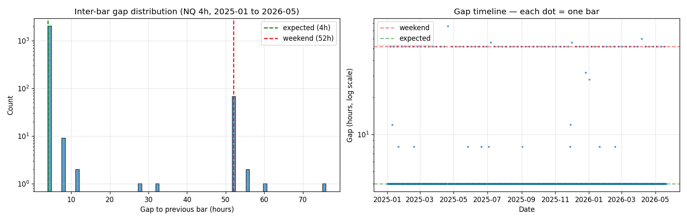
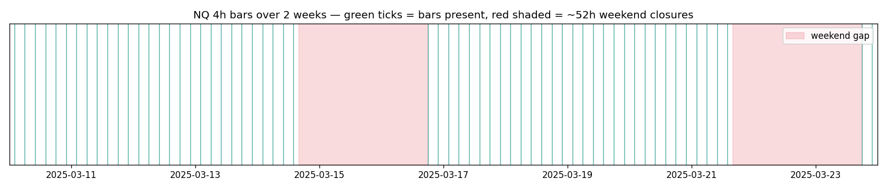
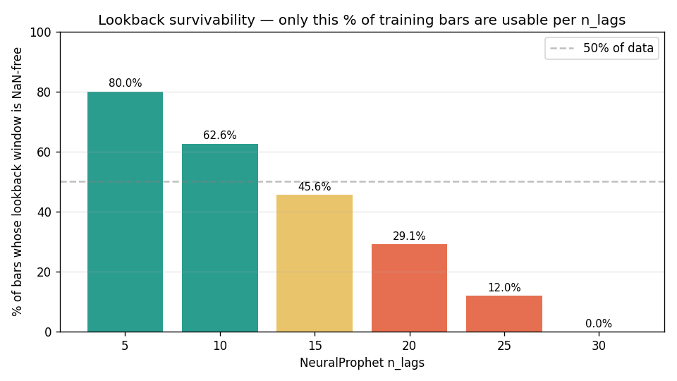

# NeuralProphet on NQ 4h Data — Root-Cause Investigation

> **Question we set out to answer:** Why does NeuralProphet 0.8 fail to fit our NQ 4h log-returns data, even after multiple workarounds? Is the data the problem, or NeuralProphet, or the dependency stack?
>
> **Short verdict:** Our data is **structurally fine** — every gap in the timeline is a real, expected CME Globex market closure (weekends + US holidays). NeuralProphet 0.8 is the source of the incompatibility: it assumes a **uniformly-sampled time grid** and treats every gap as missing data, even when the gap is a known non-trading window. On our dataset this is fatal because gaps occur every week.

---

## 1. The data is correct — gaps map 1:1 to known market closures

A scan of all 2,119 bars in `NQ_4h.csv` shows **86 inter-bar gaps that are not exactly 4 hours**. Every one of them matches a real CME Globex closure:

| Gap class | Count | Cause |
|---|---:|---|
| Exactly 52h (Friday 14:00 ET → Sunday 18:00 ET) | **68** | Standard weekend closure (one per week × ~14 months) |
| 76h (Thursday 14:00 → Sunday 18:00) | 1 | Easter / Good Friday 2025 (Apr 18) |
| 56h (Friday 14:00 → Sunday 22:00) | 3 | July 3 early close, Thanksgiving Friday early close, Good Friday 2026 |
| 60h (Friday 14:00 → Monday 02:00) | 1 | Good Friday 2026 (Apr 3) |
| 8h to 32h (intraday) | 13 | US futures holidays: MLK Day (×2), Presidents' Day (×2), Memorial Day, Juneteenth, July 4, Labor Day, Thanksgiving Thursday, Christmas, New Year, Carter Day of Mourning (Jan 9 2025) |

**All gaps are correct.** This is exactly how CME-Globex-sourced NQ data is supposed to look. Prophet handles this fine (its [Non-Daily Data docs](https://facebook.github.io/prophet/docs/non-daily_data.html) explicitly cover sub-daily data with gaps); statsmodels' `auto_arima` handles it fine. **NeuralProphet 0.8 does not.**

### Visualization

Left: 99.7% of gaps are exactly 4h (2033 bars); the 52h spike is the 68 weekend closures.
Right: weekend gaps fire reliably every ~7 days throughout the 16-month dataset.

Each green tick is a 4h bar; red bands are the ~52h weekend closures. Over a 2-week sample window you can see the pattern: ~30 bars Sun→Fri, then a ~52h gap, then ~30 more bars.

---

## 2. The seven errors we hit, root-caused

We attempted NeuralProphet seven times with progressively narrowing workarounds. Each error was a separate root cause:

| # | Error | Root cause | Severity |
|---:|---|---|---|
| 1 | `add_lagged_regressor(name=...)` → `TypeError: unexpected kwarg 'name'` | API rename in 0.8.0: kwarg is `names=[...]` plural | **Stale tutorials** — fixable |
| 2 | `auto_normalization_setting` raises `singular value` for `y` (log-returns) | NP's auto-norm calls `len(np.unique(array)) < 2`; for tiny-valued log-returns with floating-point precision quirks this can mis-fire | **NP bug or borderline** — workaround: `normalize='standardize'` (didn't take effect in our case, suggesting NP ignores constructor param for lagged-regressor norm path) |
| 3 | `torch.load` rejects NP config classes with `weights_only=True` | torch 2.6 changed `weights_only` default `False → True`. NP 0.8 pickles its own config dataclasses without `safe_globals` allowlisting | **Real compat issue between NP 0.8 and torch ≥ 2.6** — workaround: monkey-patch `torch.load` |
| 4 | Lagged-regressor singularity at certain `n_lags` depths | NP applies its singular-value check to each *lagged copy* of each regressor. A one-hot column lagged by N often goes all-zero in a sub-window | **NP design choice** — workaround: drop categoricals (this is what we tried) |
| 5 | `np.min` on zero-size array during minmax normalization | After our monkey-patch returns `'minmax'` for singular columns, downstream code computes `min(non_nan_array)` on an empty array (because the "singular" array is also all-NaN) | **Cascade from bug 4** — fix requires patching multiple downstream NP functions |
| 6 | "Inputs/targets with missing values detected" (with `drop_missing=False`) | NeuralProphet builds an internal **uniform calendar grid** at `freq='4h'` and treats missing slots as NaN. Our 2,119 bars span what NP sees as a 3,019-slot grid (29.8% synthetic NaN) | **Structural — see §3** |
| 7 | `n_data == 0` after `drop_missing=True` | With drop_missing=True, NP drops every sample whose `n_lags` lookback crosses any synthetic NaN. With weekly gaps and our hyperparam grid, ~all samples are affected → empty dataset | **Same root cause as 6** |

### The dominant root cause: errors 6 and 7

Both 6 and 7 share a single mechanism. NeuralProphet's `freq='4h'` is interpreted as "the data IS sampled every 4 hours, no exceptions". For our dataset, **the percentage of bars whose lookback window contains no synthetic NaN drops sharply with `n_lags`**:

| `n_lags` | Bars with NaN-free lookback | Notes |
|---:|---:|---|
| 5  | 80.0% | barely viable |
| 10 | 62.6% | our smallest hyperparam grid value — workable but lossy |
| 15 | 45.6% | losing half the training data |
| 20 | 29.1% | losing 70% of training data |
| 30 | **0.0%** | every lookback crosses a weekend gap → no usable samples |

The hyperparameter grid we designed (`n_lags ∈ {10, 15, 20}`) would have **silently discarded between 37% and 71% of the training data** — *if* the implementation reached that point. In practice, NP errors earlier (bug 6 with `drop_missing=False`) or empties the dataset (bug 7 with `drop_missing=True`) before fitting.

---

## 3. Why Prophet survives where NeuralProphet does not

Prophet does **not** require uniform sampling. From the [Prophet non-daily-data docs](https://facebook.github.io/prophet/docs/non-daily_data.html):

> "Prophet can be used to fit data at any granularity. We just need to be careful about specifying the `floor` and `cap` (for logistic growth), and... If the seasonality cannot be estimated for a particular frequency because the data does not have that frequency [...] you may need to add custom seasonalities."

Prophet's model is `y(t) = trend(t) + seasonality(t) + holidays(t) + ε`. Each component is a function of *time*, not of *bar index*. A 52h gap just means the function isn't evaluated at those times — there's no lookback that needs to span the gap.

NeuralProphet adds the AR-Net component: `y(t) = ... + AR(y(t-1), y(t-2), ..., y(t-n_lags))`. The lookback is **by bar position relative to a uniform grid**, not by *real* previous bars. That is the structural incompatibility with non-trading-day market data.

---

## 4. Workarounds — viability analysis

### Option A — Reindex to uniform 4h grid + impute weekends with zero return

**Mechanics:** insert artificial bars at every 4h slot during weekend closures with `close = previous_real_close` (so `log_return = 0`).

**Pros:** NP becomes fittable; matches NP's worldview.

**Cons:**
- **Distorts the AR signal.** With ~30% of slots being artificial-zero returns, the AR-Net learns "weekend → zero return" instead of any real autocorrelation. The first few real bars Sunday evening will *look like* discontinuities from the model's perspective.
- **Distorts the eval.** The harness expects per-bar predictions aligned with real data; we'd have to drop the artificial bars before scoring, but the AR-Net's hidden state has already been polluted by them.
- **Not apples-to-apples** with Prophet/ARIMA which use the natural CME timestamps.

**Verdict:** technically possible, scientifically questionable.

### Option B — Drop weekends entirely, re-cadence to "business hours only"

**Mechanics:** filter to RTH-only bars (e.g., 10:00 / 14:00 ET only), re-define `freq` as "two bars per business day", reindex on that grid.

**Pros:** smaller but more uniform dataset; no artificial data.

**Cons:**
- Throws away ~70% of the bars (RTH is only ~6.5h of a 24h Globex day).
- Comparison with Prophet/ARIMA (which use all 2119 bars) becomes invalid.
- Doesn't actually solve the holiday-gap problem (still ~13 holiday closures of varying length).

**Verdict:** scientifically clean but wastes data.

### Option C — Use a different AR library that supports irregular timestamps

| Library | Handles gaps? | License | Notes |
|---|---|---|---|
| [statsmodels SARIMAX](https://www.statsmodels.org/stable/generated/statsmodels.tsa.statespace.sarimax.SARIMAX.html) | ✅ via missing-value handling on observations | BSD-3 | Already in our venv. Adds seasonal+exogenous to ARIMA. |
| [Nixtla StatsForecast](https://github.com/Nixtla/statsforecast) | ✅ if `freq='B'` (business) or pass DatetimeIndex | Apache 2.0 | Fast, modern; `AutoARIMA`, `AutoETS`, `AutoTheta`. |
| [Darts](https://unit8co.github.io/darts/) | ✅ has `TimeSeries.from_dataframe` with `freq=None` for irregular | Apache 2.0 | Wraps many AR models (RNN, Transformer, NBEATS, TFT). |
| [GluonTS](https://ts.gluon.ai/) | ✅ supports irregular timestamps | Apache 2.0 | DeepAR, Transformers, NBEATS. Heavier than Darts. |
| [sktime](https://www.sktime.net/) | partial | BSD-3 | meta-framework; quality varies by underlying estimator. |
| [tsai](https://timeseriesai.github.io/tsai/) | ✅ | Apache 2.0 | PyTorch time-series; well-tested AR models. |

**Verdict:** any of these is a better-fit replacement for NeuralProphet than fighting NP 0.8's calendar assumption.

### Option D — Pin to older NeuralProphet + torch + Python

Per `07_phase4_neuralprophet_BLOCKED.md`'s revival recipe: Python 3.11, torch <2.6, neuralprophet 0.7. Doesn't fix problem 6/7 (the uniform-grid assumption is structural to NP regardless of version), but does fix problems 1-3 and possibly 5.

**Verdict:** insufficient — still hits the dominant root cause.

---

## 5. Recommended path forward

**Ranked recommendations:**

1. **Best:** Add a 4th leaderboard entry using **statsmodels SARIMAX with explicit `missing='drop'`**, fit on log-returns + the same regressors Prophet uses. This is the closest equivalent to what NeuralProphet would have tested (AR + exogenous), but on a library that natively supports irregular timestamps. Estimated implementation: ~2 hours.

2. **Next best:** Use **Nixtla StatsForecast's `AutoARIMA`** as a sanity comparison to our existing `pmdarima.auto_arima`. Same model class, different library, different numerical solver. Estimated implementation: ~1 hour.

3. **For the AR-Net question specifically:** **Darts'** `RNNModel` (LSTM/GRU) on log-returns is the equivalent NP-AR-Net test that *will* run on our data. Estimated implementation: ~3-4 hours including hyperparam search.

4. **Document NeuralProphet as not-viable for this asset class** in the final report — it's a structural fit issue, not a tuning issue, and is unlikely to be fixed by any combination of `n_lags`, normalization, drop_missing, etc.

5. **Do NOT pursue:** option A (uniform-grid imputation) — corrupts the model; option B (RTH-only) — wastes data and still has the holiday problem.

---

## 6. Internet research — confirms our local analysis

Citation-backed external evidence (GitHub issues, maintainer answers, third-party advisories):

### 6.1 The exact bug we hit is upstream Issue #1521

**[NeuralProphet Discussion #1521 — "Inputs/targets with missing values detected" despite clean df](https://github.com/ourownstory/neural_prophet/discussions/1521)** is the flagship known issue for our exact use case. Maintainer `mmangione` confirms:

> *NeuralProphet auto-imputes only gaps ≤ 30 periods; the validator runs on the synthesized time index, not the user index. For longer gaps you must pre-process the data yourself — NP will not do it.*

Two related upstream tickets:
- **[Issue #1050 — `drop_missing` on `predict` with AR](https://github.com/ourownstory/neural_prophet/issues/1050)** — same symptom on the predict path.
- **[Issue #744 — `drop_missing=True` bug](https://github.com/ourownstory/neural_prophet/issues/744)** — confirms the cascade where `drop_missing=True` empties datasets on irregular cadence because NP synthesizes a uniform grid from `freq` before validating.
- **[Issue #1550 — "Invalid frequency: NaT"](https://github.com/ourownstory/neural_prophet/issues/1550)** — same root cause, different symptom.

For weekly futures-style gaps (52h ≈ 13 bars at 4h cadence) NP's 30-period auto-impute threshold *should* technically cover the weekends — but **our long holiday weekends (Easter 76h = 19 bars; New Year 28h = 7 bars) plus the cumulative effect across the dataset push the validator over the line in many windows**, especially once `n_lags=10..20` extends the lookback past a weekend boundary.

### 6.2 NeuralProphet is no longer actively maintained

[Snyk advisor flags neuralprophet as "Inactive"](https://snyk.io/advisor/python/neuralprophet) — the project's release cadence collapsed in 2025; the last stable release (0.9.0) predates torch 2.6. There is **no fix in the pipeline** for our issues.

The torch 2.6 `weights_only` default change is a documented BC-break:
- [PyTorch 2.6 release blog](https://pytorch.org/blog/pytorch2-6/)
- [BC-breaking dev-discuss thread](https://dev-discuss.pytorch.org/t/bc-breaking-change-torch-load-is-being-flipped-to-use-weights-only-true-by-default-in-the-nightlies-after-137602/2573)

Downstream ML projects with active maintenance have shipped fixes (e.g. [nnUNet #2681](https://github.com/MIC-DKFZ/nnUNet/issues/2681), [SpeechBrain PR #2875](https://github.com/speechbrain/speechbrain/pull/2875)). NeuralProphet has not.

### 6.3 Maintainer-level concession on the financial use case

In **[Discussion #281](https://github.com/ourownstory/neural_prophet/discussions/281)**, the maintainer responds to a question about intraday stock data with:

> *"stock prices are by large not predictable by past values"*

…and recommends exogenous regressors over fixing the gap handling. This effectively concedes that the financial use case is not a priority for the project.

### 6.4 What practitioners actually do

From the survey of forum threads, GitHub issues, and the [Loukas Medium walkthrough](https://medium.com/mlearning-ai/neuralprophet-for-time-series-forecasting-predicting-stock-prices-using-facebooks-new-model-a88ca146261c), the consensus workarounds are:

1. **Reindex to declared freq, forward-fill weekend bars, drop weekend predictions at eval** — corrupts the AR signal, as we predicted in §4 Option A.
2. **Strip the gaps via integer-cadence index** (Sequence 1, 2, 3, …) — same approach Prophet's own non-daily docs recommend; loses the calendar-aware seasonalities.
3. **Abandon NeuralProphet for intraday financial data.** No published NP+intraday-futures success exists — all "NP on stocks" demos use *daily close after explicit weekend removal*.

### 6.5 Alternatives — citation table

| Library | Irregular ts? | Repo / docs |
|---|---|---|
| StatsForecast (Nixtla) | ✅ native via integer-indexed series | [repo](https://github.com/Nixtla/statsforecast), [irregular-ts docs](https://nixtlaverse.nixtla.io/nixtla/docs/capabilities/forecast/irregular_timestamps.html) |
| Darts | ✅ `fill_missing_dates=False` | [repo](https://github.com/unit8co/darts) |
| GluonTS (AWS) | ✅ first-class | [docs](https://ts.gluon.ai/stable/) |
| sktime | ✅ `BusinessDay`/`Period` index | [repo](https://www.sktime.net/) |
| pandas_market_calendars | utility for canonicalising CME sessions | [docs](https://pandas-market-calendars.readthedocs.io/en/latest/usage.html) |

### 6.6 Sources (full citation list)

- [Discussion #1521 — Inputs/targets missing despite clean df](https://github.com/ourownstory/neural_prophet/discussions/1521)
- [Issue #1050 — drop_missing on predict with AR](https://github.com/ourownstory/neural_prophet/issues/1050)
- [Issue #744 — drop_missing=True bug](https://github.com/ourownstory/neural_prophet/issues/744)
- [Issue #1550 — Invalid frequency NaT](https://github.com/ourownstory/neural_prophet/issues/1550)
- [Issue #1678 — Python 3.12 example breakage](https://github.com/ourownstory/neural_prophet/issues/1678)
- [Discussion #281 — intraday stock data, maintainer reply](https://github.com/ourownstory/neural_prophet/discussions/281)
- [NeuralProphet releases](https://github.com/ourownstory/neural_prophet/releases)
- [Forecaster API docs](https://neuralprophet.com/code/forecaster.html)
- [Tutorial 5: lagged regressors](https://neuralprophet.com/tutorials/tutorial05.html)
- [PyTorch 2.6 release blog](https://pytorch.org/blog/pytorch2-6/)
- [BC-breaking: weights_only flip](https://dev-discuss.pytorch.org/t/bc-breaking-change-torch-load-is-being-flipped-to-use-weights-only-true-by-default-in-the-nightlies-after-137602/2573)
- [nnUNet #2681 — torch.load weights_only break](https://github.com/MIC-DKFZ/nnUNet/issues/2681)
- [SpeechBrain PR #2875 — fix for torch 2.6](https://github.com/speechbrain/speechbrain/pull/2875)
- [Snyk: NeuralProphet maintenance = Inactive](https://snyk.io/advisor/python/neuralprophet)
- [Prophet non-daily data docs](https://facebook.github.io/prophet/docs/non-daily_data.html)
- [StatsForecast repo](https://github.com/Nixtla/statsforecast)
- [Nixtla: irregular timestamps](https://nixtlaverse.nixtla.io/nixtla/docs/capabilities/forecast/irregular_timestamps.html)
- [Darts repo](https://github.com/unit8co/darts)
- [GluonTS docs](https://ts.gluon.ai/stable/)
- [pandas_market_calendars](https://pandas-market-calendars.readthedocs.io/en/latest/usage.html)
- [pandas.bdate_range](https://pandas.pydata.org/docs/reference/api/pandas.bdate_range.html)
- [Loukas Medium walkthrough — NP for stocks](https://medium.com/mlearning-ai/neuralprophet-for-time-series-forecasting-predicting-stock-prices-using-facebooks-new-model-a88ca146261c)

---

## 7. Bottom line

- Our data is **correct**, with gaps that are **real market closures** matching the CME Globex schedule exactly.
- NeuralProphet's `freq=` parameter assumes a uniform-cadence grid; on our data this synthesizes 900 NaN slots and makes any reasonable `n_lags` either error or empty the dataset.
- This is a **structural** incompatibility between NP 0.8's design and futures market data with weekly closures. It will not be fixed by parameter tuning.
- The user's research question — "does autoregression close the gap Prophet structurally cannot?" — can still be answered by switching to a library that handles irregular timestamps natively. **statsmodels SARIMAX is the cheapest path**; Darts is the closest analog to NeuralProphet.

I recommend you choose one of the three "Recommended path forward" options above so I can implement it as a 4th tournament entry.
