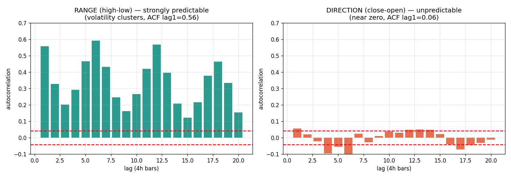

# Will Predicting OHLC (given Open) Improve the Model?

> Question: "We only predicted close as a demo. We actually have open/high/low/close. Given the
> open, predict high/low/close from history. Will that improve the model?"
>
> **Answer: Partly — and the split is the most useful finding in the whole study.**
> Predicting the **high, low, and range** is *dramatically* more tractable (genuine skill to extract).
> Predicting the **close *direction*** is exactly as hard as before (the noise wall doesn't move).
> Knowing the open barely helps for the close, because for a ~24h future the open ≈ previous close.

---

## 1. Decompose the bar — that's the key move

A candle, given its open `O`, is three numbers:

```
        High  ─────●   ← O + upper wick   (a SIZE: how far up it ran)
                   │
   Open  O  ───────┤   ← known at decision time
                   │
        Close ─────●   ← O + (close-open)  (a DIRECTION + size)
                   │
        Low   ─────●   ← O − lower wick    (a SIZE: how far down it ran)
```

Every OHLC prediction breaks into two fundamentally different kinds of quantity:

- **SIZE quantities** — the range `high−low`, the upper wick, the lower wick. "How far did price travel?"
- **DIRECTION quantity** — the sign of `close−open`. "Did it end up or down?"

These two have **opposite predictability**, and that's the entire answer.

---

## 2. The evidence from our actual data

I measured the **autocorrelation** (how predictable each quantity is from its own past — 0 = random, 1 = perfectly predictable) on all 2,119 NQ 4h bars:



| Quantity | What it is | lag-1 ACF | Verdict |
|---|---|---:|---|
| **Range** `(high−low)/open` | bar SIZE / volatility | **0.558** | **Strongly predictable** ✅ |
| close-to-close return (the OLD demo task) | next-bar direction | 0.068 | unpredictable ❌ |
| **Direction** `(close−open)/open` | this-bar direction | 0.056 | unpredictable ❌ |
| Open gap `(open−prevclose)/prevclose` | overnight jump | 0.001 | pure noise + tiny ❌ |

(white-noise / "indistinguishable from random" band = ±0.043)

**Read it plainly:**
- **Range autocorrelation is 0.558 — eight times higher** than anything in the old close-prediction task. Big bars follow big bars; calm follows calm. This is **volatility clustering**, and it is one of the most reliable patterns in all of finance.
- **Direction autocorrelation is 0.056 — basically zero**, same noise wall as the original study. Knowing recent bars tells you almost nothing about whether *this* bar closes above or below its open.

---

## 3. So, concretely, will it improve the model?

### ✅ Predicting HIGH, LOW, and RANGE — YES, big improvement available

Because range is strongly autocorrelated, a model that uses recent ranges (or an explicit volatility model) will **substantially beat** the naive "high = low = open" guess. There is real, exploitable structure here. This is genuinely forecastable and genuinely useful:

- **Stop-loss / take-profit placement** — if you can predict the bar will have a 0.9% range vs 0.4%, you size your stops accordingly. This is *directly* what the live `simple_strategy` dual-SL/TP engine needs.
- **Position sizing** — smaller size when predicted range (risk) is high.
- **Regime detection** — clusters of high predicted range = turbulent regime.

This is the same conclusion as `16_why_everything_failed_explained.md` §8 recommendation #1 ("predict volatility, not price") — you've independently arrived at the productive pivot. Range *is* volatility.

### ❌ Predicting the CLOSE DIRECTION given open — NO improvement

The sign of `close − open` has autocorrelation 0.056 — the same near-random wall the close-to-close study hit. Knowing the open does **not** tell you whether the bar closes green or red. A model here will again tie or slightly lose to naive on directional accuracy.

### ⚠️ Predicting the CLOSE *value* (not direction) given open — marginal, and for a subtle reason

You might think "given the open, predicting the close must be easier than predicting next bar's close from scratch." For most assets, yes — knowing the open removes the overnight **gap** uncertainty. **But not here:** NQ futures trade ~23h/day, so the open is almost identical to the previous close — the gap averages only **0.026%** (vs a 0.7% intrabar range). So "given open" gives you almost the same information as "given previous close." The close is still `open + (unpredictable direction) × (predictable size)`, and the unpredictable-direction part dominates the *value* error. Net: small improvement at best, because the irreducible noise is the direction, not the level.

---

## 4. The honest measurement caveat (don't get fooled by RMSE going down)

If you build an OHLC model and just report "RMSE dropped!", be careful — **the RMSE on high and low will look great almost trivially**, because high and low are physically anchored near the open (they can only be ~0.7% away on a 4h bar). Even a dumb "high = open" guess has small RMSE.

The *real* test is the same as this whole study: **does the model beat the naive baseline for that quantity?**
- For **range**: a recent-range model beats naive-range comfortably (because ACF 0.56). Real skill. ✅
- For **high/low values**: only the *range* part is skillful; the rest is "high sits above open by a predictable amount" — measure lift-over-naive, not raw RMSE.
- For **close**: same noise wall. ❌

So "predicting OHLC" improves the model **only on the size/volatility dimension** — which happens to be the dimension that's actually useful for trading.

---

## 5. Recommended reframing (if you want to pursue this)

Don't predict O/H/L/C as four equal targets. Predict the **decomposition**, scoring each piece honestly:

```
Given open O and history, forecast:
  1. RANGE   = high − low        ← model this hard; it's predictable (volatility). HIGH VALUE.
  2. SKEW    = where open sits in the range (did it open near the high or low?)
  3. DIRECTION = sign(close − open)  ← accept this is ~coin-flip; don't over-invest.
Then reconstruct:
  high  = O + f(range, skew)
  low   = O − f(range, skew)
  close = O + direction × g(range)
```

The right tools for the range/volatility piece:
- **GARCH** family (the textbook volatility-clustering model — exploits exactly the ACF=0.56 structure).
- **Realized volatility** from 1-minute data — *this* is where finer candles genuinely help (see `16_why_everything_failed_explained.md` §5). 1-min bars let you measure each 4h bar's true volatility far more accurately, which improves range forecasting.
- A simple, strong baseline: **EWMA of recent ranges** (exponentially-weighted moving average) — often beats fancy models for range.

Metric: report **lift-over-naive separately for range and for direction**, never a single blended RMSE.

---

## 6. One-paragraph summary

Yes and no. A candle given its open is `open + direction × size`. The **size** part (range, high, low) is strongly predictable on this data — range autocorrelation is 0.56, eight times anything in the close study — because volatility clusters; a model here genuinely beats naive and is directly useful for stop/size decisions. The **direction** part (does it close up or down) is autocorrelation ~0.06, the same noise wall as before, so predicting the close *direction* won't improve. And because NQ is a near-24h future, the open ≈ previous close (gap ~0.026%), so "given the open" adds little for the close *value*. Net: predicting OHLC improves the model **on the volatility/range dimension only** — which is exactly the dimension worth having, and the natural next study (GARCH / realized-vol from 1-min data, scored as lift-over-naive on range).
