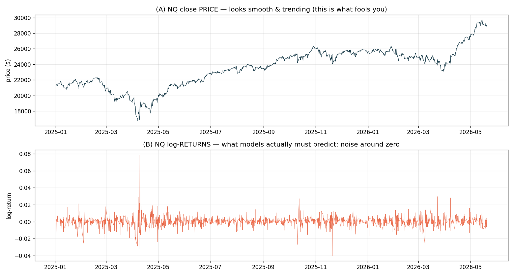
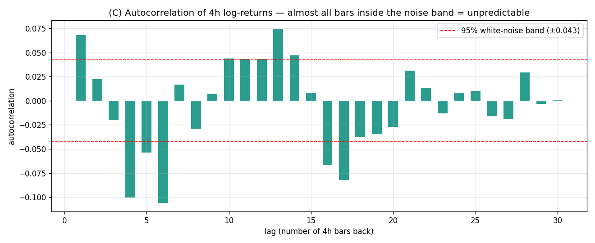

# Executive Report — What Is and Isn't Forecastable in NQ 4h Data

> **Audience:** decision-maker / colleague who wants the conclusion, the evidence, and the
> next move — without reading the 17 working notes.
> **Scope:** consolidates `16_why_everything_failed_explained.md` (why price forecasting failed)
> and `17_ohlc_will_it_help.md` (what OHLC decomposition reveals) into one deliverable.
> **Date:** 2026-06-01. **Data:** NQ 4-hour bars, 2025-01 → 2026-05 (2,119 bars).

---

## 1. Bottom line (one paragraph)

We set out to forecast the next 4-hour NQ **price** and tested 11 models (naive, Prophet, ARIMA, SARIMAX×2, StatsForecast, Darts LSTM/NBEATS/TFT, ± regressors). **None beat the trivial "assume no change" baseline** — not because the models are broken, but because **the next bar's price *direction* is ~99% random** on this data. However, decomposing the candle into its parts reveals that **one dimension is strongly forecastable: the bar's *range/volatility* (how far it travels), not its direction (where it ends up).** The recommended pivot is to forecast **volatility/range**, which is both predictable *and* directly useful for the live trading engine's stop/size decisions.

---

## 2. The core finding, visually

### Price looks predictable; price *moves* are not



The same data: smooth, "forecastable-looking" **price** (top) vs the **returns** a model must actually predict (bottom) — noise around zero.

### The root cause: returns carry almost no memory



**Autocorrelation** = how much one bar tells you about the next (0 = nothing, ±1 = perfect). Nearly every bar sits inside the red "indistinguishable-from-random" band. The strongest signal (lag 1 = +0.068) means the prior bar explains **~0.5%** of the next bar's move. The other 99.5% is irreducible noise.

### The arithmetic that explains every result

```
naive error (RMSE)  ≈  price × volatility  =  $25,786 × 0.526%  ≈  $135.6
measured naive RMSE                                              =  $133.6   ✓
```

That ~$134 is a **noise floor**. Every model lands there because that *is* the randomness; none can remove it.

---

## 3. The 11-model result (price-forecasting leaderboard so far)

| Model | RMSE ($) | Lift vs naive | Reading |
|---|---:|---:|---|
| **naive** (assume no change) | **133.59** | 0.00% | the bar to beat — near-optimal for a random walk |
| prophet (tuned) | 133.89 | −0.22% | its own CV chose the *stiffest* trend → "nothing to fit" |
| arima (pmdarima) | 133.95 | −0.26% | AR coefficients collapse to ~0 (no autocorrelation to use) |
| sarimax-plain | 134.05 | −0.34% | confirms ARIMA verdict is library-robust |
| sarimax-regressors | 134.20 | −0.45% | **regressors made it worse, not better** |
| statsforecast | 134.92 | −0.99% | third ARIMA library, same wall |
| darts-rnn-plain (LSTM) | 134.22 | −0.47% | deep autoregression — same wall |

*(Darts NBEATS/TFT runs were interrupted by a system crash — see `15_system_crash_postmortem.md` — but the pattern is already unambiguous: every model clusters at ~$134, slightly behind naive.)*

**Two robust sub-findings:**
1. **Adding exogenous regressors did not help** (Prophet, SARIMAX both neutral-to-worse). The 14 bar-open features we engineered carry no usable price-direction signal.
2. **Model sophistication did not help** — a one-line naive rule beats Bayesian decomposition (Prophet), classical AR (ARIMA family), and deep learning (LSTM).

---

## 4. Why each model "failed" (plain language)

- **Naive** is the benchmark: "next price = current price." For a near-random-walk this is *mathematically near-optimal*, not lazy.
- **Prophet** is built for `trend + seasonality + holidays`. Returns have none of those at meaningful size; Prophet's own cross-validation flattened it to the stiffest setting — it correctly reported "no structure here."
- **ARIMA / SARIMAX / StatsForecast** predict the next value from autocorrelation in past values. Autocorrelation ≈ 0 → fitted coefficients ≈ 0 → prediction collapses to naive, plus a small estimation-noise penalty.
- **Deep nets (LSTM/NBEATS/TFT)** can only learn a past→future mapping that exists. It barely does, so extra capacity just risks overfitting noise.

Full term-by-term explanation in `16_why_everything_failed_explained.md`.

---

## 5. The OHLC insight — where the signal actually lives

We only predicted **close** as a demo. The real data is OHLC, and decomposing a candle (given its open `O`) into `O + direction × size` exposes two opposite-predictability quantities:


| Quantity | Meaning | lag-1 autocorrelation | Forecastable? |
|---|---|---:|---|
| **Range** `(high−low)/open` | bar **size** / volatility | **0.558** | **YES — strongly** ✅ |
| **Direction** `(close−open)/open` | up or down | 0.056 | no ❌ |
| open gap `(open−prevclose)` | overnight jump | 0.001 | no (and tiny) ❌ |

**Range autocorrelation is 0.56 — eight times higher than anything in the price study.** This is **volatility clustering**: big bars follow big bars, calm follows calm. It is one of the most reliable patterns in finance.

**So, will predicting OHLC improve the model?**
- **High / low / range: yes, materially** — range is predictable, and a model beats naive here. Directly useful for stop-loss/take-profit placement and position sizing.
- **Close direction: no** — same noise wall (0.056).
- **Close value given open: marginal** — because NQ trades ~23h/day, the open ≈ previous close (gap only 0.026%), so knowing the open adds little.

Detail and the honest RMSE caveat in `17_ohlc_will_it_help.md`.

---

## 6. Does finer (1-minute) data help?

- **For price direction: no — it makes it worse** (finer bars have lower signal-to-noise; microstructure noise appears).
- **For range/volatility: yes — this is exactly where it helps.** Realized volatility computed from 1-minute bars is a far more accurate measure of each 4h bar's true range, which directly improves range forecasting.

So 1-minute data is valuable — just for the **volatility** question, not the **direction** question.

---

## 7. Recommended next step

**Stop forecasting price direction; forecast range/volatility instead.** Concretely, a "Phase F" study:

1. **Target:** next-bar range `(high−low)` (and optionally the upper/lower wicks).
2. **Baselines:** naive-range (last bar's range) and **EWMA of recent ranges** (often the model to beat).
3. **Models:** **GARCH** (the textbook volatility-clustering model — exploits the ACF=0.56 directly); optionally realized-volatility features from 1-minute data.
4. **Metric:** lift-over-naive on **range**, reported separately from any direction metric — never a blended RMSE.
5. **Payoff:** a working range forecast feeds straight into the live `simple_strategy` dual-SL/TP engine (better stop placement) and position sizing — unlike a price forecast, which this study shows cannot be made accurate.

**What NOT to do:** more tuning of price-direction models, or going to 1-minute data hoping direction gets easier. Both are dead ends per §2–§6.

---

## 8. Document map

| Topic | File |
|---|---|
| This executive report | `18_executive_report_forecastability.md` |
| Why every model failed (full, term-by-term) | `16_why_everything_failed_explained.md` |
| Will OHLC help (full analysis) | `17_ohlc_will_it_help.md` |
| Price-forecasting leaderboard + per-phase notes | `04`–`13_*.md`, `outputs/leaderboard.csv` |
| NeuralProphet exclusion (root cause) | `09_neuralprophet_root_cause_report.md` |
| System crash post-mortem | `15_system_crash_postmortem.md` |
| Diagnostic plots | `plots/diagnostics/` |
