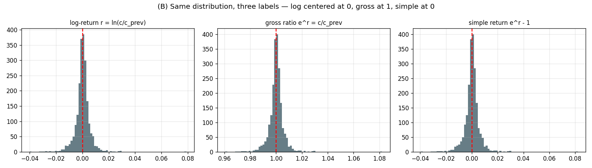
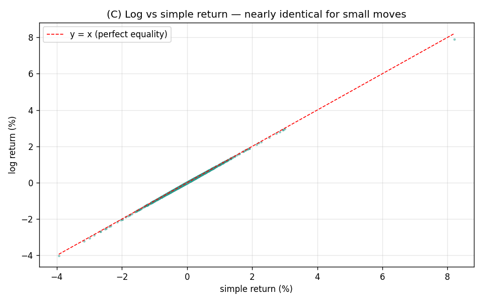
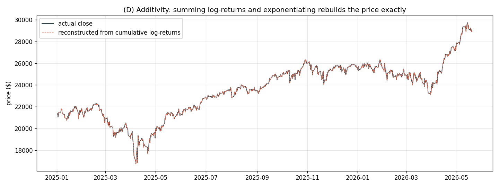
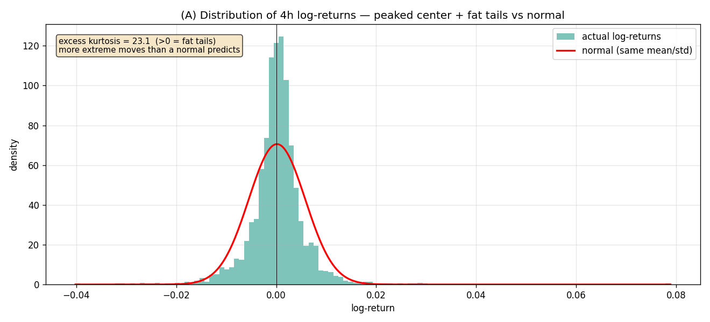

# Returns — A Full, Verbose Explainer

> What a "return" is, why we forecast it instead of price, the three equivalent ways to write
> it, its statistical shape (and the fat tails), the additivity property, and every term defined.
> Companion to `16_why_everything_failed_explained.md`. Charts in `plots/diagnostics/`.

---

## 1. What is a return?

A **return** is the *change* in price from one bar to the next, expressed as a fraction rather than dollars. If the close was `c_{t-1}` last bar and `c_t` this bar, there are three standard ways to write "how much it changed":

| Name | Formula | Typical value (NQ 4h) | Centered at |
|---|---|---|---|
| **Simple return** | `R_t = c_t / c_{t-1} − 1` | +0.000160 | 0 |
| **Gross return (ratio)** | `G_t = c_t / c_{t-1}` | 1.000160 | 1 |
| **Log return** | `r_t = ln(c_t / c_{t-1})` | +0.000144 | 0 |

**Definitions:**
- **Simple return** — the percentage change. "+0.5%" means `R = 0.005`.
- **Gross return / ratio** — one plus the simple return. It's the multiplier that takes you from last price to this price: `c_t = c_{t-1} × G_t`. Equivalently `G_t = exp(r_t)`.
- **Log return** — the natural logarithm of the gross ratio. The quant default (reasons in §4).

All three are the **same information** in different clothing — see §3.

---

## 2. Why forecast returns instead of price?

Because **price is non-stationary and returns are (roughly) stationary** — and statistical models can only learn from stationary quantities.

**Definitions:**
- **Stationary** — the statistical properties (mean, variance, correlations) stay constant over time. You can learn a fixed rule from it.
- **Non-stationary** — those properties drift. A rule learned early stops applying later.

NQ price went from ~\$21,000 (Jan 2025) to ~\$29,000 (May 2026). A model that learned "price is usually ~\$21k" in early 2025 would be catastrophically wrong by 2026 — that's non-stationarity. But the *returns* over that whole span always hovered around zero with roughly the same spread (~0.57% per bar), whether NQ was at \$21k or \$29k. That constancy is what makes returns learnable.

**The reconstruction is exact**, so forecasting returns loses nothing:

$$
forecast a return  →  rebuild the price:   ĉ_t = c_{t-1} × exp(r̂_t)
$$

---

## 3. The three returns are the same thing (don't be fooled by the units)

Three histograms of the **same** NQ data. They're identical bell shapes, just relabeled:
- **log-return** centered at **0**
- **gross ratio** centered at **1** (it's `exp(log-return)`)
- **simple return** centered at **0** (it's `gross − 1`)

For the small moves typical of a 4h bar, log and simple returns are almost numerically equal:

Every point lies on the `y = x` line — for moves under a few percent, `ln(1+R) ≈ R`. They only diverge for large moves (the math: `ln(1.10) = 0.0953 ≠ 0.10`).

**Why this matters for modelling:** because they're related by the strictly-increasing, invertible function `exp()`, **no choice among them changes what is predictable.** Correlation and rank structure are invariant to this kind of transform. (This is exactly what `20_exp_return_target_study.md` proves empirically — predicting the gross ratio gives the *same* RMSE as predicting the log-return.)

---

## 4. Why log returns specifically? (three concrete reasons)

Quant convention defaults to **log returns** for three reasons, each a real property:

**(a) Additivity over time.** Log returns *add up*; simple returns don't. The log return over a week = the sum of the daily log returns. This makes multi-period analysis clean. Demonstrated here — summing all the 4h log-returns and exponentiating rebuilds the price track exactly:

The dashed reconstruction sits exactly on the actual price, because `c_t = c_0 × exp(Σ r_i)`.

**(b) Symmetry.** A +10% gain then a −10% loss does NOT return you to start in simple terms (1.10 × 0.90 = 0.99, a 1% loss). In log terms, +0.0953 then −0.0953 = exactly 0. Log returns treat up and down moves symmetrically, which matches how risk actually compounds.

**(c) Better-behaved distribution.** Log returns are closer to (though not exactly) normally distributed, which most statistical models assume.

---

## 5. The shape of returns — and the fat tails

The green histogram is the actual distribution of 4h log-returns; the red curve is a **normal distribution** (bell curve) with the same mean and standard deviation. Two features stand out:

**(a) Peaked center.** Most bars are *very* small moves — more clustered near zero than a normal predicts. Markets spend most of their time quiet.

**(b) Fat tails.** The actual data has far more **extreme** moves than the normal curve allows. The **excess kurtosis is 23.1** — for reference, a normal distribution has excess kurtosis 0. This is huge.

**Definitions:**
- **Standard deviation (σ)** — the typical spread of returns; here ~0.57% per 4h bar. Also called **volatility**.
- **Kurtosis / fat tails** — how often extreme values occur. High kurtosis = rare giant moves happen *much* more often than a bell curve says. The +8.2% bar on 2025-04-09 (tariff-pause day, see `01_data_jump_investigation.md`) is a ~14σ event — under a normal distribution that should never happen in the life of the universe, yet here it is in 16 months of data.

**Why fat tails matter for forecasting:** they're the reason RMSE (which squares errors) is dominated by a handful of giant bars, and the reason no Gaussian-assuming model can ever "predict" those bars. They are the irreducible-risk part of the series.

---

## 6. The volatility-clustering structure (the one predictable thing)

Returns' *direction* is unpredictable (autocorrelation ≈ 0.07 — see `16_..._explained.md`), but their *size* is not. Big moves cluster together (turbulent weeks) and small moves cluster (calm weeks). This is **volatility clustering**, and it's why the **range** `(high−low)` has autocorrelation 0.56 (eight times the direction signal — see `17_ohlc_will_it_help.md`). 

So the full picture of a return is:

$$
return_t = (sign: ~random, unpredictable)  ×  (size: volatility, strongly predictable)
$$

The sign is a coin flip; the magnitude follows a predictable, clustering pattern. This split is the single most important practical takeaway of the whole study.

---

## 7. Glossary (every term in one place)

| Term | Meaning |
|---|---|
| **Return** | fractional price change between bars |
| **Simple return** `R` | `c_t/c_{t-1} − 1`; the percentage change |
| **Gross return** `G` | `c_t/c_{t-1}`; the multiplier; `= exp(r)` |
| **Log return** `r` | `ln(c_t/c_{t-1})`; quant default |
| **Stationary** | statistical properties constant over time (returns ≈ yes) |
| **Non-stationary** | properties drift over time (price = yes) |
| **Volatility (σ)** | standard deviation of returns; typical move size |
| **Kurtosis / fat tails** | frequency of extreme moves vs a normal distribution |
| **Autocorrelation** | how much a value predicts a future value (0 = none) |
| **Volatility clustering** | big moves follow big moves; calm follows calm |
| **Additivity** | log returns sum across time; simple returns don't |
| **Reconstruction** | rebuilding price from returns: `ĉ_t = c_{t-1}·exp(r̂_t)` |

---

## 8. One-paragraph summary

A return is the per-bar fractional price change, written three equivalent ways (simple `c/c_prev−1`, gross `c/c_prev`, log `ln(c/c_prev)`) that differ only by the invertible `exp` map and so carry identical information. We forecast returns rather than price because price is non-stationary (drifts from \$21k to \$29k) while returns are stationary (always ~0 ± 0.57%). Log returns are the default because they add across time, treat gains/losses symmetrically, and are better-behaved. The return distribution is sharply peaked with very fat tails (excess kurtosis 23) — extreme bars far more common than a bell curve allows, which is why RMSE is outlier-dominated and unbeatable on direction. The only predictable component is the *size* of returns (volatility clustering, range ACF 0.56), not their *sign* (ACF 0.07).
