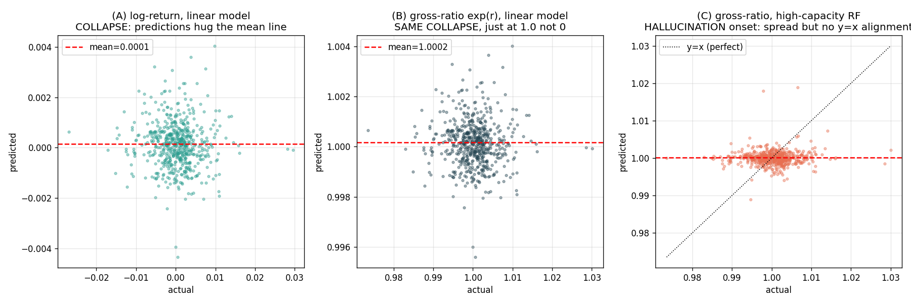

# Does Training on `exp(r)` Solve the Near-Zero Average — or Make the Model Hallucinate?

> The sharp follow-up to `20_exp_return_target_study.md`. That doc proved `exp(r)` gives the same
> RMSE. This doc answers the *mechanism* question you actually asked: when the target's average is
> ~0, what does the model **do internally** — and does switching to `exp(r)` (average ~1.0) change
> whether it **collapses** (refuses to predict) or **hallucinates** (invents predictions)?
>
> **Answer: Neither.** `exp(r)` does not solve the near-zero average and does not cause
> hallucination. It just **relocates the collapse point from 0 to 1.0** — and 1.0 reconstructs to
> the exact same naive price. The collapse-vs-hallucinate axis is controlled by **model capacity**,
> not by the `exp` transform. Evidence below.

---

## 1. First, define the two failure modes precisely

When a model faces a target it can't predict, it fails in one of two ways:

- **COLLAPSE (a.k.a. mean-reversion to the unconditional mean):** the model gives up on per-bar variation and outputs (almost) the same number every time — the average of the target. Its predictions have **near-zero variance** and **near-zero correlation** with the truth. This is the *safe* failure: outputting the mean return ≈ 0 reconstructs to "price = previous close" = **naive**. You lose nothing vs the baseline.

- **HALLUCINATE (a.k.a. overfitting / fitting noise):** the model produces confident, *varied* predictions that swing around — but those swings are driven by noise in the training data, not real signal. Predictions have **high variance** but still **near-zero correlation** with the truth. This is the *dangerous* failure: the wild guesses are wrong in both directions, so reconstructed price is **worse than naive**.

The whole question is: which one happens, and does `exp(r)` change it?

---

## 2. The experiment

Two targets — log-return `r` (mean ≈ 0) and gross ratio `exp(r)` (mean ≈ 1.0) — each fed to two models: a low-capacity **LinearRegression** and a high-capacity **RandomForest** (200 trees, unlimited depth). 5 lags as features, fit on 2025, tested on 2026. We measure two diagnostics:

- **variance ratio** = `std(predictions) / std(actuals)`. Near 0 = collapse (flat predictions); near 1 = full-amplitude predictions.
- **correlation(pred, actual)**. This is the *real* signal. Near 0 = the model knows nothing, regardless of how much its predictions swing.

| Model | Target | variance ratio | correlation | Diagnosis |
|---|---|---:|---:|---|
| Linear | **log r** (mean 0) | 0.175 | −0.040 | collapse |
| Linear | **exp r** (mean 1.0) | 0.176 | −0.040 | collapse (identical) |
| RandomForest | **log r** | 0.362 | +0.044 | hallucination onset |
| RandomForest | **exp r** | 0.369 | +0.046 | hallucination onset (identical) |

Two things jump out:

1. **The `log r` and `exp r` rows are identical** (0.175 vs 0.176; −0.040 vs −0.040). The `exp` transform changes the model's behavior by *nothing*. Whatever failure mode you get on `r`, you get the same on `exp(r)`.
2. **The failure mode is set by the model, not the target.** Linear → collapse (variance ratio 0.18). RandomForest → starts to hallucinate (variance ratio doubles to 0.37) but correlation stays ~0 — it's producing more varied guesses that are still uncorrelated with reality. **That extra variance is pure noise-fitting = the beginning of hallucination.**

---

## 3. See it

- **(A) log-return, linear model — COLLAPSE.** Predictions (y-axis) form a tight horizontal band hugging the mean line, *regardless* of the actual value (x-axis). The model has thrown up its hands and outputs ≈ the average every time.
- **(B) gross-ratio `exp(r)`, linear model — THE SAME COLLAPSE, just relocated to 1.0.** Identical picture, shifted up by 1. This is the visual proof that `exp(r)` doesn't "solve" anything — the model collapses just the same, only the collapse value moved from 0 to 1.0. And `price = prev × 1.0 = prev = naive`, exactly as `price = prev × exp(0) = prev = naive`.
- **(C) gross-ratio, high-capacity RandomForest — HALLUCINATION onset.** Now the predictions spread out vertically (more variance) — but they form a *blob*, not a diagonal. There's no alignment with the `y = x` line, meaning the spread is noise, not signal. The model is inventing structure that isn't there.

---

## 4. Direct answers to your question

**"Will training on `exp(r)` solve the near-zero average?"**
No. It moves the average from ~0 to ~1.0, but the model still collapses to *whatever the average is*. A collapse to 1.0 reconstructs to the identical naive price as a collapse to 0. The near-zero-ness was never the problem — the problem is that the **conditional** mean (best guess given the past) ≈ the **unconditional** mean (the overall average), because the past carries almost no information. Shifting the average doesn't create information.

**"Or will it make the model hallucinate?"**
No — not by itself. `exp(r)` is behaviorally identical to `r` (§2 rows match to 3 decimals). Hallucination is triggered by **giving a high-capacity model freedom on a no-signal target** — and that happens equally on both targets. The RandomForest hallucinates a bit on `r` and the exact same amount on `exp(r)`.

**So what actually controls collapse vs hallucinate?** Model capacity and regularization:
- **Low capacity / strong regularization** → collapse → safe → ties naive.
- **High capacity / weak regularization** → hallucinate → dangerous → worse than naive.
- This is why, in the main study, Prophet's own cross-validation chose the *stiffest* setting (`changepoint_prior_scale=0.001`): it deliberately forced itself toward collapse to *avoid* hallucinating. That was the correct, self-protective choice.

---

## 5. The subtle case where target scale *would* matter (and why it doesn't here)

There is one real scenario where near-zero targets genuinely cause hallucination: **if the loss function is relative/percentage-based** (e.g. MAPE, or any loss with the target in a denominator). Then a target near 0 makes the loss explode (divide-by-almost-zero), and the optimizer chases those exploding terms → genuine hallucination. In *that* setup, switching to `exp(r)` (near 1.0, never near 0) would genuinely help.

**But it doesn't apply to us**, for two reasons:
1. We score with **absolute** error (RMSE/MAE on reconstructed price), which has no target-in-denominator blow-up.
2. Every model **standardizes** the target before fitting, mapping near-zero `r` to unit variance — so the optimizer never even sees the raw near-zero scale.

So the one mechanism by which `exp(r)` could have helped is switched off by our loss choice and standardization. Under our setup, it's a pure no-op.

---

## 6. The takeaway in one paragraph

Training on `exp(r)` neither solves the near-zero-average problem nor causes hallucination — it relocates the model's collapse point from 0 to 1.0, and since `price = prev × 1.0 = prev = naive`, the reconstructed forecast is unchanged (variance ratio 0.18 and correlation −0.04 are identical for both targets). The real axis is **collapse vs hallucinate**, and it's governed by **model capacity**: a low-capacity model safely collapses to the mean (ties naive), while a high-capacity model hallucinates by fitting noise (loses to naive) — and it does so equally whether fed `r` or `exp(r)`. The only setting where the near-zero scale genuinely bites is a *relative/percentage loss*, which we don't use, and which standardization would neutralize anyway. Bottom line: the near-zero average is a symptom of "no signal," not a cause of failure — and you cannot cure a no-signal problem by relabeling the units of the thing you can't predict.
