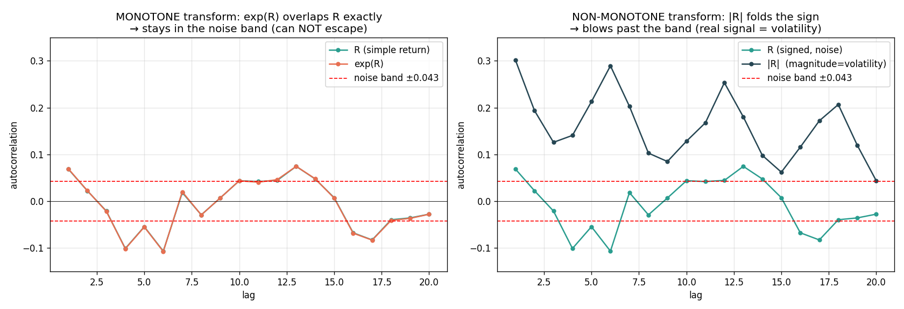

# Does `exp(simple return)` Escape the White-Noise Band?

> **Question:** the simple return 
$$
R = (x_t − x_{t-1})/x_{t-1}
$$
is a small near-zero number.
> What if we take `exp(R)` (instead of the gross ratio) — will the bigger values "get out of the
> white-noise range"?
>
> **Answer: No.** `exp(R)` keeps the autocorrelation at ~0.07, exactly where `R` already was —
> still in the noise band. And here's the important part: **the white-noise band is not about how
> big the numbers are; it's about sample count.** You can't escape it by enlarging values. The
> only way out is a transform that *extracts a different quantity* — and that turns out to be the
> volatility (`|R|` or `R²`), which is a non-monotone fold of the sign. Evidence + the key concept
> below.

---

## 1. First: what is the "white-noise band" actually made of?

The dashed red band on every autocorrelation chart is:

$$
band  =  ± 1.96 / √N        where N = number of bars
      =  ± 1.96 / √2118
      =  ± 0.0426
$$

**It depends ONLY on `N`, the sample count — not on the magnitude of the values.** It's the range within which an autocorrelation is statistically indistinguishable from zero (pure randomness). To "get out of the white-noise range," you must make the **autocorrelation itself** bigger than 0.0426 — making the *numbers* bigger does nothing, because autocorrelation is normalized (scale-free).

This is the crux: "small values" was never the obstacle. A correlation of 0.07 is 0.07 whether the values are 0.005 or 5,000,000.

---

## 2. Empirical test: `exp(R)` at several scales

I took the simple return `R` and applied `exp` at increasing amplifications, measuring lag-1 autocorrelation:

| transform | mean | lag-1 ACF | escapes the ±0.043 band? |
|---|---:|---:|---|
| `R` (simple return) | 0.0002 | 0.0686 | barely out (the faint real lag-1 signal) |
| `exp(R)` | 1.0002 | 0.0694 | **no change** — same 0.07 |
| `exp(10·R)` | 1.0033 | 0.0797 | still ~0.08, no real escape |
| `exp(100·R)` | 2.9174 | **0.0030** | **worse** — collapses *into* the noise |

Two lessons:

1. **`exp(R)` ≈ `R`'s autocorrelation.** Because for small `R`, `exp(R) ≈ 1 + R` — it's essentially "add 1," a shift, which can't change correlation. The 0.0686 → 0.0694 difference is the third-decimal nonlinearity, meaningless.
2. **Amplifying *before* exp backfires.** At `exp(100·R)` the few large-magnitude bars get blown into enormous outliers (mean jumps to 2.9), and those outliers *destroy* the autocorrelation (0.003 — pure noise). So aggressive nonlinearity makes it **worse**, not better.

**`exp(R)` cannot escape the white-noise band.**

---

## 3. The key concept: monotone vs non-monotone transforms

Why is `exp` powerless here? Because **`exp` is monotone (order-preserving).** It never changes *which* bars are up and which are down — it just relabels the values while keeping their order. Autocorrelation of signed returns is fundamentally about "does an up-bar tend to be followed by an up-bar?" Since `exp` preserves up/down, it can't change that pattern. **Any monotone transform — `exp`, `log`, `×1000`, `+1`, square-root — is trapped at the same ~0.07.**

To escape, you need a transform that **changes the question** by folding or recombining the data using structure the raw series doesn't expose on its own. The classic one: **take the magnitude** (drop the sign).

- **Left panel — `exp(R)` (monotone).** Its autocorrelation curve lies *exactly on top of* `R`'s. Both hug the noise band. No escape.
- **Right panel — `|R|` (non-monotone, sign folded).** It **blows past the band** — autocorrelation 0.30 at lag 1, decaying slowly. This is real, strong signal.

| transform | type | lag-1 ACF | in noise band? |
|---|---|---:|---|
| `exp(R)` | monotone | 0.069 | yes — noise |
| `R²` | non-monotone (folds sign) | **0.147** | **no — signal** |
| `\|R\|` | non-monotone (folds sign) | **0.301** | **no — strong signal** |

---

## 4. Why does `|R|` escape but `exp(R)` doesn't? (the intuition)

- **Signed return `R`** answers "*which direction* did price go?" — that's a coin flip (no memory, ACF 0.07).
- **Magnitude `|R|` or `R²`** answers "*how big* was the move, ignoring direction?" — that's **volatility**, and volatility **clusters** (turbulent bars follow turbulent bars). That clustering is real, persistent autocorrelation (0.30).

`exp(R)` keeps the sign, so it stays stuck measuring the unpredictable thing (direction). `|R|` throws away the sign, so it measures the predictable thing (size). The escape isn't about value magnitude — it's about **switching from the sign question to the size question.**

This is the same result as `17_ohlc_will_it_help.md` (range = high−low, ACF 0.56) and `19_returns_explained_full.md` §6: **the predictable component of a return is its size, not its direction.**

---

## 5. Direct answer

**"Will `exp(simple return)` solve the small values and get out of the white-noise range?"**

No, on both counts:
- It doesn't meaningfully change the values' usefulness — `exp(R) ≈ 1 + R` for small `R`, a cosmetic shift.
- It cannot escape the white-noise band, because that band is set by sample count (N), not value size, and `exp` is a monotone transform that preserves the unpredictable sign structure (ACF stuck at ~0.07).
- Pushing harder (`exp(100·R)`) makes it *worse* by manufacturing outliers that destroy what little correlation existed.

**What *does* escape the band:** a non-monotone transform that extracts **magnitude/volatility** — `|R|` (ACF 0.30) or `R²` (ACF 0.15), or directly the bar **range** `high−low` (ACF 0.56). That's the real, signal-bearing target — and it's exactly the volatility-forecasting pivot recommended in `16_..._explained.md` §8 and `17_ohlc_will_it_help.md`.

---

## 6. One-paragraph summary

`exp(simple return)` does not escape the white-noise band. The band (±0.043) is fixed by sample count, not value magnitude, so enlarging numbers is irrelevant; you must enlarge the *autocorrelation*, and `exp` — being monotone — preserves the unpredictable sign structure and leaves autocorrelation at ~0.07 (amplifying first, e.g. `exp(100·R)`, even destroys it via outliers). The only transforms that break out are **non-monotone** ones that fold the sign and expose **magnitude/volatility** — `|R|` (0.30), `R²` (0.15), or the bar range (0.56) — because volatility clusters while direction is a coin flip. The lesson the whole study keeps arriving at from every angle: you cannot manufacture predictability by re-scaling or bending an unpredictable variable; you have to switch to a *different quantity* (size, not direction) that has real memory.
