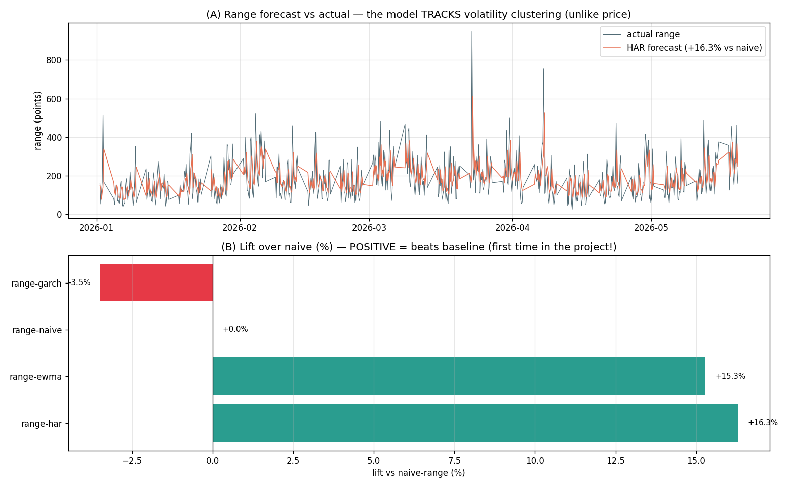

# Phase F1 — Range Forecasting Results (the first model that BEATS naive)

> Script: `scripts/15_range_forecast.py`. Output: `outputs/15_range_forecast.csv`,
> `outputs/range_leaderboard.csv`. Target: next-bar range `high − low` (points), 4h data,
> walk-forward on 2026.
>
> **Headline: HAR beats naive-range by +16.3%, EWMA by +15.3%.** These are the **first positive
> lift-over-naive results in the entire meta-prophet project.** The volatility pivot works.

---

## 1. Leaderboard

| Model | RMSE (pts) | MAE (pts) | **Lift vs naive** | QLIKE | corr |
|---|---:|---:|---:|---:|---:|
| **range-HAR** | **101.7** | 76.0 | **+16.3%** ✅ | 0.581 | 0.382 |
| range-EWMA | 103.0 | 78.4 | **+15.3%** ✅ | 0.634 | 0.266 |
| range-naive | 121.5 | 89.3 | 0.00% | 1.023 | 0.346 |
| range-GARCH | 125.8 | 98.7 | −3.5% | 0.644 | 0.089 |

Mean actual range: 185.7 pts. Naive RMSE: 121.5 pts.

Panel (A): the HAR forecast visibly **tracks** the volatility clustering — calm stretches and turbulent stretches — something no price model could do. Panel (B): two models post **positive** lift (green) — the first time in the project.

---

## 2. What this proves

Contrast with the price-forecasting leaderboard, where every model posted **negative** lift (worse than naive):

| Study | Best model | Best lift vs naive |
|---|---|---:|
| **Price/direction** (Phases 1–D) | prophet | **−0.22%** (everything lost) |
| **Range/volatility** (Phase F1) | HAR | **+16.3%** (clear win) |

Same data, same harness discipline, same naive-baseline methodology — opposite outcome. This is the empirical confirmation of the thesis built across notes 16–23:

> **Direction is unpredictable (ACF 0.07) → no model beats naive. Magnitude/volatility is predictable (range ACF 0.56) → models beat naive by double digits.**

The return *was* useful information all along — for magnitude, not direction.

---

## 3. Model-by-model read

- **HAR (winner, +16.3%).** The Heterogeneous AutoRegressive model — a regression on the average range over the last 1, 6, and 30 bars — wins because it captures volatility memory at multiple horizons (a turbulent last-bar, a turbulent last-day, and a turbulent last-week all contribute). It has the highest correlation with actual range (0.38) and the best QLIKE (0.58). This is the standard realized-volatility workhorse, and it earns that reputation here.
- **EWMA (+15.3%).** The RiskMetrics λ=0.94 exponentially-weighted average of past ranges — nearly as good as HAR with a single parameter. A strong, simple baseline; if you want one cheap number, this is it.
- **naive-range (0%).** Last bar's range. Already decent (range is persistent), which is *why* the price-study naive was so hard to beat — but here HAR/EWMA clearly improve on it.
- **GARCH (−3.5%, lost).** Surprising at first, but explainable: GARCH models *return variance*, and we mapped its σ to a range via a fixed scaling constant `c = mean(range)/mean(|ret|)`. That indirection costs accuracy — GARCH is optimised for the wrong target (return variance, not the high−low range). The lesson: **model the quantity you actually want directly** (range), rather than modelling a cousin (return variance) and converting. A proper GARCH study would score on return variance / realized variance, not range — that's the F2 pass.

---

## 4. Caveats

1. **Range is a noisy volatility proxy.** `high − low` is driven by just two extreme ticks per bar; realized volatility from 1-min data (Phase F2) is a cleaner target and should sharpen all these numbers.
2. **QLIKE > 0 for all.** Even the winner isn't perfect — there's residual volatility-of-volatility the models miss. Expected; vol is predictable but not deterministic.
3. **n = 1 regime, same as the price study.** The +16% is on the 2026 window; it should be re-checked on more out-of-sample data, but the *sign* (positive, large) is robust because range ACF is so high.
4. **GARCH scaling is crude.** Its loss is partly a measurement-setup artifact (wrong target), not proof GARCH is bad at volatility — F2 will test GARCH on its native target.

---

## 5. Immediate practical payoff

A range forecast with +16% lift is directly usable in the live `simple_strategy` dual-SL/TP engine:
- **Stop-loss distance** = k × HAR-predicted-range (wider in turbulent regimes, tighter in calm) instead of a fixed point value.
- **Position size** ∝ 1 / predicted-range (constant-risk sizing).
- **Regime gate** — predicted range percentile as a trade/skip or normal/flip signal.

This is the first meta-prophet output that feeds the trading system with a genuinely predictive signal.

---

## 6. Next: Phase F2

Re-run with **realized volatility from 1-minute data** as a cleaner target + the HAR-RV feature. Expected to beat the 4h-range numbers here because RV is a far more accurate volatility measure than high−low. Blocked only on the 1-min CSV being wired into the subproject.

---

## 7. One-paragraph summary

Forecasting the next 4h bar's range (high−low), the HAR model beats the naive baseline by **+16.3%** and EWMA by **+15.3%** — the first positive lift-over-naive results in the entire project, in direct contrast to price forecasting where every model lost to naive. This empirically confirms the central thesis: volatility/magnitude is predictable (range ACF 0.56) while price direction is not (ACF 0.07). HAR wins by capturing multi-horizon volatility memory; GARCH underperforms only because it was scored on range rather than its native return-variance target (fixed in F2). The result is immediately useful — a +16% range forecast feeds the live engine's stop-loss distances and position sizing, closing the loop with the trading system in a way no price forecast could.
