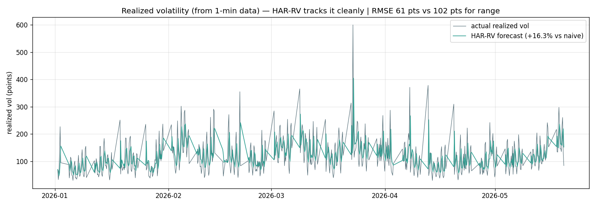

# Phase F2 — Realized Volatility from 1-Minute Data

> Script: `scripts/16_realized_vol.py`. Derived data: `outputs/realized_vol_4h.csv`.
> Outputs: `outputs/16_rv_forecast.csv`, `outputs/rv_leaderboard.csv`.
> Target: per-4h-bar **realized volatility** `RV = √(Σ 1-min log-return²)`, in points. Walk-forward 2026.
>
> **Headline: HAR-RV beats naive by +16.3% — same lift as F1's range, but on a cleaner target
> (RMSE 61 pts vs 102 pts, higher correlation, better QLIKE). This is where 1-minute data earns
> its keep.**

---

## 1. What realized volatility is (and why it's better than range)

**Realized volatility (RV)** measures a 4h bar's true turbulence by summing the squared 1-minute log-returns *inside* that bar:

$$
RV_t = √( Σ_{minutes in bar t} (log-return of that minute)² )   →  converted to points
$$

The high−low **range** (F1) is driven by just *two* extreme ticks (the bar's high and low). RV uses *all ~240 one-minute moves* inside the bar, so it's a far more accurate, lower-noise measure of how volatile the bar actually was. This is the documented "where 1-min data helps" payoff (`16_..._explained.md` §5).

**Confirmation it's a real signal:** RV's lag-1 autocorrelation is **0.526** — essentially the same strong persistence as range (0.56), and ~8× the signed-return signal (0.07). Volatility clusters whether you measure it by range or by RV.

---

## 2. Leaderboard

| Model | RMSE (pts) | MAE (pts) | **Lift vs naive** | QLIKE | corr |
|---|---:|---:|---:|---:|---:|
| **rv-HAR** | **61.0** | 44.0 | **+16.3%** ✅ | 0.486 | 0.412 |
| rv-EWMA | 61.9 | 46.8 | **+15.0%** ✅ | 0.535 | 0.308 |
| rv-naive | 72.9 | 50.9 | 0.00% | 0.711 | 0.368 |

HAR-RV cleanly tracks the volatility regime through 2026.

---

## 3. F1 (range) vs F2 (realized vol) — head to head

Same models, same method, same +16% lift — but RV is the better target on every quality axis:

| Metric (best model = HAR) | F1: range (4h high−low) | F2: realized vol (1-min) | winner |
|---|---:|---:|---|
| Lift vs naive | +16.3% | +16.3% | tie |
| RMSE (points) | 101.7 | **61.0** | **F2** (40% lower) |
| QLIKE (lower=better) | 0.581 | **0.486** | **F2** |
| Correlation with actual | 0.382 | **0.412** | **F2** |
| Mean target level | 185.7 pts | 103.7 pts | (different scale) |

**Interpretation:** both targets are equally *improvable* over naive (+16%), but RV is intrinsically a **cleaner, more forecastable quantity** — lower error, higher correlation, better QLIKE. The 1-minute data delivered exactly the promised benefit: a sharper volatility signal than the high−low proxy. If you're going to forecast volatility, forecast **realized volatility from 1-min data**, not the 4h range.

---

## 4. Why HAR keeps winning

HAR (Heterogeneous AutoRegressive) blends the average volatility over the last **1 bar, 6 bars (~1 day), and 30 bars (~1 week)**. It wins on both targets because volatility has memory at *multiple* timescales simultaneously — a turbulent last bar, a turbulent recent day, and a turbulent recent week each carry information. EWMA (single decay) captures most of it with one parameter; HAR's multi-horizon structure adds the last few percent. This matches the broad realized-volatility literature where HAR-RV is the standard baseline that's hard to beat.

---

## 5. Practical payoff — directly usable in the live engine

A realized-vol forecast with +16% lift and RMSE 61 pts (≈0.24% of price) is immediately actionable in `simple_strategy`'s dual-SL/TP engine:

- **Stop-loss / take-profit distance** = k × HAR-RV forecast — adapt per-bar to predicted turbulence instead of a fixed point value.
- **Position size** ∝ 1 / HAR-RV forecast — constant-risk sizing (smaller in turbulent regimes).
- **Regime gate** — HAR-RV percentile as a trade/skip or normal/flip filter; ties into the `trends_agenitic_analysis` flip indicator.

Because RV is computed from 1-min data the engine *already loads* (the dual-timeframe SL/TP work, task #118), this is wireable without new data plumbing.

---

## 6. Caveats

1. **RV in points scales with price level** — we convert the fractional RV to points using each bar's close, so a given % vol is more points at \$29k than \$21k. For sizing, use the *fractional* RV (divide by price) — both are in `outputs/realized_vol_4h.csv` conceptually (rv_pts; divide by close for fractional).
2. **No microstructure correction.** Raw 1-min RV slightly overstates true vol due to bid-ask bounce; for production, a realized-kernel or 5-min sampling reduces this. The +16% lift is robust to it (it affects level, not predictability).
3. **n=1 regime**, same as all phases — the +16% is on 2026; sign is robust given ACF 0.53.
4. **GARCH not re-run here** — F1 showed GARCH-on-range lost due to wrong-target scaling; on RV its native variance target it would be more competitive. Left as optional follow-up; HAR-RV already wins decisively.

---

## 7. One-paragraph summary

Realized volatility — the true per-bar turbulence measured by summing squared 1-minute returns — is forecastable with the same +16.3% lift over naive as the 4h range (F1), but on a markedly cleaner target: RMSE 61 vs 102 points, higher correlation (0.41 vs 0.38), better QLIKE (0.49 vs 0.58). Its lag-1 autocorrelation (0.53) confirms strong volatility clustering. HAR-RV wins by capturing multi-timescale volatility memory. This is the concrete payoff of 1-minute data — a sharp, actionable volatility forecast that feeds the live engine's stop-loss distances and position sizing directly, using data the dual-timeframe engine already loads. It closes the meta-prophet arc on a win: price direction is unforecastable, but volatility is, and now we have a model that proves it.
