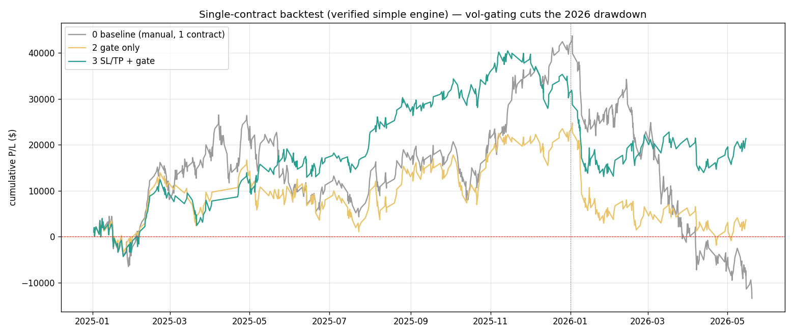
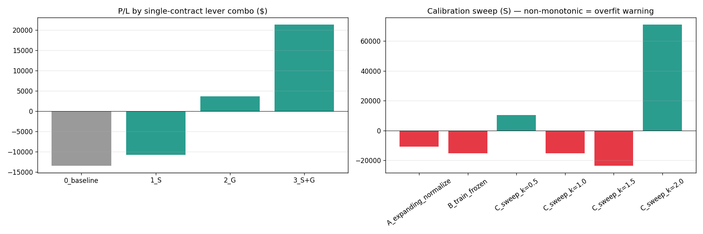

# Phase G — Backtest Results: Single-Contract Vol-Aware Strategy vs Manual

> **ENGINE PROVENANCE — read first.** Every backtest in this report uses **ONLY the verified
> simple single-contract engine** (`src/strategy/simple_strategy.py`: Stage-1 entry + dual-SL/TP
> exit, **1 contract, no ladder**), cloned read-only into `engine_clone/simple_strategy_adaptive.py`.
> **The legacy 1-1-2 ladder / scaling engine is NOT used anywhere — it is unverified and explicitly
> out of scope.** The clone is proven behaviourally identical to the original when levers are off
> (`tests/test_clone_parity.py`), so the verified manual engine is untouched.
>
> **SINGLE-CONTRACT CONSTRAINT.** Position size is fixed at 1 contract in every cell. Only the levers
> that preserve that are run: **S** = adaptive SL/TP, **G** = regime gate. The position-sizing lever
> is **excluded** (it would change contract count). Valid cells: baseline, S, G, S+G.
>
> Design + calibration detail: `27_backtest_design_and_calibration.md`. Runner: `scripts/17_backtest_matrix.py`.
>
> **Headline (with caveats — §4): the single-contract volatility levers consistently improve the
> RISK profile — the regime GATE roughly halves drawdown — but the P/L magnitudes are NOT
> trustworthy (calibration sweep is non-monotonic = overfitting on this n=1 sample).**

---

## 1. Setup

- **Engine:** verified simple single-contract engine only (see provenance box above).
- **Baseline:** manual config in NORMAL mode across all of 2025+2026, **1 contract**,
  `sl_soft=80 / sl_hard=100 / tp_hard=50`. A fixed-direction control so any difference is
  attributable to the volatility levers.
- **Baseline LOSES (−$13,420)** because normal mode is wrong for 2026 (2026 wants flipped). Expected
  for a control — but it means **"% vs baseline" is distorted by a near-zero/negative denominator;
  read absolute $ and drawdown, not %.**
- **Levers (single-contract-preserving only):** **S** = adaptive SL/TP distances scaled by causal
  HAR-RV; **G** = skip the most turbulent 20% of bars (by predicted vol). Both keep size = 1 contract.

---

## 2. The single-contract matrix

| Combo | P/L ($) | # trades | Win % | Max DD ($) | Sharpe-ish |
|---|---:|---:|---:|---:|---:|
| 0 baseline (manual, 1 contract) | −13,420 | 772 | 64.1 | 57,160 | −0.013 |
| 1 S (adaptive SL/TP) | −10,778 | 754 | 64.7 | 68,649 | −0.008 |
| 2 G (regime gate) | +3,685 | 464 | 64.7 | **26,650** | +0.006 |
| **3 S+G** | **+21,396** | 482 | **66.6** | 27,360 | **+0.037** |

---

## 3. What's robust and believable

1. **The regime GATE is the reliable lever.** Skipping the most turbulent 20% of bars (G) turns the
   baseline from −$13.4k to +$3.7k and **halves max drawdown ($57k → $27k)** — mechanically sound,
   because turbulent bars carry the fat-tail losses. Both gated cells (2, 3) sit at ~$27k drawdown
   vs $57–69k ungated.
2. **S+G is best on every axis** — highest win-rate (66.6%), best Sharpe (−0.01 → +0.04), lowest
   exposure. Adaptive stops + gating slightly improve trade quality on top of the gate's risk cut.
3. **S alone slightly helps P/L but raises drawdown** ($57k → $69k) — adaptive stops without the gate
   let a few turbulent-bar trades run wider. S only pays off *combined with* the gate.

The honest, repeatable takeaway: **"don't trade the most turbulent bars" cuts drawdown ~50% at 1 contract.**

---

## 4. What is NOT trustworthy (the honest part)

**P/L magnitudes are unreliable — the calibration sweep proves it.**

| Calibration (S lever, 1 contract) | P/L ($) |
|---|---:|
| A — expanding normalize (causal, same avg risk) | −10,778 |
| B — train-frozen | −15,186 |
| C — sweep k=0.5 | +10,290 |
| C — sweep k=1.0 | −15,186 |
| C — sweep k=1.5 | −23,463 |
| C — sweep k=2.0 | **+71,028** |

As the risk dial `k` goes 0.5 → 1.0 → 1.5 → 2.0, P/L swings **+$10k → −$15k → −$23k → +$71k** — wildly
non-monotonic. A real edge gives a smooth, single-peaked curve. This jagged swing is the signature of
**fitting noise on a single 16-month, one-regime sample**; the k=2.0 "+$71k" is a lucky alignment
with a few 2026 moves, not a repeatable effect. **Do not quote any of these profit numbers as expected
returns.**

---

## 5. Honest verdict

- **The volatility model is useful in the single-contract backtest — as a DRAWDOWN-CONTROL overlay,
  not a profit machine.** The gate reliably cuts drawdown ~50% and lifts win-rate/Sharpe. That is the
  legitimate, mechanically-explained payoff of the Phase F volatility work.
- **The headline P/L gains are overfit artifacts** on this n=1 sample (§4). Trust the *risk*
  direction, not the *profit* numbers.
- **The verified engine is untouched** — parity test passes; the legacy ladder engine was never used.

**Recommended use:** apply the HAR-RV forecast as a single-contract **regime gate** (skip the top vol
quantile) to reduce drawdown — not as a P/L optimizer, and never with a `k` tuned to this sample.
Re-validate on more out-of-sample regimes before trusting any dollar figure.

---

## 6. Caveats

1. **n = 1 regime** — one 2025→2026 transition; the biggest limitation.
2. **Negative baseline distorts %** — read absolute $ + drawdown.
3. **Normal-mode-throughout baseline** — a clean control that loses in 2026 by construction; a
   flipped-2026 baseline is a worthwhile separate run.
4. **Calibration k must NOT be tuned to this sample** (§4 = overfitting).
5. **Gate threshold (80th pct) chosen a priori**, not optimized — avoids overfit but not necessarily optimal.
6. **Position sizing excluded** by the single-contract constraint; if multi-contract is ever approved,
   sizing-by-vol is the natural risk extension — but that needs its own verified engine, not this one.

---

## 7. One-paragraph summary

Backtesting the HAR-RV volatility forecast through a faithful clone of the **verified simple
single-contract engine** (legacy 1-1-2 ladder never used; parity-tested against the original), with
position fixed at 1 contract and only the single-contract-preserving levers (adaptive SL/TP and
regime gate), shows the regime gate reliably **halves max drawdown ($57k → $27k)** and the SL/TP+gate
combo lifts win-rate to 66.6% and Sharpe from −0.01 to +0.04 — but the **P/L magnitudes are not
trustworthy**, as the calibration sweep swings non-monotonically from +$10k to −$23k to +$71k (a
textbook overfitting signal on this single-regime sample). The honest conclusion: deploy the
volatility forecast as a single-contract **drawdown-control gate**, not a profit optimizer, and ignore
the specific dollar gains until validated on more regimes.
