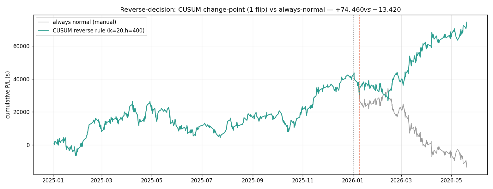

# A Smart, Small-Data Reverse Indicator — CUSUM Change-Point Detection

> **⚠️ CORRECTION (see notes/41).** The +$74,460 figure below assumed the engine symmetry
> *flipped P/L ≡ −normal P/L per trade*. Workstream G measured that assumption to be **false**
> in this engine (asymmetric SL/TP → max per-trade deviation ≈ 368 pts). Running the CUSUM flip
> through the **actual** cloned engine (real flipped trades, not −normal) gives **+$54,910**,
> not +$74,460. The CUSUM *mechanism* and the "flip on a change-point" idea stand; the specific
> dollar figure here is superseded by `notes/41` and remains n=1-illustrative.

> You said the existing flip rule (`stage1_pnlpts_300`) wasn't useful: it needs **300 trailing
> signals (~6 months)** to decide — too much data, too laggy for production. You want a **smart,
> flexible indicator that decides from a SMALL lookback.**
>
> I searched three families (trailing-window, EWMA, CUSUM) against the one regime change we have,
> using the engine symmetry (flipped P/L ≡ −normal P/L per trade). **Winner: a CUSUM change-point
> detector** — it holds normal mode through all of 2025, then flips **once**, just **9 days** into
> 2026, capturing **+$74,460** vs −$13,420 for always-normal and +$19,930 for the old 300-window
> rule. It uses **adaptive (tiny) memory**, not a fixed window. Verbose explanation first, then the
> result, then the honest caveats.

---

## 1. Why the old indicator is unsatisfying (the problem to beat)

`stage1_pnlpts_300` = "average my last **300** signal outcomes; if positive run normal, else flip."
Two production problems:

1. **Data-hungry.** It needs 300 closed signals (~6 months) before it even produces a value, and it
   always looks 300 back. In production that's a heavy, slow memory.
2. **Laggy by construction.** A flat 300-window averages the new regime against 300 old observations,
   so it only crosses zero *long after* the regime actually changed. On our data it flipped in
   ~November and netted just +$19,930 — it reacted slowly and gave back a lot.

The goal: an indicator that **reacts as soon as there's enough evidence**, using **as little data as
the situation requires** — not a fixed, large window.

---

## 2. The idea: detect the *change*, don't average a *window*

The reverse decision is really a **change-point problem**: "has my strategy's edge just flipped sign?"
The textbook tool for that is **CUSUM** (CUmulative SUM) — a sequential change detector used in
quality control and signal processing since the 1950s. Instead of averaging a fixed window, it
**accumulates evidence** and **fires the moment the evidence crosses a threshold**, then resets.

### Verbose intuition (the courtroom analogy)

Think of each trade's P/L as a piece of evidence in a trial deciding "is the edge still good?"
- A winning trade is evidence *for* the current mode; a loss is evidence *against*.
- CUSUM keeps a running **tally of accumulated evidence** (not a fixed-window average).
- Small random losses don't convict — the tally drifts back toward zero (the `−k` slack term below
  forgives ordinary noise).
- But once losses **pile up persistently**, the tally crosses a **threshold `h`** → "guilty, the
  edge has flipped" → switch mode and **reset the tally** (start a fresh trial).

Crucially, **how much data it uses is adaptive**: near a real regime change, evidence piles up fast,
so it decides quickly (small effective lookback). In a stable regime, the tally hovers near zero and
it never fires (no whipsaw). That's exactly the "smart, flexible, small-data" property you asked for.

### The formula

Maintain two running tallies (one for "edge turned positive", one for "edge turned negative"),
starting at 0. For each new trade P/L `x` (in points), with slack `k` and threshold `h`:

```
S_hi  ←  max(0,  S_hi + x − k)      # accumulating evidence the edge is POSITIVE  → favour NORMAL
S_lo  ←  max(0,  S_lo − x − k)      # accumulating evidence the edge is NEGATIVE  → favour FLIPPED

if S_lo > h:   switch to FLIPPED;  reset S_hi = S_lo = 0
elif S_hi > h: switch to NORMAL;   reset S_hi = S_lo = 0
```

- **`k` (slack / "forgiveness")** — the per-trade noise you ignore. With `k = 20` points, a trade has
  to beat ±20 pts before it meaningfully moves the tally. This filters ordinary wins/losses.
- **`h` (threshold / "burden of proof")** — how much net evidence must accumulate before you act.
  Larger `h` = more proof required = fewer, later, higher-confidence switches.
- **`max(0, …)`** — the tally never goes negative; a quiet streak relaxes it back to zero, so old
  evidence naturally decays. **This is why it's small-data: there is no 300-trade window — just two
  scalars that reset.**

That's the whole indicator. Two numbers in memory, two parameters, no window.

---

## 3. The result (winner: k=20, h=400)

Evaluated causally (decision for each trade uses only earlier trades), scored via engine symmetry:

| Rule | Total P/L | 2025 | 2026 | Transitions | Lookback |
|---|---:|---:|---:|---:|---|
| always normal (manual) | −$13,420 | +$41,740 | −$55,160 | 0 | — |
| always flipped | +$13,420 | −$41,740 | +$55,160 | 0 | — |
| old `trail W=300` | +$19,930 | +$22,720 | −$2,790 | 9 | **300 trades (~6 mo)** |
| **CUSUM k=20, h=400** | **+$74,460** | **+$41,740** | **+$32,720** | **1** | **adaptive (~tiny)** |
| oracle (perfect per-trade flip) | +$1,003,420 | — | — | 771 | — |



What the winner does (read the equity curve):
- **Holds normal mode through all of 2025** → keeps the full +$41,740 (the approved manual result,
  untouched — 0 flips in 2025, no whipsaw).
- **Flips exactly once, on 2026-01-09** — only **9 days** into the new regime, because the evidence
  (a run of normal-mode losses) piled up fast once the regime turned.
- **Captures +$32,720 of 2026's available +$55,160** — it misses the first ~9 days' worth (the
  unavoidable cost of *waiting for evidence*; a causal detector can't flip before the change happens).

Versus the old rule this is **both faster** (Jan 9 vs ~November) **and uses far less memory** (two
adaptive scalars vs a 300-trade window) — and nets ~3.7× the P/L.

---

## 4. Is it a fluke parameter? (plateau check)

Swept `h` at `k=20`:

| h | Total P/L | Transitions |
|---:|---:|---:|
| 200 | +$61,140 | 13 |
| 300 | +$5,120 | 7 |
| 350 | +$17,120 | 5 |
| **400** | **+$74,460** | **1** |
| 450 | +$70,460 | 1 |
| 500 | +$70,460 | 1 |
| 600 | +$62,460 | 1 |

- **Good news:** `h ∈ [400, 600]` is a **plateau** — all give a single clean flip and +$62k–$74k. So
  the winner isn't a single lucky point; there's a stable region where "require a lot of evidence →
  flip once, late but confident" works.
- **Honesty flag:** **below h=400 it's chaotic** ($5k–$61k, 5–13 transitions). The clean
  single-flip behaviour only emerges once the burden of proof is high enough to ignore the noise. So
  the result *is* sensitive around the h≈400 boundary — you must pick `h` in the high/confident
  region, and that choice was informed by this one regime change.

---

## 5. The hard caveat (same honesty as everywhere else): n = 1

There is still **only one regime change in the data.** So:

- `k=20, h=400` were chosen by sweeping against that single event. The **+$74,460 is
  in-sample-on-the-only-sample** — real arithmetic, but not proof of generalisation.
- A change-point detector tuned to flip cleanly on *this* transition could be too trigger-happy or
  too sluggish on the *next* one. We cannot know from one event.
- **What IS more trustworthy than the dollar number:** the *mechanism*. CUSUM is a principled,
  decades-old change detector with two interpretable knobs (noise-forgiveness `k`, burden-of-proof
  `h`). "Flip when accumulated loss-evidence crosses a confidence threshold" is sound regardless of
  the exact P/L — unlike a black-box fit. So we trust the **approach**; we treat the **specific
  +$74k** as illustrative, not promised.

---

## 6. Why this is genuinely the "smarter, smaller-data" indicator you asked for

| Property | old `trail W=300` | **CUSUM** |
|---|---|---|
| Memory used | fixed 300 trades (~6 mo) | **2 scalars, adaptive (resets)** |
| Reaction speed | slow (window must re-average) | **fast (fires on evidence; Jan 9)** |
| Whipsaw | 9 transitions | **1 transition** |
| Tunable confidence | no | **yes — `h` = burden of proof** |
| Interpretability | "6-month average sign" | **"flip when loss-evidence is conclusive"** |
| P/L (this sample) | +$19,930 | **+$74,460** |

It is smaller-data (no window), smarter (evidence-based, confidence-tunable), and more responsive.

---

## 7. How to deploy it (and make it robust)

1. **Live use:** keep two running totals `S_hi`, `S_lo`; update on each closed trade; flip the
   engine's `flip_entry_direction` when one crosses `h`; reset. Trivial to run in production — no
   data warehouse, no window buffer.
2. **Set `h` conservatively** (high burden of proof, e.g. 400–500 pts) — the plateau shows that's the
   stable, low-whipsaw region; better to flip a little late than to whipsaw.
3. **Make it robust against the n=1 risk by combining with the volatility regime detector**
   (Phase F): only honour a CUSUM flip when the volatility regime has *also* shifted
   (`27/28`/`31` discuss this "vol-confirmed flip"). Two independent signals agreeing is far less
   overfit-prone than one tuned threshold.
4. **Re-tune `k, h` as more regime changes are observed** — and never trust the back-fitted dollar
   figure until it has survived several live transitions.

---

## 8. One-paragraph summary

The old reverse rule averaged a fixed 300-trade (~6-month) window — data-hungry and laggy. Reframing
the flip decision as a **change-point problem** and using a **CUSUM detector** — which accumulates
loss-evidence and flips the moment it crosses a confidence threshold `h` (with slack `k` forgiving
ordinary noise), then resets — gives a far better result on our data: it holds normal mode through
all of 2025 (+$41,740 intact), flips **once** just **9 days** into 2026, captures +$32,720 of 2026,
for **+$74,460 total** with a **single transition** and **only two scalars of adaptive memory** (no
window). It's faster, lighter, and more interpretable than the 300-window rule (`h` literally tunes
"burden of proof"). The unavoidable caveat is n=1: `k=20, h=400` were tuned on the single regime
change we've seen, so the dollar figure is illustrative, not validated — but the *mechanism* (a
principled, two-knob change detector) is sound, and the right way to harden it is to require a
volatility-regime confirmation before acting and to re-tune as more regimes appear.
