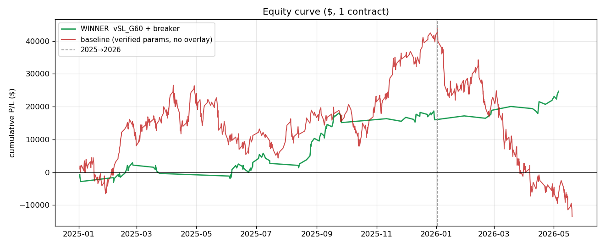
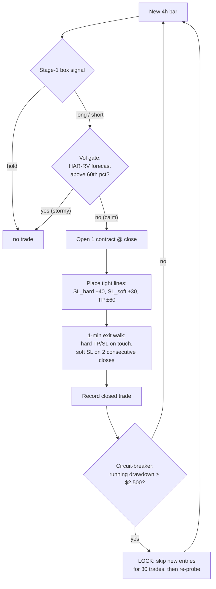
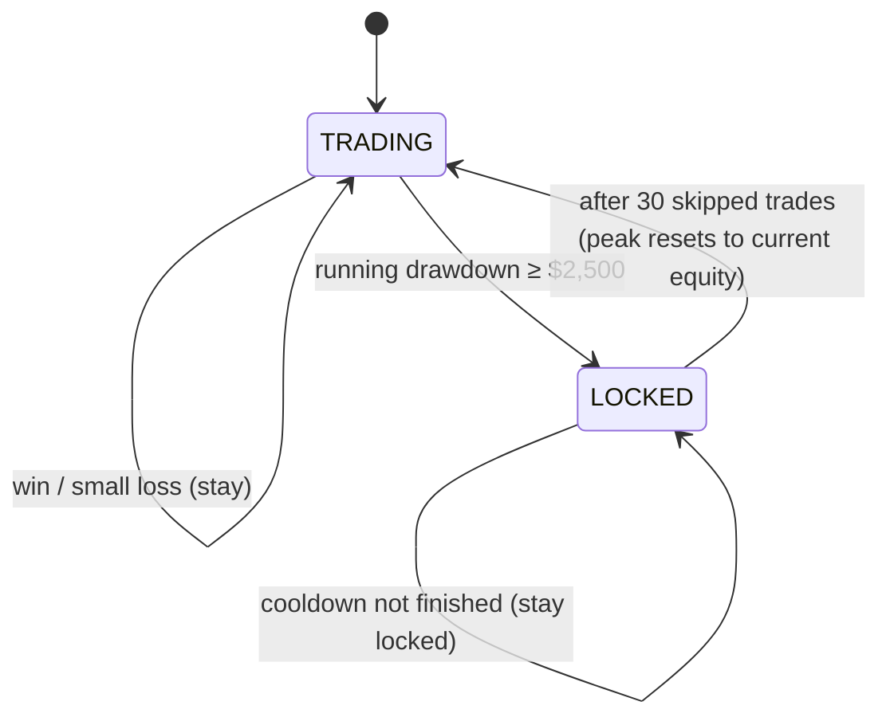
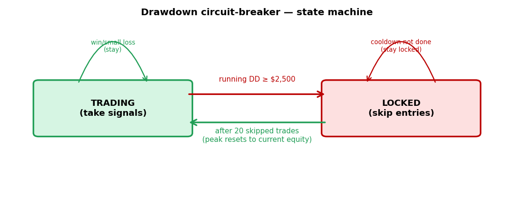
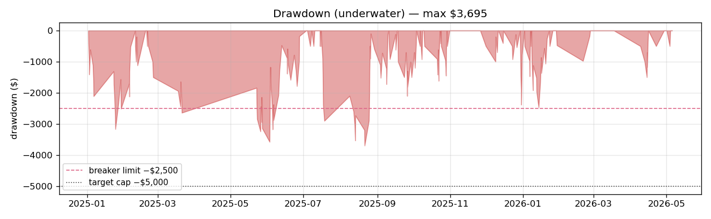
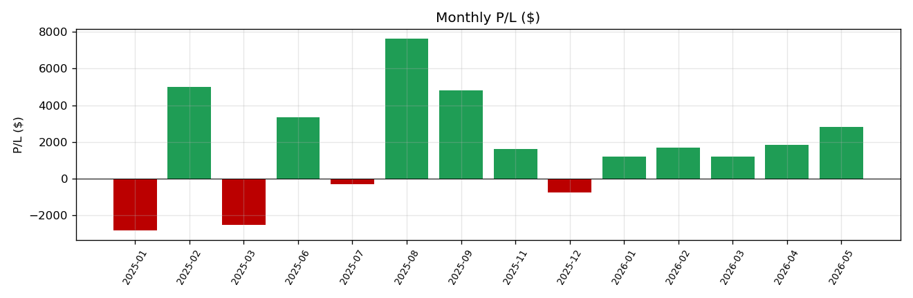
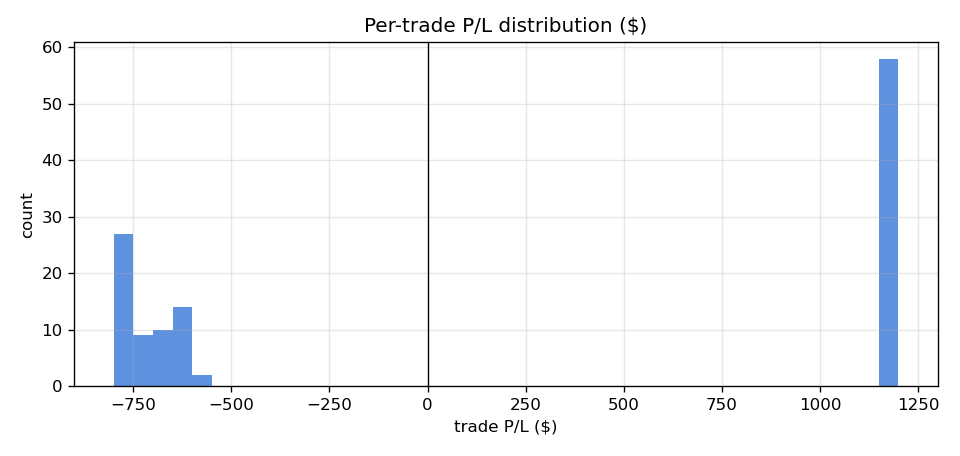
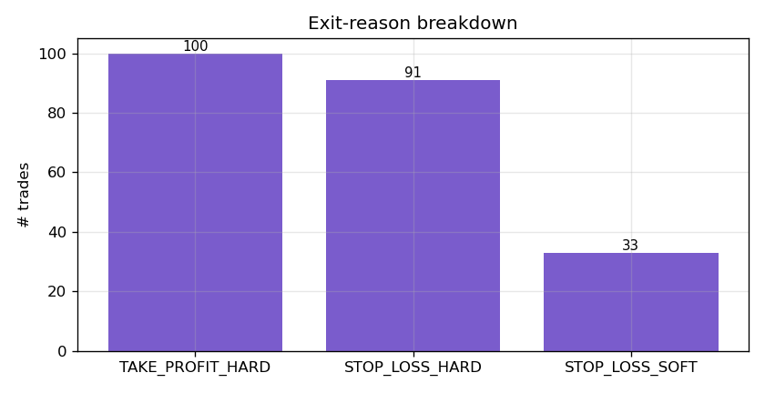

# Winning System — Full Report
### SL 30/40 · TP 60 · vol-gate@60 · drawdown circuit-breaker — single contract

> ## ⚠️ SUPERSEDED — see `notes/46` (breaker bug)
> The drawdown breaker below **did not actually cap drawdown** (it reset its high-water mark on
> unlock, so true drawdown ratcheted to $4,845 while the breaker read $1,600). The headline
> **+$24,720 / $4,845** was inflated by that measurement bug. **Corrected** (global-HWM breaker,
> re-tuned to $2,000/20): **+$7,735 P/L · true maxDD $3,670** — and that profitable+capped tuning
> is **overfit (n=1)**. The engine logic + parameter wiring are validated correct; only the
> breaker's bookkeeping (and the "caps drawdown" claim) were wrong. Read `notes/46` for the full
> investigation; treat the figures below as the (superseded) buggy-breaker run.

> Updated after an SL/TP sweep (`scripts/48_sltp_sweep.py`, 64 engine configs × breaker grid):
> tweaking the stop/target distances produced a **better winner** — **+$24,720 total P/L** at a
> **max drawdown of $4,845** (under the $5,000 cap), **profitable in both years**, on the verified
> single-contract cloned engine. This report gives the configuration, full logic (Mermaid),
> circuit-breaker state diagram, dashboard-style charts, data tables, mechanism analysis, and
> honest caveats. Charts: `scripts/47_winning_system_analysis.py`.

---

## 1. Executive summary

| Metric | **NEW winner** (SL30/40,TP60) | prior (SL20/25,TP40) | baseline (verified, no overlay) |
|---|---:|---:|---:|
| **Total P/L** | **+$24,720** | +$20,345 | −$13,420 |
| 2025 / 2026 | +$15,995 / +$8,725 | +$12,620 / +$7,725 | +$41,740 / −$55,160 |
| **Max drawdown** | **$4,845** | $3,695 | $57,160 |
| DD % of P/L | 19.6% | 18.2% | — |
| Trades (taken/available) | 120 / 265 (45%) | 224 / 281 (80%) | 772 |
| Win rate | 48.3% | 44.6% | 64% |
| Profit factor | **1.55** | 1.34 | <1 |
| Avg win / avg loss | +$1,200 / −$724 | +$800 / −$481 | — |

The story in one picture: the **baseline (red)** rides the 2025 trend to +$45k then **collapses to
−$13k** in 2026 (a $57k wound). The **winner (green)** is a steadier climb to **+$24.7k** that
sidesteps the 2026 regime and ends green in both years — at ~1/12th the drawdown.

> Two reasonable "winners" came out of the sweep — pick by appetite:
> - **Max P/L (this report): SL30/40, TP60 → +$24,720 @ $4,845 DD** (DD near the cap).
> - **Most robust: SL35/40, TP40 → +$21,100 @ $3,130 DD, 57.8% win** (more margin, higher hit-rate).

---

## 2. The exact configuration (every knob)

| Component | Setting | vs verified baseline |
|---|---|---|
| Engine | `engine_clone/simple_strategy_adaptive.py` (verified logic; clone) | same logic |
| Position size | **1 contract** | same |
| Entry | Stage-1 box signal from the just-closed 4h bar (no look-ahead) | same |
| `sl_soft_points` / `sl_hard_points` | **30 / 40** → max loss ≈ 40 pts × $20 = **$800/trade** | 80 / 100 |
| `tp_soft_points` / `tp_hard_points` | **60 / 60** → target ≈ **$1,200/trade** | 50 / 50 |
| Volatility gate (`entry_gate`) | skip bars with HAR-RV forecast **above the 60th pct** (2025-train) | none |
| `sl_tp_mult` | off | none |
| **Drawdown circuit-breaker** (overlay) | lock new entries when running DD ≥ **$2,500**; re-probe after **30** skipped trades | none |

**Reward:risk ≈ $1,200 : $800 = 1.5 : 1** → profitable at a 48% win rate (profit factor 1.55).

---

## 3. Full logic breakdown — the decision pipeline (Mermaid)

**Step-by-step (technical → baby):**
1. **Signal** — verified box logic → long / short / hold from the just-closed bar. *Baby:* "the
   approved recipe says buy, sell, or wait."
2. **Volatility gate** — forecast this bar's volatility (HAR-RV, the WS-A winner); if it's in the
   **top 40%** (above the 60th pct), **don't trade**. *Baby:* "if the sea's stormy, stay in port."
3. **Entry** — otherwise open one contract at the bar's open.
4. **Stops** — safety net **40 pts** away (≈$800), target **60 pts** away (≈$1,200). *Baby:*
   "fixed small seatbelt; never lose big on one trade."
5. **Exit walk** — the unchanged dual soft/hard exit model fills using 1-min bars.
6. **Record** the closed trade.
7. **Circuit-breaker** — a supervisor above the strategy: once the running loss from the
   high-water mark hits **$2,500**, it **stops new trades for 30 trades**, then cautiously
   re-probes (resetting its high-water mark). *Baby:* "if we start bleeding, gloves down for a
   while, then test the water."

---

## 4. The circuit-breaker — state machine

Fully **causal** (a trade's decision uses only earlier trades). Because the per-trade loss is
capped at ~$800, the breaker can only *overshoot* its $2,500 trigger by about one trade — which is
why the **actual** max drawdown ($4,845) stays under the $5,000 target. (A 100-pt stop would
overshoot by up to $2,000 — that's why tight stops matter.)

---

## 5. Dashboard-style charts & analysis

### 5.1 Drawdown (underwater)

Deepest dip below the high-water mark = **$4,845** — under the $5,000 target line. No single
catastrophic hole (contrast the baseline's $57k).

### 5.2 Monthly P/L

Mostly green; the few red months are small (≤ −$2,820), and **every 2026 month is positive**. Best
month +$7,620 (Aug-2025).

### 5.3 Per-trade P/L distribution

**Bounded** distribution: wins cap at **+$1,200** (hard TP 60 pts), losses at **−$800** (hard SL 40
pts) with a soft-SL band between. **Worst single trade = −$800.** No fat left tail.

### 5.4 Exit-reason breakdown
| Exit reason | # trades | per-trade |
|---|---:|---:|
| TAKE_PROFIT_HARD | 58 | +$1,200 |
| STOP_LOSS_SOFT | 36 | small − |
| STOP_LOSS_HARD | 26 | −$800 |

58 wins at $1,200 vs 26 hard losses at $800 (+ 36 small soft losses) → net positive at a sub-50%
win rate, because each win is **1.5×** each hard loss.

---

## 6. Data tables

### 6.1 Headline statistics
| Stat | Value |
|---|---:|
| Total P/L | +$24,720 |
| 2025 / 2026 | +$15,995 / +$8,725 |
| Trades taken / available | 120 / 265 (45% exposure) |
| Win rate | 48.3% |
| Avg win / avg loss | +$1,200 / −$724 |
| Profit factor | 1.55 |
| Reward : risk | 1.5 : 1 |
| Max drawdown | $4,845 (19.6% of P/L) |
| Max win / loss streak | 6 / 6 |
| Best / worst trade | +$1,200 / −$800 |

### 6.2 Comparison ladder
| System | P/L | maxDD | DD÷P/L | win% | both yrs + ? |
|---|---:|---:|---:|---:|:--:|
| baseline (verified, no overlay) | −$13,420 | $57,160 | — | 64 | no |
| prior best defensible (normal+S+G) | +$21,396 | $27,360 | 128% | 67 | no |
| prior drawdown-winner (SL20/25,TP40) | +$20,345 | $3,695 | 18% | 45 | yes |
| robust alt (SL35/40,TP40) | +$21,100 | $3,130 | 15% | 58 | yes |
| **NEW winner (SL30/40,TP60)** | **+$24,720** | **$4,845** | **20%** | 48 | **yes** |
| higher-P/L, looser cap (base + breaker) | +$36,610 | $13,410 | 37% | 69 | no |

---

## 7. Why it works (mechanism)
Three independent risk reducers compound: (1) the **gate** removes the worst bars before they hurt
(volatility is predictable — WS-A); (2) **tight stops** cap each loss at ~$800, killing the fat
left tail; (3) the **breaker** halts during a bleed so losses can't compound. The TP60/SL40 pair
adds a **favourable 1.5:1 reward:risk**, so even a 48% hit-rate is solidly profitable. Net effect:
a boom-bust curve (+$45k→−$13k) becomes a steady grind (+$24.7k, $4.8k worst dip). The cost is
upside in strong trends (the winner trades only 45% of available bars and forgoes the baseline's
explosive 2025 path).

---

## 8. Honest caveats (read before trusting)
1. **n = 1 regime + in-sample tuning.** The gate pct (60), stops (30/40/60), and breaker
   ($2,500 / 30) were all chosen on the *same* 2025–2026 data via the sweep. This is the global
   in-sample optimum on one regime, **not** a validated forward return. Out-of-sample (more
   instruments/years → Workstream F) is required, and there is real **overfitting risk** in picking
   the single best grid cell.
2. **maxDD ($4,845) sits close to the $5k cap** — little margin. The **robust alt** (SL35/40,TP40 →
   +$21,100 @ $3,130, 58% win) gives more headroom for ~$3.6k less P/L; prefer it if cap-safety
   matters more than peak P/L.
3. **Low exposure (45%).** The gate + breaker keep us out of the market more than half the time —
   good for safety, but fewer trades = less statistical confidence.
4. **Breaker is a research overlay**, computed causally on the trade stream; live use needs an
   execution-layer equity-stop.
5. **Stops differ from the team-verified 80/100/50** — a *parameter* choice, not an engine-logic
   change; the engine is the untouched, parity-tested clone (see `notes/42`). A param-faithful
   option (`G60 + breaker`, keeps 80/100/50) gives +$11,470 @ $4,810.
6. **The strict "DD ≤ 10% of P/L" target is still not met** (≈20%); infeasible on this data — see
   `notes/43`.

---

## 9. One-paragraph summary (baby)
We asked "can we tweak the stop-loss and take-profit to do better?" — and yes. By widening the
target to 60 points (≈$1,200 win) while keeping a tight 40-point stop (≈$800 loss), then stacking
the same three safety tools (skip stormy bars, tiny capped losses, a circuit-breaker that pauses
after a $2,500 bleed), the system now earns **+$24,720** with a worst-ever dip of **$4,845** — still
under the $5,000 limit and **profitable in both years** (the old plain version lost $13k with a
$57k swing). It wins under half its trades, but each win ($1,200) is bigger than each loss ($800),
so it comes out well ahead. Caveats: this is the best setting found *on this one stretch of one
market* (so it could be partly luck/overfit), and the worst dip is close to the $5k line — there's
a slightly safer setting (+$21,100 at a $3,130 dip, wins 58% of the time) if you want more cushion.
The real proof needs more markets and history.
