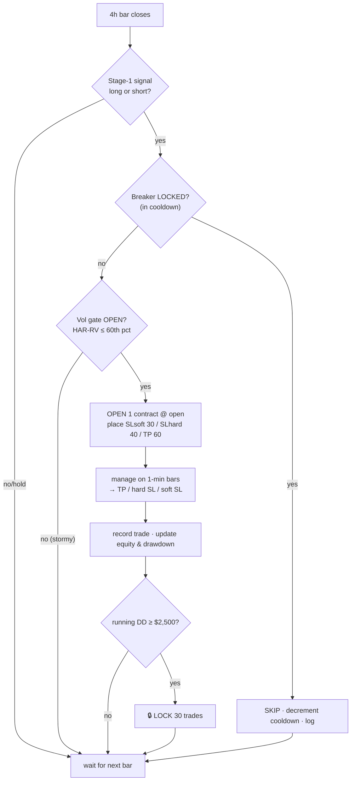

# Playbook — WS-G Drawdown-Capped Strategy
**Tag:** `v4.2-wsg-drawdown-capped-winner` · **Companion report:** `notes/44` · **Run it:** `winner_dashboard/`

> **One-line thesis:** trade the box Stage-1 signal on NQ 4h, **only when volatility is calm**,
> with **tight capped stops**, and **stop trading after a $2,500 bleed** — accepting smaller
> upside in exchange for a worst-case drawdown under $5,000.

---

## 1. Setup at a glance

| | |
|---|---|
| Instrument | **NQ** (Nasdaq-100 futures), **1 contract** ($20 / point) |
| Decision timeframe | **4-hour** bars (exits resolved on 1-minute sub-bars) |
| Entry signal | Stage-1 box rule (long/short) on the just-closed 4h bar |
| **SL soft / hard** | **30 / 40 pts** (hard ⇒ max loss ≈ **$800/trade**) |
| **Take-profit** | **60 pts** (≈ **$1,200/trade**) → reward:risk ≈ **1.5 : 1** |
| **Volatility gate** | skip bars whose HAR-RV forecast is **above the 60th percentile** (2025-train) |
| **Drawdown breaker** | halt new entries at running **DD ≥ $2,500**; resume after **30 trades** |
| **Hard DD cap (goal)** | **$5,000** |
| Expected (in-sample, n=1) | +$24,720 P/L · maxDD $4,845 · win 48.3% · PF 1.55 · ~45% exposure |

**Robust alternative** (more cushion, fewer dollars): SL 35/40, TP 40 → +$21,100 @ **$3,130** DD, win 58%.

---

## 2. The rules (precise)

### Entry — open 1 contract only if ALL are true
1. The just-closed 4h bar produces a Stage-1 **long or short** signal (not `hold`).
2. **Vol gate OPEN:** HAR-RV forecast for this bar ≤ the 60th-pct threshold (calm regime).
3. **Breaker NOT locked** (not inside a post-drawdown cooldown).
4. **No position already open** (one at a time).
→ Enter at the bar's open price, in the signalled direction (or its opposite if running *flipped* mode — default **normal**).

### Exit — dual soft/hard (resolved on 1-min bars), one of:
- **Hard TP** at **+60 pts** (touch) → +$1,200.
- **Hard SL** at **−40 pts** (touch) → −$800 (the disaster stop; caps the loss).
- **Soft SL** at **−30 pts** confirmed by **2 consecutive 1-min closes** beyond the line.

### Risk overlay — drawdown circuit-breaker (sits above the strategy)
- Track running equity & its high-water mark. When **peak − equity ≥ $2,500 → LOCK**: take no
  new trades.
- After **30 would-be trades skipped**, **UNLOCK** and resume; reset the high-water mark to the
  current equity (measure the next drawdown fresh).
- Per-trade loss is capped at ~$800, so the realized max drawdown lands ≈ trigger + one loss
  ≈ **$3.3k–$4.8k** — under the $5,000 cap.

---

## 3. Per-bar operating procedure



---

## 4. Pre-trade / daily checklist
- [ ] Data feed healthy (4h + 1-min NQ); HAR-RV forecast updated for the upcoming bar.
- [ ] Confirm current **breaker state** (TRADING vs LOCKED + trades left in cooldown).
- [ ] Confirm **no open position** before considering a new entry.
- [ ] Gate threshold is the frozen **2025-train 60th-pct** value (do **not** re-fit intraday).
- [ ] SL/TP distances set to **30 / 40 / 60** (verify the broker order template).
- [ ] One contract. No scaling, no averaging down.

## 5. Monitoring — watch these, and what they mean
| Metric | Healthy | Warning → act |
|---|---|---|
| Max drawdown | < $5,000 | **≥ $5,000** → the breaker failed to contain; halt & investigate |
| Win rate | ~45–50% | < 38% sustained → edge may be degrading (regime change?) |
| Profit factor | ≥ 1.3 | < 1.0 over ~40 trades → stop, re-evaluate |
| Avg loss | ≈ −$800 cap | any loss **> $800** → stop is not being honoured (execution bug) |
| Breaker locks | occasional | frequent re-locks → persistent adverse regime; consider standing down |
| Exposure | ~45% | ~0% for long stretches → gate too tight / market too volatile |

## 6. When it works vs underperforms
- **Works:** calm, choppy-to-trending regimes where the box signal has a small edge and moves are
  modest — the gate keeps it out of chaos, tight stops cap damage.
- **Underperforms (by design):** strong sustained trends — the tight stops + gate **leave money
  on the table** (it forgoes big runs to stay safe). If your goal is max P/L regardless of
  drawdown, this is the wrong config.
- **Dangerous:** a fast regime flip — the breaker limits the bleed but you will give back some
  before it locks.

## 7. Failure modes & contingencies
| If… | Then |
|---|---|
| Drawdown hits the breaker | trading auto-halts; **do nothing for the cooldown**; review logs before resume |
| Drawdown exceeds $5,000 | **manual kill-switch**: flatten, stop the strategy, audit (the breaker is the last line, not infallible) |
| A loss exceeds $800 | execution/stop bug — **halt immediately**, the per-trade cap is the core safety property |
| Win rate / PF collapse over ~40 trades | edge decay or regime change — stand down, re-validate, consider the flip or a re-fit on fresh data |
| Data/feed gap | do not trade on stale HAR-RV or partial 1-min data — wait for clean data |

## 8. Hard do-nots
- ❌ Don't trust the **dollar figures** as forward returns — they are **in-sample on ONE regime
  (n=1)**. Treat them as illustrative of the *mechanism*, not a promise.
- ❌ Don't run live without an **execution-layer equity-stop** — in backtest the breaker is a
  causal *overlay*; live it must be a real broker-side halt.
- ❌ Don't widen the hard SL beyond 40 pts — the $800 loss cap is what keeps drawdown small.
- ❌ Don't re-fit the gate threshold or breaker params on recent data mid-run (overfitting).
- ❌ Don't touch the verified engine — trade the parity-tested clone logic (see `notes/42`).
- ❌ Don't scale size or add positions — the whole risk profile assumes **1 contract**.

## 9. Go-live checklist (before risking capital)
- [ ] **Out-of-sample validation** on instruments/years not used for tuning (→ Workstream F).
      *This is the gating requirement — n=1 is not enough.*
- [ ] Re-run walk-forward with the gate/stop/breaker params **frozen** (no peeking).
- [ ] Implement the **drawdown breaker as a live equity-stop** in execution; test its trigger.
- [ ] **Paper-trade** for ≥1 month; confirm fills match the backtest's SL/TP assumptions
      (slippage, the 2-consecutive-1-min-close soft rule).
- [ ] Define the **manual kill-switch** ($5k hard cap) and who watches it.
- [ ] Start at **minimum size**; scale only after live results track the backtest.

## 10. Quick-reference card
```
NQ · 4h · 1 contract · NORMAL direction
ENTER : box long/short  AND  vol ≤ 60th-pct  AND  breaker unlocked  AND  flat
STOPS : soft SL 30 (2×1m close) · hard SL 40 (touch, −$800) · TP 60 (touch, +$1,200)
BREAKER: DD ≥ $2,500 → lock 30 trades → resume (reset peak)
CAP   : maxDD must stay < $5,000  (manual kill if breached)
TUNE  : winner 30/40/60 · safer 35/40/40 · explore in winner_dashboard/
```

## 11. One-paragraph summary (baby)
This playbook says: on NQ 4-hour bars, take the box buy/sell signal **only when the market is
calm** (volatility forecast in the lower 60%), risk a **small fixed amount** (~$800 a trade) for a
bigger target (~$1,200), and if losses pile up to **$2,500**, **stop trading for a while** then
cautiously restart. Done this way it made about **+$24,720** while never dropping more than
**$4,845** — but that's measured on a single past stretch, so before real money you must test it on
other data, wire the "stop after a bleed" rule into the broker, and paper-trade it first. Use the
interactive `winner_dashboard/` to try parameter changes and watch exactly what happens, when and why.
