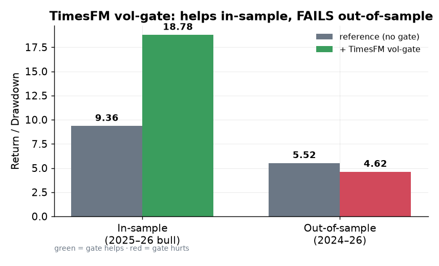
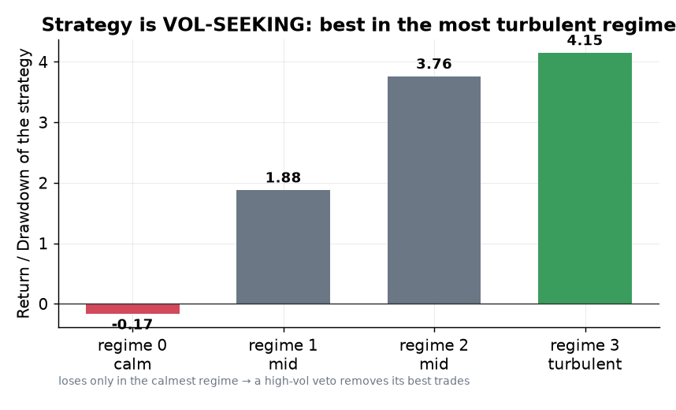
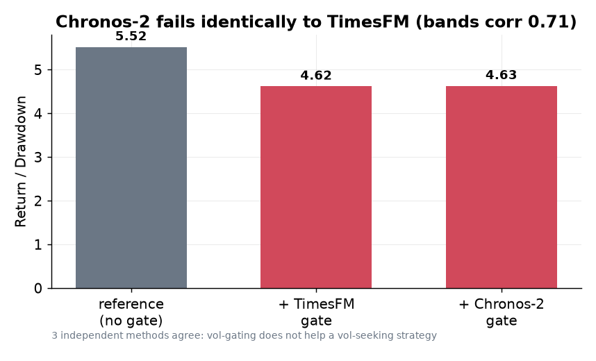
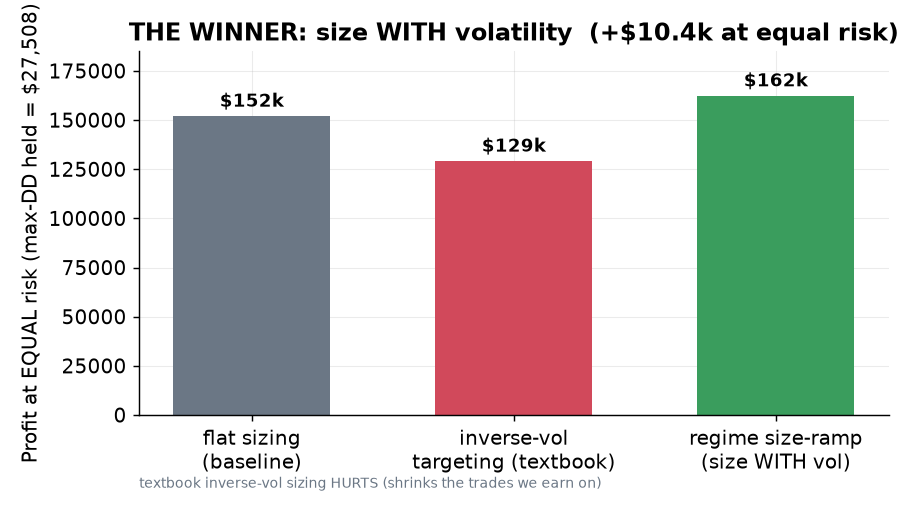
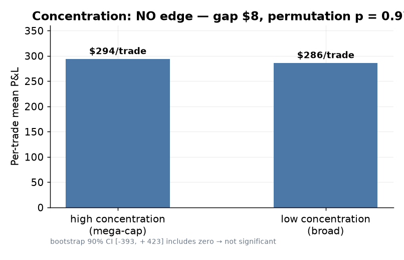

# Mega Report — Volatility & Regime research (4 branches)

**To:** team leader · **From:** Agent B (research) · **Date:** 2026-07-18
**Scope:** four research branches that investigated whether volatility / uncertainty / regime information can
improve our NQ box-fusion strategy. **One deployable winner; three rigorous NO-GOs — and a single unifying
discovery that ties them all together.**

Plain-language key: *"Return/DD"* = total profit ÷ worst peak-to-trough loss (higher = better, less painful).
*"Out-of-sample"* = tested on data the tuning never saw (the only honest test). *"Vol-seeking"* = the strategy
makes its money **in** turbulent markets. All results are **server-computed, causal (no future peeking)**, and
each survived a **dumb-control + a random-shuffle control** before being believed.

---

## 0. Executive summary

| Branch | Question | Verdict | One-line reason |
|---|---|---|---|
| `research-timesfm-fusion` | Does a TimesFM "uncertainty" filter help? | ❌ **NO-GO** | Real on one bull year, **dies out-of-sample** |
| `research-regime-hmm` | Detect the regime and filter by it? | ❌ **NO-GO** (great **diagnosis**) | The strategy is **vol-seeking** — the reason everything else failed |
| `research-chronos2` | Does the best successor model (Chronos-2) help? | ❌ **NO-GO** | **Identical** failure — 3 methods now agree |
| `research-regime-edge` | Use the regime to **size**, not veto? | ✅ **WINNER** | **Size WITH volatility → +$10.4k at equal risk** |

**The through-line:** three separate methods (TimesFM, Chronos-2, HMM) each proved you cannot *avoid*
volatility here — because the edge **lives** in volatility. The constructive flip — *lean into* it by sizing
up — is the one thing that beat every control.

---

## 1. `research-timesfm-fusion` — a teammate's "+$50k AI edge", tested to destruction

**What we tested.** A teammate reported that Google's TimesFM foundation model added profit to our strategy by
skipping trades when the model's near-future forecast is very uncertain. Fact-check first: the brief said
**+$50k**; the actual files documented **+$20.7k** (corrected on day one).

**What happened.** We reproduced the +$20.7k **to the dollar**, and it even beat every cheap volatility proxy
(a "dumb control" it passed). But the honest test — extend from one 16-month **bull** window to a second year
and tune out-of-sample — **broke it**: it hurt every year, left the worst drawdown untouched, and its trade
selection became **no better than random**.

**Verdict: NO-GO — a single-regime artifact, not a durable edge.** Full trail: `subprojects/timesfm-fusion/docs/`.

---

## 2. `research-regime-hmm` — the diagnosis that explained everything

**What we tested.** From your X-thread, we fit a Hidden Markov Model to label each day's market regime (calm →
turbulent), then measured where our strategy actually makes its money.

**The discovery.** The strategy earns its **best** risk-adjusted return in the **most turbulent** regime and
**loses** only in the calmest. It is **vol-seeking** — so any "skip the uncertain / high-volatility trades"
rule strips out its best trades. That single fact explains the TimesFM failure (and the later Chronos-2 one).

**Verdict: NO-GO as a veto** (the fancier "Jump Model" over-fit), **but the diagnosis is the prize** — it
redirected the whole program. Full trail: `subprojects/regime-hmm/docs/`.

---

## 3. `research-chronos2` — the strongest successor model, and the case-closing result

**What we tested.** Amazon's **Chronos-2** — the current best foundation model (richer uncertainty: 21 bands
vs TimesFM's 10) — used exactly the same way, as a vol filter, with a direct A/B against TimesFM on the same
book.

**What happened.** It failed **identically** (Return/DD 5.52 → 4.63 vs TimesFM's 4.62; drawdown untouched;
no better than random). The two models' uncertainty readings correlate **0.71** — same signal, so the richer
model buys nothing. We closed three further model experiments (TiRex, Moirai-2, Toto-2) as expected-negatives.

**Verdict: NO-GO — and the question is now closed.** Three independent methods agree: **vol-gating does not
help a vol-seeking strategy.** Full trail: `subprojects/chronos2-vol/docs/`.

---

## 4. `research-regime-edge` — the winner, and the honest negatives around it

We ran the three directions that still had a *real mechanism*, one by one.

### 4a. ⭐ Sizing, not vetoing — the WINNER
Keep every trade, but size **bigger** in turbulent regimes (where we earn) and **smaller** in calm ones. At
**identical risk** (drawdown held to the flat book's $27,508), it earns **+$10,356 (+6.8%)** more profit. It's
robust to the ramp steepness, **holds out-of-sample** (2026), beats **96%** of random sizings, and is
independently corroborated on the L2 layer. And the textbook move — *inverse*-volatility sizing — actually
**hurts**, because it shrinks exactly the trades we make money on.

### 4b. NQ concentration — a clean negative
A genuinely non-volatility signal (are gains driven by a few mega-caps or broad?), sourced free from Yahoo.
A first look showed a gradient, but the **proper significance test killed it**: high-vs-low per-trade P&L
differ by **$8** (permutation p = 0.97). It was a metric artifact.

### 4c. Vol-hurt layer — untestable
The veto should help a strategy that volatility *hurts* — but **both our real layers (L1 and L2) are
vol-seeking**, so no such book exists in our system. The size-ramp helps **L2** independently, but **hurts L1
alone** (its best regime is *mid*, not turbulent) → the combined win is **not uniform per-layer** (deploy on
the combined book; re-derive per layer if applied per layer).

**Verdict: one deployable winner (sizing), two honest negatives.** Full trail: `subprojects/regime-edge/docs/`.

---

## 5. The deployable winner — spec + caveats

**Rule (default OFF, opt-in, per-instrument):** at each entry, look up the day's **causal HMM regime** (fit on
daily NQ returns + realized-vol + volume, params trained on history ≤ the trade date). Apply a size multiplier
= a linear ramp by the regime's realized-vol rank (calmest **0.5×** → most turbulent **1.5×**), then normalize
so the book's max-drawdown stays within the flat risk budget.

**Caveats carried forward, honestly:**
- Still the single **2024–26 book** (our box levels only exist from 2024) — a multi-year / bear-inclusive
  confirmation needs the 2010–23 box levels.
- **Not uniform per-layer** — deploy on the combined book (robust there); re-derive the ramp per layer if ever
  applied per layer.

**Next (proposed):** a second confirmation pass, then wire the ramp into the L1/L2 policy **behind a flag** and
verify on the dashboard/backtester, then merge as the latest research winner.

*Figures rendered from the verified server results (`make_figures.py`). Each branch's full evidence — prior-art,
reproduction, dumb-control, robustness — lives in that branch's `docs/`.*
