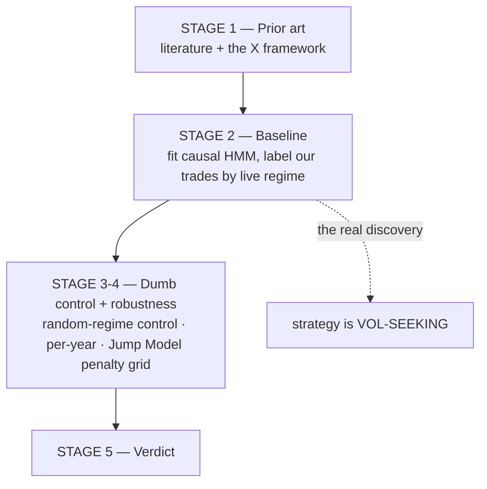

# REGIME-HMM — Team Leader Report
## The "Markov chain" idea from X (Twitter): did it work for us?

**Workstream:** `research-regime-hmm` (branched off `dev`, opened 2026-07-15, merged)
**Origin:** two X/Twitter threads the user supplied in `x.md`
**Instrument:** NQ (Nasdaq-100 E-mini futures), $20 per point
**Status:** COMPLETE — **verdict: NO-GO for this strategy**, but it banked the single most useful *diagnostic* in the whole regime line of work
**Compute:** server only (isolated venv: `hmmlearn 0.3.3` + `jumpmodels 0.1.1`)

---

# PART 1 — EXECUTIVE SUMMARY

## 1.1 Where the idea came from

Two posts on X made a strong claim: that the real edge in quant trading is not AI but a **Markov chain** — a
century-old piece of maths that detects which *regime* ("mood") the market is in, and switches strategy
accordingly. One post (@antpalkin) was a promotional teaser; the other (@RuujSs) was a genuinely rigorous,
code-complete **Hidden Markov Model (HMM)** framework. You asked us to test it on our own strategy.

## 1.2 What we did

We didn't just take the tweet at face value. A prior-art pass found that the academic literature says a
different tool — the **statistical Jump Model** — usually *beats* the HMM, so we tested **both**. We fit each
model on 17 years of NQ data, labelled every one of our trades with the market regime that was live *at the
time* (no hindsight), and asked: does knowing the regime let us improve the strategy by trading bigger in some
regimes and sitting out in others?

## 1.3 The answer

**No — regime detection does not add a durable edge to our strategy.** But the *reason* it failed is the
valuable part, and it's a genuine discovery about how our strategy works:

> **Our strategy is "volatility-seeking."** It makes its best risk-adjusted money in the **most turbulent**
> markets, and its *only* losing regime is the calmest one. So the whole premise of a regime filter — "sit out
> the scary regimes" — is backwards for us. Sitting out high-volatility trades **removes exactly the trades
> that pay.**

That single fact also **explains an earlier failure** (the TimesFM volatility-veto workstream) that we had
not fully understood at the time. Two completely different methods arrived at the same conclusion, which is why
we hold the *diagnosis* with high confidence even though the *signal* is a dead end.

## 1.4 Bottom line

| Question | Answer |
|---|---|
| Did we actually test the Markov/HMM idea? | **Yes** — fully, both HMM and the literature-preferred Jump Model, through all 5 stages |
| Did it improve the strategy? | **No** — no durable regime edge on the available data |
| Was it wasted? | **No** — it proved the strategy is vol-seeking, which explains a separate prior failure and redirects the whole "regime" line of work toward **sizing**, not vetoing |
| Where is it? | `subprojects/regime-hmm/` — verdict in `ROBUSTNESS.md`, timeline in `EXPERIMENTS_LOG.md`, this report consolidates them |

---

# PART 2 — WHAT A "MARKOV / HIDDEN MARKOV MODEL" ACTUALLY IS

Plain-language, because the whole idea rests on it.

**A Markov chain** describes a system that hops between **observable** states, where the next state depends
only on the current one — not the full history. Weather is the textbook example: sunny today → some chance of
rain tomorrow. You can *see* the state directly.

**A Hidden Markov Model** adds the twist that makes it useful for markets: the state is **hidden**. You never
observe "the market is in a crisis regime" directly. You only observe its *fingerprints* — returns get more
erratic, volatility clusters, drawdowns deepen. The HMM's job is to infer the hidden regime from those
observable fingerprints, and to tell you **how confident** it is.

Two technical points that turned out to matter enormously:

- **Filtered vs smoothed probabilities.** A "filtered" estimate uses only past data — it is what you could
  actually have known live. A "smoothed" estimate is allowed to peek at the future to sharpen its guess about
  the past. **Using smoothed regime labels in a backtest is cheating** (lookahead bias), and the source thread
  itself warns about this. We enforced filtered-only for every decision.
- **A regime is a statistical summary, not a physical fact.** It depends on which features you feed, how many
  regimes you allow, and how you validate. That humility is the difference between a regime detector you can
  trust and one producing confident-looking noise.

---

# PART 3 — WHY WE RAN THIS NOW (the connection to a prior failure)

This did not come out of nowhere. Just before it, a workstream called **TimesFM** tried to use a volatility
"band" to veto trades in high-vol conditions — and **failed** the robustness bar. At the time we knew it
failed but not precisely *why*.

Regime detection was the principled next step: instead of blindly vetoing high-vol trades, *identify the
regime* and change the risk posture intelligently. And unlike the TimesFM band — which had **no** published
precedent — regime-switching has **real, rigorous out-of-sample evidence** behind it (Part 4). So it was worth
a proper test, held to the same bar that killed TimesFM.

There was also a design through-line from the source material itself: a trilogy of techniques
(**cointegration → Kalman filter → Hidden Markov Model**), which is why this workstream is coupled to our
separate Kalman study.

---

# PART 4 — WHAT THE LITERATURE SAID (the prior-art pass)

Mandatory before any new workstream here. The verdict was **GO to test — this is a genuinely promising
direction** — with two crucial steers.

| Source | Finding |
|---|---|
| ⭐ **Nystrup et al. 2024, "Downside Risk Reduction Using Regime-Switching Signals: A Statistical Jump Model Approach"** (arXiv 2402.05272) | Out-of-sample on US/Germany/Japan equity indices **1990–2023**, *with transaction costs and trading delays*: regime-switching **cuts volatility and max-drawdown and raises Sharpe**. The strongest, most relevant evidence. |
| **Regime-Switching Factor Investing with HMMs** (MDPI JRFM) | HMM regime predictions beat static allocation on absolute and risk-adjusted returns. |
| Practitioner sources | A 2005–2026 regime strategy at Sharpe ~1.22 / max-DD ~19.5%; consistent direction, weaker evidence class. |

**The two steers that shaped the whole test:**

1. ⚠️ **Jump Model beats HMM.** In the Nystrup study the statistical Jump Model lifts annualised return
   9.82% → 12.55% and Sharpe **0.51 → 0.78**, with lower drawdown — because JM regimes are **more persistent**
   (HMMs "flicker"; their built-in geometric-duration assumption is unrealistic for crises). So we implemented
   **both** and treated the Jump Model as the strong contender, not the tweet's HMM as the default.
2. **A regime is a SLOW state.** Almost all the OOS evidence is on **daily** data — a regime persists
   weeks-to-months. Our trades are intraday. So we fit the regime on daily data and mapped it onto intraday
   trades as a daily "backdrop", rather than fitting an intraday-native regime (which is less validated and
   flickers).

Crucially, the prior-art pass also warned: **a favourable prior means nothing without full robustness** — the
TimesFM lesson. A regime that looks great on one window is exactly what overfitting produces.

---

# PART 5 — THE EXPERIMENTS

Five stages, run through the standard reporting system.

## Stage 2 — Baseline: fit the model, label the trades

**Setup.** Daily NQ features over **2010–2026 (4,977 days)**: daily log-return, log intraday realised
volatility, and a 20-day volume z-score. The HMM was fit on **train = everything before 2024 (4,187 days)**.
Each day's regime = the **filtered** (causal, past-data-only) most-likely state. Our **539 fusion trades**
from 2024–26 were then each labelled by the regime that was live on their entry day. Regimes were ranked
0 = calmest → 3 = most turbulent by their volatility signature.

The number of regimes (4) was chosen by BIC — a standard model-selection score.

**Result — the strategy is volatility-seeking:**

| Regime (0 = calm → 3 = turbulent) | Trades | P/L | Max drawdown | **Return/DD** | Win % |
|---|--:|--:|--:|--:|--:|
| **All trades** | 539 | $151,872 | $27,508 | **5.52** | 52% |
| 0 — calmest | 15 | **−$1,354** | $7,897 | **−0.17** ⚠️ | 53% |
| 1 | 110 | $18,621 | $9,917 | 1.88 | 49% |
| 2 | 332 | $101,464 | $27,019 | 3.76 | 53% |
| 3 — most turbulent | 82 | $33,141 | $7,982 | **4.15 (best)** | 52% |

Read the last column top to bottom: risk-adjusted performance **rises** as the market gets more turbulent, and
the **calmest regime is the only money-loser** (−$1,354, Return/DD −0.17). This is the opposite of the naive
"sit out the scary regimes" intuition.

**And the naive filter provably hurts:**

| Policy | Trades kept | Return/DD | vs baseline 5.52 |
|---|--:|--:|---|
| Sit out the most turbulent regime (regime 3) | 457 | 4.48 | **HURTS (−1.04)** |
| Sit out the top volatility tercile (dumb control) | 334 | 3.58 | **HURTS (−1.94)** |

Vetoing high volatility — by either the HMM regime or a plain volatility ranking — **destroys** return/drawdown,
because it removes the trades that carry the book.

**The inverted hypothesis this suggested:** if calm is the weak regime, maybe we should **sit out the CALM
regime** instead. That became the thing to test in robustness — but only *after* a control, because "sit out
regime 0" was *observed post-hoc on this book*, which is the single most common overfitting trap.

## Stage 3-4 — Does the inverted policy survive a fair test?

Two hurdles: a **random-regime control** (does the real regime beat *shuffled* regime labels? — if a random
labelling does just as well, the regime carries no information), and a **per-year** breakdown (does it hold
out-of-sample, not just on the pooled book?).

**HMM — sit out the calmest regime:**

| Policy | Trades kept | Return/DD | vs base 5.52 | Beats random | Per-year |
|---|--:|--:|--:|--:|---|
| Sit out calmest 1 regime (−15 trades) | 524 | **5.89** | +0.37 | **81%** | 2024 +0.20, 2025 +0.20, **2026 −0.18** |
| Sit out calmest 2 regimes (−125 trades) | 414 | 4.80 | **−0.72 (hurts)** | 57% | 2025 +1.83, **2026 −2.37** |

The best case removes 15 tiny losing trades for a +0.37 improvement — but it beats only **81%** of random
regime-shuffles (our bar for "special" is >95%) and it **hurts 2026**. That is a weak, year-fragile effect, not
a durable edge.

**Jump Model — the literature's favoured method, given a fair shot:**

The Jump Model has a "penalty" knob controlling how sticky the regimes are. Sweeping it:

| # states | Penalty | Sit-out-calmest-1 Return/DD |
|--:|--:|--:|
| 2 | 0 / 1 | 5.77 / 5.96 |
| 2 | 3 / 5 / 10 | **7.12 / 4.15 / 4.38** |
| 3 | 0 / 1 | 6.28 / 5.90 |
| 3 | 3 / 5 / 10 | **7.30 / 4.56 / 5.52** |

The result swings from **4.15 to 7.30 purely by changing the penalty** — and every impressive number (7.12,
7.30) gets there by **removing 60%+ of all trades** (at high penalties the volatility ranking flips). Picking
the winning penalty by looking at this one book is **textbook backtest overfitting** — the exact failure our
process exists to catch.

---

# PART 6 — VERDICT

| Element | Verdict |
|---|---|
| **HMM regime policy** | ❌ Weak (+0.37 Return/DD), beats only 81% of random, **hurts 2026** |
| **Jump Model regime policy** | ❌ Penalty-sensitive (4.15–7.30) = **overfitting** |
| **Overall** | ❌ **NO-GO for this strategy** — no durable regime edge on the available data |

**But the diagnosis is the deliverable.** The reason it failed — the strategy is **vol-seeking / regime-robust**,
earning across regimes and best in the most turbulent one — is a real, mechanistic discovery. And it
**explains the earlier TimesFM NO-GO**: a high-volatility veto backfires because high volatility is *where this
strategy earns*. Two independent methods (a volatility band, and HMM/Jump-Model regimes) reaching the same
conclusion is why we trust the *diagnosis* with high confidence, even though neither produced a deployable
signal.

---

# PART 7 — HONEST LIMITS (what this verdict does NOT prove)

- **n = 1 book.** The trade book is 2024–26 only. A clean test needs a **longer book** (blocked on 2010–2023
  box levels — the same missing-history wall that limits the fundamentals and regime-sizing work) and, ideally,
  a separate *training* book on which to choose the regime-to-cut and the Jump-Model penalty **out of sample**
  — which is exactly what would have prevented the overfitting shown in Part 5. We don't have that yet.
- **This is a verdict on THIS strategy, not on regime detection generally.** The literature is clear that
  regime-switching helps *asset allocation* out-of-sample. It just doesn't help *our* vol-seeking intraday
  breakout. A **mean-reversion** strategy — which dies in trends and thrives in calm ranges — is the natural
  place a regime filter genuinely *would* help. That is a separate, untested hypothesis.
- **The 4-state model was chosen by BIC**, with the persistence/stability check the prior-art warned about
  only partly addressed.

---

# PART 8 — WHAT WE BANKED (this is why it wasn't wasted)

Three durable takeaways carry forward regardless of the NO-GO:

1. **The strategy is vol-seeking — size WITH volatility, never veto it.** This reframed the entire "regime"
   line of work. It is the direct ancestor of the later **regime-sizing** experiment (upsize turbulent /
   downsize calm), which became the one control-passing positive result of the whole research arc — the mirror
   image of what failed here.
2. **Jump Model > HMM** for regime detection (more persistent, higher Sharpe in the literature) — don't
   default to the tweet's HMM if this is ever revisited.
3. **Filtered-not-smoothed is the make-or-break causality control.** Smoothed regime labels in a backtest are
   lookahead bias; a strategy that looks excellent with them can behave completely differently live.

## Salvage options recorded for later

1. **Reframe as SIZING, not veto** — upsize turbulent / downsize calm (needs the longer book + out-of-sample
   penalty selection). *This one was subsequently pursued and became the regime-sizing winner.*
2. **Apply to a different, vol-hurt strategy** — a mean-reversion book or the L2 layer, where a regime filter
   has a real mechanism.
3. **Feed the regime as a covariate** into a covariate-aware forecaster (Chronos-2 / Moirai-2).

---

# PART 9 — WHAT WENT WELL / WHAT WENT WRONG

**Went well**
- **We didn't just implement the tweet.** The prior-art pass caught that the Jump Model beats the HMM, so we
  tested the stronger method too — and it's what exposed the overfitting most clearly.
- **The controls did their job.** The random-regime control (81% < 95%) and the penalty sweep (4.15–7.30) both
  correctly flagged a non-durable, over-tuned effect that a single flattering number would have hidden.
- **The failure produced a mechanism, not just a "no".** "Vol-seeking" is a reusable fact about the strategy
  that explained a *separate* prior failure and seeded a later *success*.
- **Causality was enforced throughout** (filtered probabilities only), heeding the source thread's own central
  warning.

**Went wrong / limits**
- **n=1 book with no out-of-sample selection set.** We could observe which regime to cut and which penalty
  "won", but not choose them honestly — so the Jump-Model "wins" are un-adoptable by construction. The right
  fix (a train-period trade book) is blocked on the same missing 2010–23 data as everything else.
- **4 states chosen by BIC** with only a partial stability check — a known soft spot flagged but not fully
  closed.

---

# PART 10 — ARTIFACTS

| Item | Path |
|---|---|
| Prior art | `subprojects/regime-hmm/docs/PRIOR_ART.md` |
| Baseline (the vol-seeking table) | `subprojects/regime-hmm/docs/REPRO.md` |
| Robustness + verdict | `subprojects/regime-hmm/docs/ROBUSTNESS.md` |
| Consolidated timeline | `subprojects/regime-hmm/docs/EXPERIMENTS_LOG.md` |
| **This report** | `subprojects/regime-hmm/docs/REGIME-HMM-TEAM-LEADER-REPORT.md` |
| Code | `regime_baseline.py`, `regime_stage3.py`, `jm_scan.py` |
| The X source | `x.md` (repo root — @antpalkin + @RuujSs threads) |
| Commits | `87bf7f9` (open + prior-art) · `29c5eb0` (baseline) · `d6037e3` (verdict) |

**Related workstreams:** the TimesFM vol-band NO-GO this diagnoses; the **regime-sizing** winner it seeded; the
Kalman study it is coupled to via the source trilogy; and the parked **exogenous-signals-fusion** design
(regime → policy head) that surviving signals were meant to feed.
